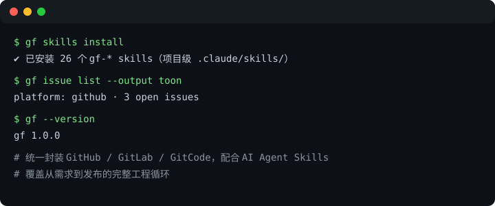

# gitflow-cli

[](https://github.com/byx-darwin/gitflow-cli/actions)
[](https://github.com/byx-darwin/gitflow-cli/releases/latest)
[](https://www.rust-lang.org/)
[](LICENSE)

**跨平台 Git 工程化工作流编排框架：统一封装 GitHub / GitLab / GitCode 三大平台，配合 AI Agent Skills，覆盖从需求到发布的完整工程循环。**



## 安装

```bash
# Homebrew (macOS)
brew tap byx-darwin/gitflow-cli
brew install gitflow-cli

# 或 Cargo
cargo install gitflow-cli
```

## 30 秒上手

```bash
# 1. 安装 Skills（项目级，跟随仓库）
gitflow-cli skills install

# 2. 验证
gitflow-cli skills list     # 应看到 26 个 gitflow-* skills
gitflow-cli --version

# 3. 在 Agent 平台中进入四阶段工作流
/gitflow-workflow 我要做 X
```

## 平台支持

### Git 平台

`gitflow-cli` 统一封装三大 Git 平台差异，`--platform` 自动检测或手动指定：

| 平台 | CLI 依赖 | 特性 |
|------|---------|------|
| **GitHub** | `gh` (v2.0.0+) | Issue / PR / Release / Review / Pipeline / Repo（含 Enterprise） |
| **GitLab** | `glab` (v1.30.0+) | Issue / PR(MR) / Release / Review / Pipeline / Repo（含自建实例） |
| **GitCode** | `gitcode` (v0.6.0+) | Issue / PR(MR) / Release / Review / Pipeline / Repo |

```bash
gitflow-cli issue list                                  # 自动检测（基于 git remote）
gitflow-cli issue list --platform gitlab --output text  # 手动指定平台
```

详见官网[兼容性矩阵](https://byx-darwin.github.io/gitflow-cli/compatibility/)。

### Agent 平台

Skills 可安装到任意支持的 AI Agent 平台，`--agent` 指定目标（不指定则自动检测）。安装位置分项目级（默认，装到当前仓库 `.claude/` 等）与全局级（`-g`，装到 `~/`）。

| Agent | 项目级目录 | 全局级目录 | Stop Hook 支持 |
|-------|-----------|-----------|----------------|
| **Claude Code** | `.claude/skills/` | `~/.claude/skills/` | ✅ |
| **Codex** (OpenAI) | `.codex/skills/` | `~/.codex/skills/` | ✅ |
| **OpenCode** | `.opencode/skills/` | `~/.opencode/skills/` | ❌ 跳过 |
| **Gemini CLI** | `.gemini/skills/` | `~/.gemini/skills/` | ❌ 跳过 |
| **Copilot CLI** | `.copilot/skills/` | `~/.copilot/skills/` | ❌ 跳过 |

## Skill 矩阵

| 层 | Skill | 做什么 |
|----|-------|--------|
| 编排 | `gitflow-workflow` | 四阶段全流程编排：需求澄清 → 计划制定 → 执行 → 交付后检查 |
| 编排 | `gitflow-quality` | 本地质量门禁：build → test → coverage → format → static → pre-commit |
| Issue | `gitflow-issue-create` / `gitflow-issue-review` / `gitflow-issue-triage` | 创建 / 需求审查 / 分类分流 |
| PR | `gitflow-pr-create` / `gitflow-pr-review` / `gitflow-pr-inline-review` / `gitflow-pr-apply-feedback` | 创建 / 6 维审查 / 逐行评论 / 应用反馈 |
| 交付 | `gitflow-release-helper` / `gitflow-label-stats` / `gitflow-pipeline-analyzer` | Release Note / 标签统计 / 流水线健康 |
| 辅助 | `gitflow-security-check` / `gitflow-precommit` / `gitflow-regression` / `gitflow-repo-onboarding` / `gitflow-autoreport-bug` | 安全审计 / 预提交 / 回归 / 入门 / 自动报障 |

## CLI 命令一览

| 命令 | 用途 |
|------|------|
| `gitflow-cli issue {create,list,view,close,reopen,comment}` | Issue 管理 |
| `gitflow-cli pr {create,list,view,close,merge,checkout}` | PR 管理 |
| `gitflow-cli release {create,list,view,edit}` | 发布管理 |
| `gitflow-cli review {comment,approve,request-changes,submit}` | 代码审查 |
| `gitflow-cli auth {login,logout,status,token}` | 认证管理 |
| `gitflow-cli pipeline {status,logs,jobs,report}` | CI/CD 流水线 |
| `gitflow-cli commit {view,diff,patch,comment}` | 提交操作 |
| `gitflow-cli label/milestone` | 标签/里程碑管理 |
| `gitflow-cli repo {clone,list,create,stats,sync,view}` | 仓库操作 |
| `gitflow-cli skills {install,list,uninstall}` | Skills 管理 |
| `gitflow-cli completions {bash,zsh,fish}` | Shell 补全 |

支持 `--platform github|gitlab|gitcode` 与 `--output json|text|toon|auto`。

## 文档与官网

官方网站：<https://byx-darwin.github.io/gitflow-cli>

- [5 分钟快速上手](https://byx-darwin.github.io/gitflow-cli/quickstart/)
- [兼容性矩阵](https://byx-darwin.github.io/gitflow-cli/compatibility/)
- [更新日志](https://byx-darwin.github.io/gitflow-cli/changelog/)
- 仓库内文档：[`docs/`](docs/index.md)

## 设计原则

- **步骤化工作流**：每个 skill 有明确步骤顺序，不跳步。
- **先验证再行动**：PR 创建前检查分支与变更；Issue 创建前引导填写模板。
- **生态互补**：本地开发循环（Superpowers）+ 远端协作（gitflow-cli）明确分工。
- **多 Agent 兼容**：skills 可安装到 Claude Code / Codex / OpenCode / Gemini / Copilot。
- **质量门闸门**：build → test → coverage → format → static → pre-commit 全部通过才能交付。

## 贡献

详见 [CONTRIBUTING.md](CONTRIBUTING.md)。
