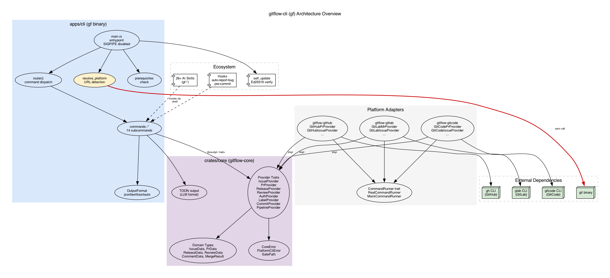
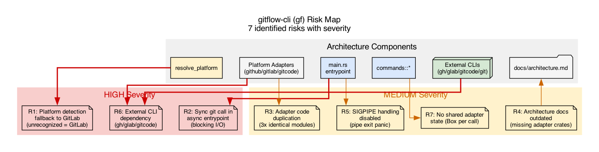

# Architecture Review: gitflow-cli (gf)

**Date**: 2026-08-28
**Reviewer**: risk-quality-reviewer + graphviz
**Scope**: Full workspace architecture review
**Audience**: Project maintainer / engineering team

---

## 1. System Overview

gitflow-cli (`gf`) is a cross-platform Git engineering workflow orchestration framework written in Rust. It unifies GitHub, GitLab, and GitCode platforms behind a single CLI, providing Issue/PR/Release/Review/Pipeline operations and 26+ AI agent skills.

**Tech Stack**: Rust 1.96+, Edition 2024, Cargo workspace, tokio async runtime, clap CLI, serde/toon serialization.

**Code Size**: ~41,000 lines of Rust across 8 crates.

### Architecture Pattern

```
apps/cli (thin binary)
  ├── crates/core (traits + domain types)
  ├── crates/github (gh CLI adapter)
  ├── crates/gitlab (glab CLI adapter)
  └── crates/gitcode (gitcode CLI adapter)
```

The architecture follows a **Provider trait + CLI adapter** pattern: core defines abstract traits (`IssueProvider`, `PrProvider`, etc.), and each platform crate implements them by shelling out to the respective CLI tool (`gh`, `glab`, `gitcode`).

### Architecture Overview



---

## 2. Architecture Strengths

### S1: Clean Separation of Concerns [Confidence: HIGH]

**Evidence**: `apps/cli/src/main.rs` contains only routing logic; all business logic lives in `crates/*`. The dependency flow is strictly one-directional: `apps/cli → crates/github|gitlab|gitcode → crates/core`.

**Assessment**: Binary is thin (~630 lines), library crates are independently testable. This matches the documented architecture in `docs/architecture.md`.

### S2: Provider Trait Abstraction [Confidence: HIGH]

**Evidence**: `crates/core/src/issue.rs:89-96` defines `IssueProvider` trait with `async_trait`. Eight provider traits cover all platform operations. Command handlers in `apps/cli/src/commands/pr.rs:215-218` create `Box<dyn PrProvider>` based on platform string.

**Assessment**: Well-defined abstraction boundary. Adding a new platform requires implementing the traits without touching the command layer.

### S3: Testability via CommandRunner [Confidence: HIGH]

**Evidence**: `crates/github/src/runner.rs:22-46` defines `CommandRunner` trait abstracting process spawning. `MockCommandRunner` and `SequencedMockCommandRunner` enable deterministic testing without real CLI tools.

**Assessment**: Excellent test isolation. The `SequencedMockCommandRunner` supports testing retry logic and multi-step workflows.

### S4: Security Posture [Confidence: HIGH]

**Evidence**: `#![forbid(unsafe_code)]` at workspace level (`Cargo.toml:70`). `SafePath` validation (`core/src/lib.rs:254-368`) rejects path traversal, null bytes, bidi characters. `secrecy` crate for token handling. Ed25519 signing for release verification.

**Assessment**: Strong security defaults. Path validation is thorough. Release signing provides supply-chain integrity.

### S5: Multi-Format Output [Confidence: HIGH]

**Evidence**: `OutputFormat` enum in `main.rs:427-438` supports JSON, Text, TOON, and Auto. TOON (Token-Oriented Object Notation) is specifically designed for LLM consumption.

**Assessment**: Forward-thinking design for AI agent integration. The TOON format differentiates this tool in the AI-agent tooling space.

---

## 3. Risk Findings

### Risk Map



### R1: Platform Detection Fallback [Severity: MEDIUM, Likelihood: MEDIUM]

**Evidence**: `crates/core/src/platform.rs:57-67` — `Platform::detect_from_remote_url()` defaults to `GitLab` for any unrecognized domain. The comment says "Default to GitLab for all other domains (including self-hosted GitLab)".

**Risk**: A user with a Bitbucket, Azure DevOps, or custom Gitea instance will silently get GitLab adapter behavior, leading to confusing errors rather than a clear "unsupported platform" message.

**Validation**: `platform.rs:128-134` tests confirm this is intentional behavior, but the test name "should_default_to_gitlab_for_unrecognized_url" shows awareness of the assumption.

**Recommendation**: Add an explicit `Platform::Unknown` variant or require `--platform` flag for unrecognized domains instead of silently defaulting.

### R2: Synchronous git Call in Async Entrypoint [Severity: LOW, Likelihood: HIGH]

**Evidence**: `apps/cli/src/main.rs:259-264` — `resolve_platform()` uses `std::process::Command::new("git")` (synchronous) before the tokio runtime starts. This blocks the main thread.

**Risk**: Minimal in practice (git remote is fast), but establishes a pattern of sync I/O in the async entrypoint. If `resolve_platform` grows more complex (e.g., network calls), this becomes a real bottleneck.

**Recommendation**: Document this as intentional (pre-runtime) or move to async `tokio::process::Command` after runtime creation.

### R3: Adapter Code Duplication [Severity: MEDIUM, Likelihood: HIGH]

**Evidence**: All three adapter crates have identical module structures: `auth.rs`, `commit.rs`, `error.rs`, `issue.rs`, `label.rs`, `pipeline.rs`, `pr.rs`/`mr.rs`, `release.rs`, `review.rs`, `runner.rs`. Each is ~10 files implementing the same traits.

**Risk**: Bug fixes or API changes must be replicated across three crates. The `deserialize_u64_or_string` helper in `core/src/types.rs:17-42` exists specifically because GitCode returns strings where GitHub returns integers — these compatibility gaps will grow.

**Recommendation**: Consider a shared adapter macro or base module for common patterns (error parsing, JSON deserialization, runner integration).

### R4: Architecture Documentation Outdated [Severity: LOW, Likelihood: CERTAIN]

**Evidence**: `docs/architecture.md:7-17` shows workspace layout with only `crates/core` — does not mention `crates/github`, `crates/gitlab`, `crates/gitcode`, `crates/e2e-core`, `crates/e2e-github`, or `crates/release-signer`.

**Risk**: New contributors will not understand the adapter pattern or know where to look for platform-specific logic.

**Recommendation**: Update `docs/architecture.md` to reflect the current 8-crate workspace structure.

### R5: SIGPIPE Handling Disabled [Severity: LOW, Likelihood: LOW]

**Evidence**: `apps/cli/src/main.rs:402-404` — `reset_sigpipe()` is intentionally empty due to `#![forbid(unsafe_code)]`. The comment references ripgrep/fd/bat as using this pattern.

**Risk**: Piping `gf` output to `head` or similar may cause EPIPE panic instead of clean exit. Low probability because tokio handles some of this, but it's a known gap.

**Recommendation**: Evaluate if `signal-hook` crate provides a safe SIGPIPE reset without unsafe code.

### R6: External CLI Tool Dependency [Severity: MEDIUM, Likelihood: MEDIUM]

**Evidence**: All platform operations shell out to `gh`, `glab`, or `gitcode` CLI tools. `apps/cli/src/commands/prerequisites.rs` checks for their presence.

**Risk**:
- Users must install and authenticate the correct CLI tool for their platform.
- CLI tool version changes can break JSON output parsing.
- No direct HTTP API fallback when CLI tools fail.
- Performance overhead from process spawning per operation.

**Mitigation**: `prerequisites.rs` checks before commands run. `doctor` command diagnoses environment issues.

**Recommendation**: Document minimum CLI versions in compatibility matrix. Consider caching or batching for operations that spawn many subprocesses.

### R7: No Shared Adapter State [Severity: LOW, Likelihood: MEDIUM]

**Evidence**: `apps/cli/src/commands/pr.rs:215-218` creates `Box<dyn PrProvider>` per command invocation. Each adapter (e.g., `GitHubPrProvider::new(repo)`) stores only the repo string — no connection reuse, no caching.

**Risk**: Acceptable for CLI usage (one command = one invocation), but if `gf` is used as a library or in workflow chains, each operation re-creates the adapter. No session-level caching of auth state, repo info, or API responses.

**Recommendation**: Low priority for CLI use. If workflow chains become common, consider a `Session` or `Context` struct that holds shared state across operations.

---

## 4. Quality Attribute Assessment

| Attribute | Rating | Evidence |
|-----------|--------|----------|
| **Maintainability** | GOOD | Clean crate boundaries, inherited lints, consistent patterns across adapters |
| **Testability** | EXCELLENT | CommandRunner trait, MockCommandRunner, SequencedMockCommandRunner, rstest, trycmd |
| **Security** | EXCELLENT | forbid(unsafe_code), SafePath, secrecy crate, Ed25519 release signing |
| **Extensibility** | GOOD | Provider traits make new platforms straightforward; skills system extends CLI |
| **Performance** | ACCEPTABLE | Process spawning per operation is fine for CLI; would need caching for library use |
| **Reliability** | GOOD | Comprehensive error types, platform CLI error parsing with hints, doctor command |
| **Observability** | GOOD | tracing-subscriber with TTY-aware output, JSON for pipes, env-filter support |
| **Documentation** | NEEDS WORK | Architecture doc outdated; inline docs are excellent (CLAUDE.md conventions) |

---

## 5. Remediation Priority

| Priority | Finding | Effort | Impact |
|----------|---------|--------|--------|
| P1 | R4: Update architecture docs | Low | High (contributor onboarding) |
| P2 | R1: Platform detection fallback | Medium | Medium (user experience) |
| P3 | R3: Reduce adapter duplication | High | Medium (maintenance burden) |
| P4 | R6: Document CLI version compatibility | Low | Medium (environment issues) |
| P5 | R2: Document sync git call rationale | Low | Low (code clarity) |
| P6 | R5: Investigate safe SIGPIPE fix | Medium | Low (edge case) |
| P7 | R7: Shared adapter state | High | Low (future-proofing) |

---

## 6. Artifacts

- Architecture overview: `docs/architecture-diagram.dot` → `.svg` / `.png`
- Risk map: `docs/risk-map-diagram.dot` → `.svg` / `.png`
- Combined diagram (legacy): `docs/architecture-review-diagram.dot`
- This review: `docs/architecture-review-2026-08-28.md`

## 7. Caveats

- Review based on static code analysis; no runtime telemetry or production incident data available.
- E2E test coverage not deeply inspected — `crates/e2e-core` and `crates/e2e-github` exist but test scope is unknown.
- Skills system (26+ skills) is a significant part of the ecosystem but reviewed only at directory level.
- The `self_update` mechanism with `skip-verify` feature flag is a security consideration that deserves separate review.
