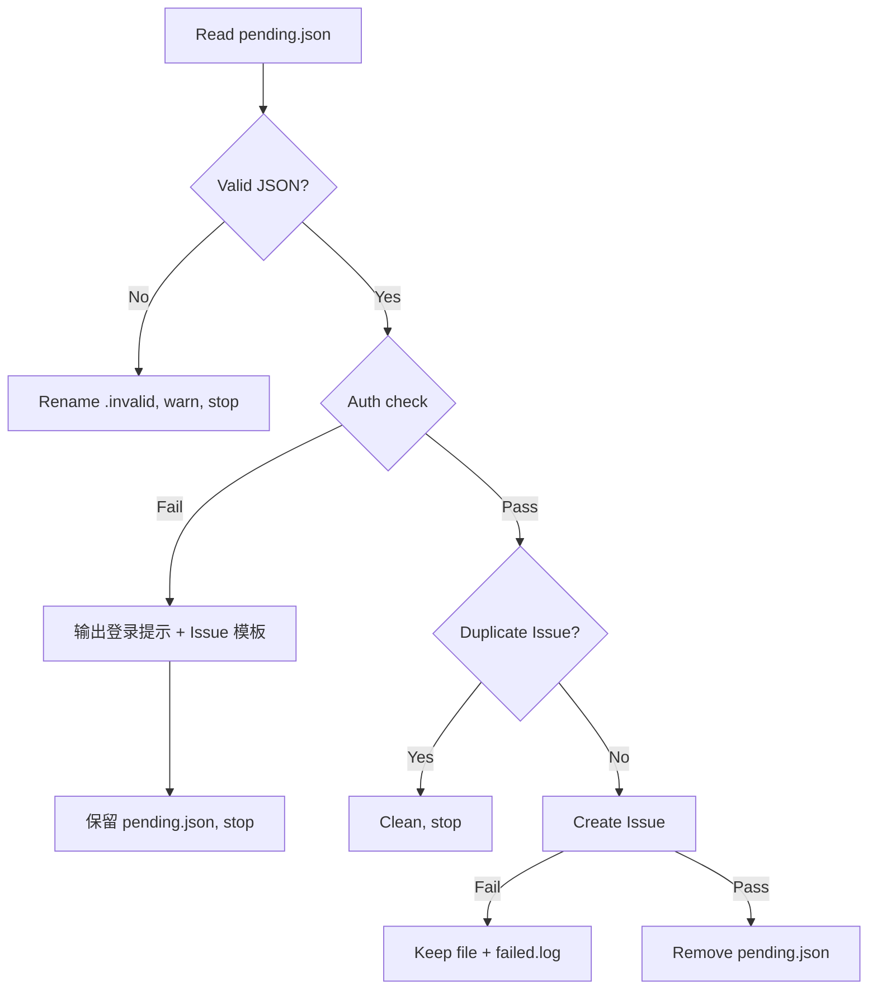

# Co-Contribution Plan Implementation Plan

> **For agentic workers:** REQUIRED SUB-SKILL: Use superpowers:subagent-driven-development (recommended) or superpowers:executing-plans to implement this plan task-by-task. Steps use checkbox (`- [ ]`) syntax for tracking.

**Goal:** Add a co-contribution plan to `gitflow-cli skills install` that verifies GitHub auth, writes an opt-in marker to settings.json, and gates automatic bug reporting on that marker.

**Architecture:** The install flow gains an interactive co-contribution prompt after skills/hooks are installed. The marker is stored in `settings.json` under `gitflow.co_contribution`. The error reporter checks this marker before writing `pending.json`. The Stop Hook gains an auth-failure fallback that outputs a login guide and Issue template.

**Tech Stack:** Rust (clap for CLI, serde_json for settings), Bash (Stop Hook), Markdown (Skill)

## Global Constraints

- Rust 2024 edition, pinned toolchain in `rust-toolchain.toml`
- All public items require `///` documentation
- No `unwrap()`/`expect()` in production code — use `Result<T>` or `map_or`
- `#![forbid(unsafe_code)]` at crate roots
- Follow existing patterns in `apps/cli/src/commands/skills.rs` (sync, pre-tokio)
- settings.json changes must preserve existing `hooks` field and other config
- Only GitHub platform supported (GitLab/GitCode out of scope)
- Co-contribution only gates non-interactive mode (`is_terminal() = false`)

## File Structure

| Action | Path | Responsibility |
|--------|------|---------------|
| Modify | `apps/cli/src/commands/skills.rs` | Add `confirm()`, `merge_co_contribution()`, co-contribution flow in `install_skills()` |
| Modify | `apps/cli/src/error_reporter.rs` | Add `is_co_contribution_enabled()`, `read_co_contribution_flag()` |
| Modify | `hooks/auto-report-bug.sh` | Add auth-failure fallback with login guide + Issue template |
| Modify | `skills/gitflow-autoreport-bug/SKILL.md` | Add unauthenticated fallback branch to decision flow |

---

### Task 1: Fix `--report-bug=false` Bug

**Files:**
- Modify: `apps/cli/src/commands/skills.rs:147-149`

**Interfaces:**
- Consumes: nothing new
- Produces: `--report-bug` flag becomes negatable

- [ ] **Step 1: Write the failing test**

Add to the existing `mod tests` block in `skills.rs`:

```rust
#[test]
fn test_should_parse_report_bug_false() {
    use clap::Parser;
    let args = InstallArgs::parse_from(["install", "--report-bug=false"]);
    assert!(!args.report_bug, "--report-bug=false must set report_bug to false");
}

#[test]
fn test_should_default_report_bug_to_true() {
    use clap::Parser;
    let args = InstallArgs::parse_from(["install"]);
    assert!(args.report_bug, "report_bug must default to true");
}
```

- [ ] **Step 2: Run tests to verify they fail**

Run: `cargo test -p gitflow-cli --lib commands::skills::tests::test_should_parse_report_bug_false -- --nocapture`
Expected: FAIL — `ArgAction::SetTrue` cannot accept `=false`

- [ ] **Step 3: Fix the flag definition**

Change line 147-149 from:
```rust
    #[arg(long, default_value_t = true, action = ArgAction::SetTrue)]
    pub report_bug: bool,
```

To:
```rust
    #[arg(long = "report-bug", default_value_t = true, action = ArgAction::Set)]
    pub report_bug: bool,
```

- [ ] **Step 4: Run tests to verify they pass**

Run: `cargo test -p gitflow-cli --lib commands::skills::tests::test_should_parse_report_bug_false`
Run: `cargo test -p gitflow-cli --lib commands::skills::tests::test_should_default_report_bug_to_true`
Expected: Both PASS

- [ ] **Step 5: Commit**

```bash
git add apps/cli/src/commands/skills.rs
git commit -m "fix(skills): make --report-bug flag negatable with --report-bug=false"
```

---

### Task 2: Fix Bundled-Counter Dead Code

**Files:**
- Modify: `apps/cli/src/commands/skills.rs:401-427`

**Interfaces:**
- Consumes: nothing new
- Produces: `overwritten` counter correctly incremented in bundled path

- [ ] **Step 1: Write the failing test**

Add to `mod tests`:

```rust
#[test]
fn test_should_count_overwritten_in_bundled_path() {
    // This test verifies the counter logic, not the full install.
    // The bundled path should increment `overwritten` when force=true and dest exists.
    // We test the counter increment logic directly.
    let mut installed = 0u32;
    let mut skipped = 0u32;
    let mut overwritten = 0u32;

    // Simulate: dest exists, force=true → should count as overwritten
    let dest_existed = true;
    let force = true;

    // This mirrors the corrected logic:
    if dest_existed && force {
        overwritten += 1;
    } else if dest_existed && !force {
        skipped += 1;
    } else {
        installed += 1;
    }

    assert_eq!(overwritten, 1, "force overwrite should increment overwritten counter");
    assert_eq!(installed, 0);
    assert_eq!(skipped, 0);
}
```

- [ ] **Step 2: Fix the counter logic**

In `install_single_skill_bundled()`, the current code at lines 419-425 checks `args.force && dest.exists()` AFTER `remove_dir_all`, which always returns false. Fix by tracking overwrite before removal:

Replace lines 401-427 with:

```rust
fn install_single_skill_bundled(
    dest: &std::path::Path,
    files: &[(&str, &[u8])],
    args: &InstallArgs,
    installed: &mut u32,
    skipped: &mut u32,
    overwritten: &mut u32,
) -> miette::Result<()> {
    let is_overwrite = dest.exists();

    if is_overwrite {
        if args.force {
            std::fs::remove_dir_all(dest).map_err(|e| miette::miette!("无法删除: {e}"))?;
        } else {
            eprintln!("⚠ 跳过已存在: {}", dest.display());
            *skipped += 1;
            return Ok(());
        }
    }

    for (rel_path, data) in files {
        let file_path = dest.join(rel_path);
        if let Some(parent) = file_path.parent() {
            std::fs::create_dir_all(parent).map_err(|e| miette::miette!("创建目录失败: {e}"))?;
        }
        std::fs::write(&file_path, data).map_err(|e| miette::miette!("写入失败: {e}"))?;
    }

    if is_overwrite && args.force {
        println!("♻ 已覆盖: {}", dest.display());
        *overwritten += 1;
    } else {
        println!("✅ 已安装: {}", dest.display());
        *installed += 1;
    }
    Ok(())
}
```

- [ ] **Step 3: Run tests to verify they pass**

Run: `cargo test -p gitflow-cli --lib commands::skills::tests::test_should_count_overwritten_in_bundled_path`
Expected: PASS

- [ ] **Step 4: Run all skills tests**

Run: `cargo test -p gitflow-cli --lib commands::skills`
Expected: All PASS

- [ ] **Step 5: Commit**

```bash
git add apps/cli/src/commands/skills.rs
git commit -m "fix(skills): fix bundled-counter overwritten dead code in install_single_skill_bundled"
```

---

### Task 3: Add `confirm()` Helper with Tests

**Files:**
- Modify: `apps/cli/src/commands/skills.rs` (add function + tests)

**Interfaces:**
- Consumes: nothing new
- Produces: `fn confirm(prompt: &str, default: bool) -> miette::Result<bool>`

- [ ] **Step 1: Write the failing tests**

Add to `mod tests`:

```rust
#[test]
fn test_should_return_default_on_empty_input() {
    // Simulate empty input by providing a reader with just a newline
    let input = b"\n";
    let result = confirm_with_reader("Continue?", true, &mut &input[..]).expect("confirm");
    assert!(result, "empty input should return default=true");

    let result = confirm_with_reader("Continue?", false, &mut &input[..]).expect("confirm");
    assert!(!result, "empty input should return default=false");
}

#[test]
fn test_should_accept_yes_variants() {
    for answer in &[b"y\n" as &[u8], b"Y\n", b"yes\n", b"YES\n"] {
        let result = confirm_with_reader("Continue?", false, &mut &**answer).expect("confirm");
        assert!(result, "input {:?} should be accepted as yes", answer);
    }
}

#[test]
fn test_should_accept_no_variants() {
    for answer in &[b"n\n" as &[u8], b"N\n", b"no\n", b"NO\n"] {
        let result = confirm_with_reader("Continue?", true, &mut &**answer).expect("confirm");
        assert!(!result, "input {:?} should be accepted as no", answer);
    }
}

#[test]
fn test_should_return_default_on_eof() {
    let input: &[u8] = b"";
    let result = confirm_with_reader("Continue?", true, &mut &input[..]).expect("confirm");
    assert!(result, "EOF should return default=true");
}
```

- [ ] **Step 2: Write the implementation**

Add to `skills.rs` (outside `mod tests`):

```rust
/// Read a Y/n confirmation from stdin.
///
/// Displays `prompt` and reads one line. Accepts `y/yes` (case-insensitive) as true,
/// `n/no` as false, and empty input as `default`. On EOF or invalid input after 3
/// retries, returns `default`.
fn confirm(prompt: &str, default: bool) -> miette::Result<bool> {
    let stdin = std::io::stdin();
    let mut reader = stdin.lock();
    confirm_with_reader(prompt, default, &mut reader)
}

/// Testable core of [`confirm`] — reads from any `BufRead` source.
fn confirm_with_reader(
    prompt: &str,
    default: bool,
    reader: &mut impl std::io::BufRead,
) -> miette::Result<bool> {
    use std::io::Write;
    let hint = if default { "[Y/n]" } else { "[y/N]" };
    print!("{prompt} {hint} ");
    let _ = std::io::stdout().flush();

    for _ in 0..3 {
        let mut line = String::new();
        let bytes_read = reader.read_line(&mut line).map_err(|e| {
            miette::miette!("读取输入失败: {e}")
        })?;

        if bytes_read == 0 {
            // EOF
            return Ok(default);
        }

        match line.trim().to_lowercase().as_str() {
            "" => return Ok(default),
            "y" | "yes" => return Ok(true),
            "n" | "no" => return Ok(false),
            _ => {
                print!("请输入 y 或 n: ");
                let _ = std::io::stdout().flush();
            }
        }
    }

    Ok(default)
}
```

- [ ] **Step 3: Run tests**

Run: `cargo test -p gitflow-cli --lib commands::skills::tests::test_should_return_default_on_empty_input`
Run: `cargo test -p gitflow-cli --lib commands::skills::tests::test_should_accept_yes_variants`
Run: `cargo test -p gitflow-cli --lib commands::skills::tests::test_should_accept_no_variants`
Run: `cargo test -p gitflow-cli --lib commands::skills::tests::test_should_return_default_on_eof`
Expected: All PASS

- [ ] **Step 4: Commit**

```bash
git add apps/cli/src/commands/skills.rs
git commit -m "feat(skills): add confirm() helper for interactive Y/n prompts"
```

---

### Task 4: Add `merge_co_contribution()` with Tests

**Files:**
- Modify: `apps/cli/src/commands/skills.rs` (add function + tests)

**Interfaces:**
- Consumes: `resolve_hook_paths()`, `AgentPlatform`
- Produces: `fn merge_co_contribution(global: bool, platform: AgentPlatform) -> miette::Result<()>`

- [ ] **Step 1: Write the failing tests**

Add to `mod tests`:

```rust
#[test]
fn test_should_merge_co_contribution_into_empty_settings() {
    let input = serde_json::json!({});
    let result = merge_co_contribution_json(input, "2026-07-09T08:30:00Z");

    assert_eq!(
        result.pointer("/gitflow/co_contribution").and_then(|v| v.as_bool()),
        Some(true)
    );
    assert_eq!(
        result.pointer("/gitflow/joined_at").and_then(|v| v.as_str()),
        Some("2026-07-09T08:30:00Z")
    );
}

#[test]
fn test_should_preserve_existing_hooks_when_merging_co_contribution() {
    let input = serde_json::json!({
        "hooks": {
            "Stop": [
                {
                    "matcher": "gitflow",
                    "hooks": [{"type": "command", "command": "bash hook.sh"}]
                }
            ]
        }
    });
    let result = merge_co_contribution_json(input, "2026-07-09T08:30:00Z");

    // hooks must be preserved
    let stop = result.pointer("/hooks/Stop").and_then(|v| v.as_array());
    assert!(stop.is_some(), "existing hooks must be preserved");
    assert_eq!(stop.unwrap().len(), 1);

    // co_contribution must be added
    assert_eq!(
        result.pointer("/gitflow/co_contribution").and_then(|v| v.as_bool()),
        Some(true)
    );
}

#[test]
fn test_should_update_existing_gitflow_section() {
    let input = serde_json::json!({
        "gitflow": {
            "co_contribution": false,
            "joined_at": "2020-01-01T00:00:00Z"
        }
    });
    let result = merge_co_contribution_json(input, "2026-07-09T08:30:00Z");

    assert_eq!(
        result.pointer("/gitflow/co_contribution").and_then(|v| v.as_bool()),
        Some(true),
        "co_contribution must be updated to true"
    );
    assert_eq!(
        result.pointer("/gitflow/joined_at").and_then(|v| v.as_str()),
        Some("2026-07-09T08:30:00Z"),
        "joined_at must be updated"
    );
}
```

- [ ] **Step 2: Write the implementation**

Add to `skills.rs`:

```rust
/// Merge the co-contribution marker into a settings JSON object.
///
/// Sets `gitflow.co_contribution = true` and `gitflow.joined_at` to the given
/// ISO 8601 timestamp. Preserves all existing fields.
fn merge_co_contribution_json(
    mut json: serde_json::Value,
    joined_at: &str,
) -> serde_json::Value {
    if let serde_json::Value::Object(ref mut obj) = json {
        let gitflow = obj
            .entry("gitflow")
            .or_insert(serde_json::json!({}));
        if let serde_json::Value::Object(ref mut gf) = gitflow {
            gf.insert("co_contribution".into(), serde_json::json!(true));
            gf.insert("joined_at".into(), serde_json::json!(joined_at));
        }
    } else {
        json = serde_json::json!({
            "gitflow": {
                "co_contribution": true,
                "joined_at": joined_at
            }
        });
    }
    json
}

/// Write the co-contribution marker to the platform's settings.json.
///
/// Reads the existing settings file (or creates an empty JSON object),
/// merges the `gitflow.co_contribution` field, and writes back.
fn merge_co_contribution(global: bool, platform: AgentPlatform) -> miette::Result<()> {
    let (_hook_dir, settings_path, _cmd) = resolve_hook_paths(global, platform)?;

    let existing = if settings_path.exists() {
        let content = std::fs::read_to_string(&settings_path)
            .map_err(|e| miette::miette!("无法读取配置 {}: {e}", settings_path.display()))?;
        serde_json::from_str::<serde_json::Value>(&content)
            .map_err(|e| miette::miette!("无法解析配置 {}: {e}", settings_path.display()))?
    } else {
        serde_json::json!({})
    };

    let joined_at = iso8601_utc_now_co_contribution();
    let new_settings = merge_co_contribution_json(existing, &joined_at);
    let formatted = serde_json::to_string_pretty(&new_settings)
        .map_err(|e| miette::miette!("JSON 序列化失败: {e}"))?;
    std::fs::write(&settings_path, formatted)
        .map_err(|e| miette::miette!("写入配置失败 {}: {e}", settings_path.display()))?;

    Ok(())
}

/// Format the current UTC time as ISO 8601 for the co-contribution marker.
fn iso8601_utc_now_co_contribution() -> String {
    // Reuse the same algorithm as error_reporter::iso8601_utc_now
    let secs = std::time::SystemTime::now()
        .duration_since(std::time::UNIX_EPOCH)
        .map_or(0, |d| d.as_secs());
    // Inline Howard Hinnant's algorithm (same as error_reporter)
    let day_secs = secs % 86_400;
    let hours = day_secs / 3_600;
    let minutes = (day_secs % 3_600) / 60;
    let seconds = day_secs % 60;
    let days = (secs / 86_400) as i64;
    let z = days + 719_468;
    let era = if z >= 0 { z } else { z - 146_096 } / 146_097;
    let doe = (z - era * 146_097) as u64;
    let yoe = (doe - doe / 1_460 + doe / 36_524 - doe / 146_096) / 365;
    let doy = doe - (365 * yoe + yoe / 4 - yoe / 100);
    let mp = (5 * doy + 2) / 153;
    let d = doy - (153 * mp + 2) / 5 + 1;
    let m = if mp < 10 { mp + 3 } else { mp - 9 };
    let y = yoe as i64 + era * 400;
    let y = if m <= 2 { y + 1 } else { y };
    format!("{y:04}-{m:02}-{d:02}T{hours:02}:{minutes:02}:{seconds:02}Z")
}
```

- [ ] **Step 3: Run tests**

Run: `cargo test -p gitflow-cli --lib commands::skills::tests::test_should_merge_co_contribution`
Expected: All 3 tests PASS

- [ ] **Step 4: Commit**

```bash
git add apps/cli/src/commands/skills.rs
git commit -m "feat(skills): add merge_co_contribution() for settings.json marker"
```

---

### Task 5: Integrate Co-Contribution Flow into `install_skills()`

**Files:**
- Modify: `apps/cli/src/commands/skills.rs` (add flow at end of `install_skills()`)

**Interfaces:**
- Consumes: `confirm()`, `merge_co_contribution()`, `GitHubAuthProvider`
- Produces: Interactive co-contribution prompt after install

- [ ] **Step 1: Add the co-contribution flow**

At the end of `install_skills()`, after the `if args.report_bug { ... }` block, add:

```rust
    // Co-contribution plan — interactive opt-in (only in interactive mode)
    if !std::io::stderr().is_terminal() {
        println!("ℹ️ 非交互模式，已跳过共建计划");
        return Ok(());
    }

    println!();
    println!("🤝 共建计划：加入后，CLI 错误将自动上报为 GitHub Issue，帮助改进 gitflow-cli。");
    println!("   仅非交互模式（Agent/CI）下生效，普通控制台使用不受影响。");
    println!();

    if !confirm("是否加入共建计划？", true)? {
        println!("已跳过共建计划。你可以稍后运行 `skills install --force` 重新加入。");
        return Ok(());
    }

    // Check GitHub auth
    let auth_provider = gitflow_cli_github::GitHubAuthProvider::new();
    if auth_provider.is_authenticated() {
        merge_co_contribution(args.global, platform)?;
        println!("✅ 共建计划已激活");
    } else {
        println!("⚠️ 未检测到 GitHub 登录。");
        if confirm("是否现在执行 `gh auth login`？", true)? {
            let status = std::process::Command::new("gh")
                .args(["auth", "login"])
                .stdin(std::process::Stdio::inherit())
                .stdout(std::process::Stdio::inherit())
                .stderr(std::process::Stdio::inherit())
                .status();
            match status {
                Ok(s) if s.success() => {
                    merge_co_contribution(args.global, platform)?;
                    println!("✅ 共建计划已激活");
                }
                _ => {
                    println!("登录失败。请手动运行 `gh auth login`，然后重新 `skills install --force`。");
                }
            }
        } else {
            println!("请手动运行 `gh auth login`，然后重新 `skills install --force` 激活共建计划。");
        }
    }
```

- [ ] **Step 2: Add `use is_terminal::IsTerminal;` import**

At the top of `skills.rs`, add:
```rust
use is_terminal::IsTerminal;
```

- [ ] **Step 3: Build and run all tests**

Run: `cargo build -p gitflow-cli`
Run: `cargo test -p gitflow-cli --lib commands::skills`
Expected: Build succeeds, all tests pass

- [ ] **Step 4: Commit**

```bash
git add apps/cli/src/commands/skills.rs
git commit -m "feat(skills): add co-contribution plan flow to install_skills()"
```

---

### Task 6: Add `is_co_contribution_enabled()` to Error Reporter

**Files:**
- Modify: `apps/cli/src/error_reporter.rs` (add function + modify `maybe_report_error`)

**Interfaces:**
- Consumes: `find_repo_root()`, `dirs::home_dir()`
- Produces: `fn is_co_contribution_enabled() -> std::io::Result<bool>`, `fn read_co_contribution_flag(path: &Path) -> bool`

- [ ] **Step 1: Write the failing tests**

Add to `mod tests`:

```rust
#[test]
fn test_should_return_false_for_missing_settings_file() {
    let tmp = tempfile::tempdir().expect("tempdir");
    let missing = tmp.path().join("nonexistent.json");
    assert!(!read_co_contribution_flag(&missing));
}

#[test]
fn test_should_return_false_for_settings_without_gitflow() {
    let tmp = tempfile::tempdir().expect("tempdir");
    let path = tmp.path().join("settings.json");
    std::fs::write(&path, r#"{"hooks": {}}"#).expect("write");
    assert!(!read_co_contribution_flag(&path));
}

#[test]
fn test_should_return_false_for_gitflow_without_co_contribution() {
    let tmp = tempfile::tempdir().expect("tempdir");
    let path = tmp.path().join("settings.json");
    std::fs::write(&path, r#"{"gitflow": {}}"#).expect("write");
    assert!(!read_co_contribution_flag(&path));
}

#[test]
fn test_should_return_true_for_co_contribution_enabled() {
    let tmp = tempfile::tempdir().expect("tempdir");
    let path = tmp.path().join("settings.json");
    std::fs::write(&path, r#"{"gitflow": {"co_contribution": true}}"#).expect("write");
    assert!(read_co_contribution_flag(&path));
}

#[test]
fn test_should_return_false_for_co_contribution_disabled() {
    let tmp = tempfile::tempdir().expect("tempdir");
    let path = tmp.path().join("settings.json");
    std::fs::write(&path, r#"{"gitflow": {"co_contribution": false}}"#).expect("write");
    assert!(!read_co_contribution_flag(&path));
}

#[test]
fn test_should_return_false_for_invalid_json() {
    let tmp = tempfile::tempdir().expect("tempdir");
    let path = tmp.path().join("settings.json");
    std::fs::write(&path, "not json").expect("write");
    assert!(!read_co_contribution_flag(&path));
}
```

- [ ] **Step 2: Write the implementation**

Add to `error_reporter.rs`:

```rust
/// Check whether the co-contribution plan is enabled.
///
/// Checks two locations in order:
/// 1. `<repo_root>/.claude/settings.json` (project-level)
/// 2. `~/.claude/settings.json` (global, from `-g` install)
///
/// Returns `true` if either location has `gitflow.co_contribution = true`.
/// Returns `false` if neither file exists, or the field is missing/false.
/// Any I/O or parse error silently degrades to `false`.
fn is_co_contribution_enabled() -> std::io::Result<bool> {
    if let Ok(repo_root) = find_repo_root() {
        let project_settings = repo_root.join(".claude/settings.json");
        if read_co_contribution_flag(&project_settings) {
            return Ok(true);
        }
    }

    if let Some(home) = dirs::home_dir() {
        let global_settings = home.join(".claude/settings.json");
        if read_co_contribution_flag(&global_settings) {
            return Ok(true);
        }
    }

    Ok(false)
}

/// Read the `gitflow.co_contribution` flag from a specific settings file.
///
/// Returns `false` if the file doesn't exist, can't be read, or the field
/// is missing/not a boolean.
fn read_co_contribution_flag(path: &Path) -> bool {
    let content = match std::fs::read_to_string(path) {
        Ok(c) => c,
        Err(_) => return false,
    };
    let json: serde_json::Value = match serde_json::from_str(&content) {
        Ok(j) => j,
        Err(_) => return false,
    };
    json.pointer("/gitflow/co_contribution")
        .and_then(|v| v.as_bool())
        .unwrap_or(false)
}
```

- [ ] **Step 3: Modify `maybe_report_error()` to check co-contribution**

Add the check after the `should_skip_reporting()` check:

```rust
pub(crate) fn maybe_report_error(
    command: &str,
    platform: &str,
    error_message: &str,
    error_code: &str,
) -> std::io::Result<()> {
    if should_skip_reporting() {
        return Ok(());
    }

    // Only report if user has joined the co-contribution plan
    if !is_co_contribution_enabled()? {
        return Ok(());
    }

    let report = ErrorReport::from_error(command, platform, error_message, error_code);
    let repo_root = find_repo_root()?;
    report.write_to_disk(&repo_root)
}
```

- [ ] **Step 4: Add `use std::path::Path;` import**

Add to the imports at the top:
```rust
use std::path::Path;
```

- [ ] **Step 5: Run tests**

Run: `cargo test -p gitflow-cli --lib error_reporter::tests`
Expected: All tests PASS (including the 6 new ones)

- [ ] **Step 6: Commit**

```bash
git add apps/cli/src/error_reporter.rs
git commit -m "feat(error-reporter): gate bug reporting on co-contribution opt-in marker"
```

---

### Task 7: Update Stop Hook for Auth Failure Fallback

**Files:**
- Modify: `hooks/auto-report-bug.sh`

**Interfaces:**
- Consumes: `pending.json`, `gh` CLI
- Produces: Auth failure message with login guide + Issue template

- [ ] **Step 1: Add the auth failure fallback block**

After the existing auth cache check (around line 59), add a new section:

```bash
# Auth failure fallback — guide user to login or manually create Issue
AUTH_STATUS="未知"
AUTH_CHECK_FAILED=false

if [ -f "$CACHE_FILE" ]; then
  CACHED_TIME=$(cat "$CACHE_FILE")
  NOW=$(date +%s 2>/dev/null || python3 -c "import time; print(int(time.time()))")
  AGE=$(( NOW - CACHED_TIME ))
  if [ "$AGE" -lt "$AUTH_CACHE_TTL" ]; then
    AUTH_STATUS="✅ cache 命中（age: ${AGE}s）"
  else
    AUTH_STATUS="⚠️ cache 过期"
    AUTH_CHECK_FAILED=true
  fi
else
  # No cache — attempt live auth check
  if command -v gh >/dev/null 2>&1; then
    if gh auth status >/dev/null 2>&1; then
      AUTH_STATUS="✅ 已登录"
      # Update cache
      mkdir -p "$(dirname "$CACHE_FILE")"
      date +%s > "$CACHE_FILE"
    else
      AUTH_STATUS="❌ 未登录"
      AUTH_CHECK_FAILED=true
    fi
  else
    AUTH_STATUS="❌ gh CLI 未安装"
    AUTH_CHECK_FAILED=true
  fi
fi

if [ "$AUTH_CHECK_FAILED" = "true" ]; then
  echo ""
  echo "━━━━━━━━━━━━━━━━━━━━━━━━━━━━━━━━━━━━━━━━━━━━━━━━━━━━━"
  echo "  ⚠️  GitHub 未登录，无法自动创建 Issue"
  echo "━━━━━━━━━━━━━━━━━━━━━━━━━━━━━━━━━━━━━━━━━━━━━━━━━━━━━"
  echo ""
  echo "  方式 1: 登录后重新触发（推荐）"
  echo "    gh auth login"
  echo ""
  echo "  方式 2: 手动创建 Issue"
  echo "    URL: https://github.com/byx-darwin/gitflow-cli/issues/new"
  echo ""
  ERROR_MSG=$(echo "$PENDING_CONTENT" | grep -o '"error_message"[[:space:]]*:[[:space:]]*"[^"]*"' | head -1 | sed 's/.*: *"//;s/"$//')
  echo "  📋 报告内容（可复制）:"
  echo "  ---"
  echo "  **命令**: ${COMMAND}"
  echo "  **平台**: ${PLATFORM}"
  echo "  **错误码**: ${ERROR_CODE}"
  echo "  **错误信息**: ${ERROR_MSG}"
  echo "  **时间**: ${TIMESTAMP}"
  echo "  ---"
  echo ""
  exit 0
fi
```

- [ ] **Step 2: Test the hook manually**

Create a test `pending.json` and run the hook:

```bash
# Create test pending.json
mkdir -p .cache/bug-reports
cat > .cache/bug-reports/pending.json << 'EOF'
{
  "id": "test123",
  "source": "cli",
  "command": "issue create",
  "platform": "github",
  "exit_code": 1,
  "error_code": "TEST_ERROR",
  "error_message": "test error message",
  "timestamp": "2026-07-09T09:00:00Z"
}
EOF

# Remove auth cache to force auth check
rm -f .cache/auth-cache/github.ttl

# Run hook in non-interactive mode
echo "" | bash hooks/auto-report-bug.sh
```

Expected: If not logged in, shows auth failure message with Issue template. If logged in, shows normal banner.

- [ ] **Step 3: Clean up test files**

```bash
rm -f .cache/bug-reports/pending.json
```

- [ ] **Step 4: Commit**

```bash
git add hooks/auto-report-bug.sh
git commit -m "feat(hook): add auth failure fallback with login guide and Issue template"
```

---

### Task 8: Update SKILL.md for Unauthenticated Fallback

**Files:**
- Modify: `skills/gitflow-autoreport-bug/SKILL.md`

**Interfaces:**
- Consumes: nothing new
- Produces: Updated decision flow and skill instructions

- [ ] **Step 1: Update the decision flow diagram**

Replace the existing flowchart with:



- [ ] **Step 2: Add unauthenticated fallback section**

Add after the "Decision Flow" section:

```markdown
## Auth 失败处理

当 `gitflow-cli auth status` 返回未登录时，不要尝试创建 Issue。改为：

1. 输出登录提示：`gh auth login`
2. 输出手动 Issue URL：`https://github.com/byx-darwin/gitflow-cli/issues/new`
3. 格式化 `pending.json` 内容为可复制的 Issue 模板：
   - **命令**: `{command}`
   - **平台**: `{platform}`
   - **错误码**: `{error_code}`
   - **错误信息**: `{error_message}`
   - **时间**: `{timestamp}`
4. 保留 `pending.json`，不做清理（等待用户登录后下次触发）
```

- [ ] **Step 3: Commit**

```bash
git add skills/gitflow-autoreport-bug/SKILL.md
git commit -m "docs(autoreport-bug): add unauthenticated fallback branch to skill"
```

---

### Task 9: Run Full Test Suite and Quality Gates

**Files:**
- No new files — validation only

**Interfaces:**
- Consumes: all previous tasks

- [ ] **Step 1: Run all tests**

```bash
cargo test --workspace
```

Expected: All tests pass.

- [ ] **Step 2: Run clippy**

```bash
cargo clippy --all-targets --all-features -- -D warnings -W clippy::pedantic
```

Expected: No warnings or errors.

- [ ] **Step 3: Run fmt**

```bash
cargo +nightly fmt --check
```

Expected: No formatting issues.

- [ ] **Step 4: Run cargo audit**

```bash
cargo audit
```

Expected: No vulnerabilities.

- [ ] **Step 5: Commit any fixes and create PR**

```bash
git add -A
git commit -m "chore: quality gates pass for co-contribution plan"
```

---

## Summary

| Task | Description | Estimated Time |
|------|-------------|---------------|
| 1 | Fix `--report-bug=false` bug | 5 min |
| 2 | Fix bundled-counter dead code | 10 min |
| 3 | Add `confirm()` helper | 15 min |
| 4 | Add `merge_co_contribution()` | 15 min |
| 5 | Integrate co-contribution flow | 20 min |
| 6 | Add `is_co_contribution_enabled()` | 15 min |
| 7 | Update Stop Hook | 15 min |
| 8 | Update SKILL.md | 10 min |
| 9 | Quality gates | 10 min |
| **Total** | | **~2 hours** |
