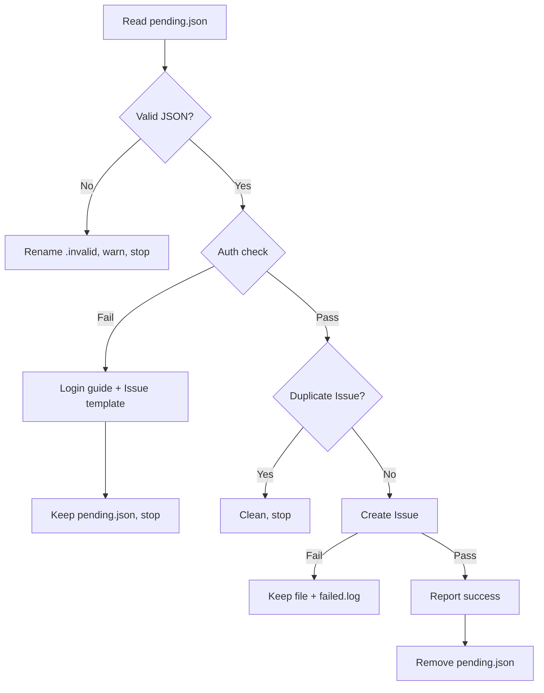

# 主动上报 bug 功能 P1/P2 遗留项修复实施计划

> **For agentic workers:** REQUIRED SUB-SKILL: Use superpowers:subagent-driven-development (recommended) or superpowers:executing-plans to implement this plan task-by-task. Steps use checkbox (`- [ ]`) syntax for tracking.

**Goal:** 修复「主动上报 bug」功能 4 项 P1/P2 遗留问题（认证口径统一 / 知情同意 / 品牌统一 / skill 规范）。

**Architecture:** 4 个独立任务：T1 改 hook 认证（`gh` → `gf --platform`）；T2 给 `gf doctor` 增加 co_contribution 类别（只读展示，复用 `read_co_contribution_flag`）；T3 品牌统一（hook banner + skill 标题前缀 + params 示例，保留 repo URL 与配置键）；T4 skill 规范（补 When to Use/Red Flags/Rationalization + 压缩词数，源 → 副本同步）。

**Tech Stack:** Rust 2024 + miette 7 · bash（Stop Hook）· bats 测试 · Claude Code skill 规范

**Spec:** `docs/superpowers/specs/2026-08-18-autoreport-bug-p1p2-design.md`（随计划传递，执行者需同时阅读）

## Global Constraints

- **保留不动：** 仓库 URL `byx-darwin/gitflow-cli`（真实 repo 名）、配置键 `gitflow.co_contribution`（既有键名）。
- **不改 `skills install` 写入逻辑**（历史设计 #82 global-only 保持）。
- skill 源在 `skills/gf-autoreport-bug/SKILL.md`；`.claude/skills/` 是 Claude Code 使用的副本，**两处必须同步**。
- 所有 Rust 变更须过 `make test` + `cargo clippy --all-targets --all-features -- -D warnings`。
- skill 修改后运行 `make check-agent-sync` 验证同步。

---

### Task 1: P1-1 hook 认证口径统一

**Files:**
- Modify: `hooks/auto-report-bug.sh:77`（`gh auth status` → `gf auth status --platform "$PLATFORM"`）
- Test: `hooks/tests/auto-report-bug.bats`（mock `gh` → mock `gf` + 传参断言）

**Interfaces:**
- Consumes: `$PLATFORM`（脚本前面已从 pending.json 提取）
- Produces: hook 认证用 `gf auth status --platform <platform>`，三平台口径统一

- [ ] **Step 1: 写失败测试（bats mock gf）**

编辑 `hooks/tests/auto-report-bug.bats` 的 setup()，将 mock `gh` 改为 mock `gf`：

```bash
  # --- Mock `gf`: records every invocation; auth result from $GF_AUTH_STATUS ---
  cat > "$bindir/gf" <<'MOCK'
#!/usr/bin/env bash
printf '%s\n' "$*" >> "$GF_CALL_LOG"
if [ "${GF_AUTH_STATUS:-ok}" = "fail" ]; then
  exit 1
fi
exit 0
MOCK
  chmod +x "$bindir/gf"

  export GF_AUTH_STATUS="ok"
  export GF_CALL_LOG="$BATS_TEST_TMPDIR/gf-calls.log"
  : > "$GF_CALL_LOG"
```

同时替换所有 `GH_AUTH_STATUS` / `GH_CALL_LOG` 引用为 `GF_*`。**注意**：`write_pending` 需包含 `"platform": "github"`（已有）。

新增测试断言 `--platform` 传参正确：

```bash
@test "auth success -> calls gf auth status with platform flag" {
  write_pending
  GF_AUTH_STATUS="ok"
  run_hook

  [ "$status" -eq 0 ]
  [ "$(wc -l < "$GF_CALL_LOG")" -eq 1 ]
  grep -q "auth status --platform github" "$GF_CALL_LOG"
}
```

- [ ] **Step 2: 运行测试验证失败**

```bash
bats hooks/tests/auto-report-bug.bats 2>&1 | tail -10
# 期望：旧 hook 用 gh，mock gf 不调用 → 相关测试 FAIL
```

> bats 本地未安装时，用 Step 3 后的手动模拟验证（与 wf-2026-08-18-006 T3 相同方法）。

- [ ] **Step 3: 修改 hook 认证**

编辑 `hooks/auto-report-bug.sh:77`：

```bash
    if gh auth status >/dev/null 2>&1; then
```

改为：

```bash
    if gf auth status --platform "$PLATFORM" >/dev/null 2>&1; then
```

同时更新脚本顶部注释（第 3 行附近的「gh CLI」描述 → 「gf CLI」）。

- [ ] **Step 4: 手动模拟验证（bats 不可用时）**

```bash
# 同 wf-2026-08-18-006 方法：mock gf 记录调用，验证 --platform github 被调用
```

期望：`gf auth status --platform github` 被调用；auth fail 时输出登录指引。

- [ ] **Step 5: 提交**

```bash
git add hooks/auto-report-bug.sh hooks/tests/auto-report-bug.bats
git commit -m "fix(hook): use gf auth status --platform for auth check (P1-1)"
```

---

### Task 2: P1-4 gf doctor 报告 co_contribution 状态

**Files:**
- Modify: `apps/cli/src/commands/doctor.rs`（新增 `CoContributionCheck` + 注册）
- Test: `apps/cli/src/commands/doctor.rs` 测试模块（类别断言）

**Interfaces:**
- Consumes: `crate::error_reporter::read_co_contribution_flag(path) -> bool`（已有，`pub(crate)`）；`gitflow_core::doctor::{CheckItem, HealthCheck}`；`dirs::home_dir`
- Produces: 新 doctor 类别 `co_contribution`，报告状态 + 退出指引

- [ ] **Step 1: 写失败测试（doctor 类别含 co_contribution）**

编辑 `apps/cli/src/commands/doctor.rs` 测试模块的 `test_should_collect_all_categories_in_report`（约 574 行），在 `assert!(categories.contains("agent_env"))` 后追加：

```rust
        assert!(categories.contains("co_contribution"));
```

- [ ] **Step 2: 运行测试验证失败**

```bash
cargo test -p gitflow-cli --bin gf commands::doctor::tests::test_should_collect_all_categories_in_report 2>&1 | tail -10
# 期望：FAIL（co_contribution 类别不存在）
```

- [ ] **Step 3: 新增 CoContributionCheck**

在 `apps/cli/src/commands/doctor.rs` 中，`GfSelfCheck` 之后新增：

```rust
/// Checks the co-contribution flag (bug auto-report opt-in).
///
/// Reports whether the user has joined the co-contribution plan and how to
/// opt out, making the auto-report feature discoverable and reversible.
pub struct CoContributionCheck;

impl HealthCheck for CoContributionCheck {
    fn category(&self) -> &'static str {
        "co_contribution"
    }

    fn run(&self) -> Vec<CheckItem> {
        let mut items = Vec::new();
        let enabled = dirs::home_dir().is_some_and(|home| {
            crate::error_reporter::read_co_contribution_flag(&home.join(".claude/settings.json"))
        });
        if enabled {
            items.push(CheckItem::pass(
                self.category(),
                "共建计划",
                "bug 自动上报已开启（~/.claude/settings.json）",
            ));
        } else {
            items.push(CheckItem::pass(
                self.category(),
                "共建计划",
                "未加入共建计划，bug 自动上报未开启",
            ));
        }
        // 退出指引（无论是否开启都展示，保持可发现性）
        let item = items.pop().expect("item exists");
        items.push(item.with_detail(
            "退出方式：编辑 ~/.claude/settings.json，移除 gitflow.co_contribution 字段后保存",
        ));
        items
    }
}
```

- [ ] **Step 4: 注册到 checks 列表**

编辑 `apps/cli/src/commands/doctor.rs:383-387`，在 `Box::new(AgentEnvCheck)` 后追加：

```rust
        Box::new(CoContributionCheck),
```

- [ ] **Step 5: 运行测试验证通过**

```bash
cargo test -p gitflow-cli --bin gf commands::doctor 2>&1 | tail -8
# 期望：全部通过（含新类别断言）
```

- [ ] **Step 6: 运行完整验证**

```bash
make test
cargo clippy --all-targets --all-features -- -D warnings
```

- [ ] **Step 7: 端到端验证 doctor 输出**

```bash
./target/debug/gf doctor 2>&1 | grep -A2 "co_contribution\|共建计划"
# 期望：显示共建计划状态 + 退出指引
```

- [ ] **Step 8: 提交**

```bash
git add apps/cli/src/commands/doctor.rs
git commit -m "feat(doctor): report co-contribution status + opt-out guide (P1-4)"
```

---

### Task 3: P2-1 品牌统一（gitflow → gf）

**Files:**
- Modify: `hooks/auto-report-bug.sh:120`（banner 文案）
- Modify: `skills/gf-autoreport-bug/SKILL.md:106`（标题前缀）
- Modify: `docs/references/gf-autoreport-bug-params.md:10,25-26,44`（示例命令）
- Modify: `.claude/skills/gf-autoreport-bug/SKILL.md`（同步副本）

**Interfaces:**
- Consumes: 无（独立）
- Produces: 品牌统一为 gf；repo URL 与配置键保留

- [ ] **Step 1: hook banner 文案**

编辑 `hooks/auto-report-bug.sh:120`：

```bash
echo "  🐛 检测到 gitflow CLI 错误报告"
```

改为：

```bash
echo "  🐛 检测到 gf CLI 错误报告"
```

- [ ] **Step 2: skill 标题前缀**

编辑 `skills/gf-autoreport-bug/SKILL.md:106`（Task 4 会重写整个文件，此步骤可合并到 Task 4；若独立执行）：

```markdown
--title "[auto-report] gitflow {command} — {error_code}"
```

改为：

```markdown
--title "[auto-report] gf {command} — {error_code}"
```

- [ ] **Step 3: params 示例命令**

编辑 `docs/references/gf-autoreport-bug-params.md`：
- 行 10：`"command": "gitflow issue create"` → `"command": "gf issue create"`
- 行 25-26：`gitflow issue create` / `gitflow pr create` → `gf issue create` / `gf pr create`
- 行 44：`--title "[auto-report] gitflow {cmd} — {err}"` → `--title "[auto-report] gf {cmd} — {err}"`

- [ ] **Step 4: 同步 skill 副本**

```bash
cp skills/gf-autoreport-bug/SKILL.md .claude/skills/gf-autoreport-bug/SKILL.md
```

- [ ] **Step 5: 验证品牌残留**

```bash
grep -rn "gitflow" hooks/auto-report-bug.sh skills/gf-autoreport-bug/SKILL.md docs/references/gf-autoreport-bug-params.md | grep -v "byx-darwin/gitflow-cli" | grep -v "gitflow.co_contribution"
# 期望：无输出（品牌残留仅剩 repo URL 与配置键）
```

- [ ] **Step 6: 提交**

```bash
git add hooks/auto-report-bug.sh skills/gf-autoreport-bug/SKILL.md .claude/skills/gf-autoreport-bug/SKILL.md docs/references/gf-autoreport-bug-params.md
git commit -m "refactor(brand): unify gitflow -> gf in banner and issue title prefix (P2-1)"
```

---

### Task 4: P2-2 skill 规范（When to Use/Red Flags/Rationalization + <500 词）

**Files:**
- Modify: `skills/gf-autoreport-bug/SKILL.md`（源，重写）
- Modify: `.claude/skills/gf-autoreport-bug/SKILL.md`（同步副本）

**Interfaces:**
- Consumes: 无（独立；Task 3 Step 2 的标题前缀改动并入本任务）
- Produces: 规范 skill 文档（词数 <500，含 When to Use/Red Flags/Rationalization）

- [ ] **Step 1: 重写 SKILL.md**

将 `skills/gf-autoreport-bug/SKILL.md` 重写为（保留核心内容，补规范章节，压缩冗余）：

````markdown
---
name: gf-autoreport-bug
description: |
  Use when `.cache/bug-reports/pending.json` exists and needs automated
  bug report processing (triggered by Stop Hook or manual invocation).
  当存在待处理的 bug 报告需要自动创建 Issue 时使用。
---

# gf-autoreport-bug

Processes `pending.json` → validate → auth → dedup → create Issue → cleanup.

## CLI Requirement

MUST use `gf` CLI, NOT `gh`. `gf` is this project's unified CLI (GitHub + GitLab + GitCode).

## Preconditions

- `gf` installed: `command -v gf`
- `gf` authenticated: `gf auth status`

## When to Use

| EN | ZH |
|----|----|
| pending.json exists | 存在待处理 bug 报告 |
| auto-report a bug | 自动上报缺陷 |
| Stop Hook triggered | Stop Hook 触发 |

## When NOT to Use

| Scenario | Use Instead |
|----------|-------------|
| Manual bug Issue creation | `/gf-issue-create` |
| Fixing the reported bug | `/gf-workflow` |
| No pending.json | — |
| Other repositories | Manual Issue creation |

## Decision Flow



## Workflow

1. **Validate** — `.cache/bug-reports/pending.json`; require `id`, `command`, `platform`, `error_code`, `error_message`, `timestamp`. Invalid → rename `.invalid`, stop.
2. **Auth** — `gf auth status --platform {platform}`. Fail → login guide + template, keep file, stop.
3. **Dedup** — `gf issue list --repo byx-darwin/gitflow-cli --search "[auto-report] {command} {error_code}"`. Match → clean, stop.
4. **Create** — Analyze root cause + severity. `gf issue create --repo byx-darwin/gitflow-cli --title "[auto-report] gf {command} — {error_code}" --label "auto-report"`. Fail → keep file + `failed.log`.
5. **Notify** — Output `✅ 已自动报告 bug: {issue_url}`.
6. **Cleanup** — `rm -f .cache/bug-reports/pending.json`.

## Error Handling

| Error | Action |
|-------|--------|
| Missing pending.json | "No pending reports", stop |
| Invalid JSON | Rename `.invalid`, warn, stop |
| Auth failure | Login guide + template, keep file |
| Dedup hit | Clean, show existing Issue |
| Create failure | Keep file + `failed.log` |

## Responsibility

- ✅ Report bugs only; never fix.
- ✅ Read pending.json, auth check, dedup, create Issue, cleanup.
- ❌ Modify code, launch fix flows, or analyze source for remediation.
- 🔧 Fix flow: user-initiated via `/gf-workflow --fast`.

## Red Flags

- 🔴 Reading `src/` files to "understand the bug" — analysis crosses the fix boundary.
- 🔴 Saying "I'll just fix this too" — report only.
- 🔴 Skipping dedup — always search before create.
- 🔴 Missing `--repo` — always target `byx-darwin/gitflow-cli`.

## Rationalization Excuses

| Excuse | Reality |
|--------|---------|
| "Only looking, not fixing" | Any source analysis crosses the boundary |
| "Same bug, fix together" | Report only; fixes need user workflow |
| "Dedup wastes time" | Duplicate Issues pollute the tracker |

## Common Mistakes

- ❌ Attempting to fix the bug — report only.
- ❌ Skipping dedup — always search first.
- ❌ Missing `--repo` — always target the fixed repo.
````

- [ ] **Step 2: 验证词数 <500**

```bash
wc -w skills/gf-autoreport-bug/SKILL.md
# 期望：< 500
```

- [ ] **Step 3: 同步副本**

```bash
cp skills/gf-autoreport-bug/SKILL.md .claude/skills/gf-autoreport-bug/SKILL.md
```

- [ ] **Step 4: 验证副本一致 + agent-sync**

```bash
diff skills/gf-autoreport-bug/SKILL.md .claude/skills/gf-autoreport-bug/SKILL.md && echo "✅ 一致"
make check-agent-sync 2>&1 | tail -5
```

- [ ] **Step 5: 提交**

```bash
git add skills/gf-autoreport-bug/SKILL.md .claude/skills/gf-autoreport-bug/SKILL.md
git commit -m "docs(skill): add When to Use/Red Flags/Rationalization, trim to <500 words (P2-2)"
```

---

## Self-Review（写后自检）

**Spec 覆盖：**
- T1 → §3.1 P1-1（hook 认证 + bats mock gf + 传参断言）✅
- T2 → §3.2 P1-4（doctor 类别 + 退出指引 + 单测）✅
- T3 → §3.3 P2-1（banner/标题前缀/params；repo URL 与配置键保留）✅
- T4 → §3.4 P2-2（When to Use/Red Flags/Rationalization + <500 词 + 副本同步）✅
- AC1→T1S1-S4 · AC2→T2S5-S7 · AC3→T3S5 · AC4→T4S2-S4 · AC5→各任务 Step 验证 ✅

**占位符扫描：** 无 TBD/TODO；所有代码块含完整内容。

**类型一致性：** `CoContributionCheck` 实现 `HealthCheck`（`category()`/`run()`），注册到 `checks: Vec<Box<dyn HealthCheck>>`（doctor.rs:383-387）；`read_co_contribution_flag` 已是 `pub(crate)`（error_reporter.rs:232）；`CheckItem::pass`/`with_detail` 签名已核实（core/src/doctor.rs:118,195）。T3 Step 2 的标题前缀改动在 T4 Step 1 的完整重写中已含（`[auto-report] gf {command}`），避免重复编辑冲突。

**测试注意：** T1 bats 的 mock 从 `gh` 改为 `gf` 需同步替换所有 `GH_*` 变量（5 个现有用例引用）；T2 新增类别需在 `test_should_collect_all_categories_in_report` 中追加断言（现有 4 个类别基础上 +1）。
