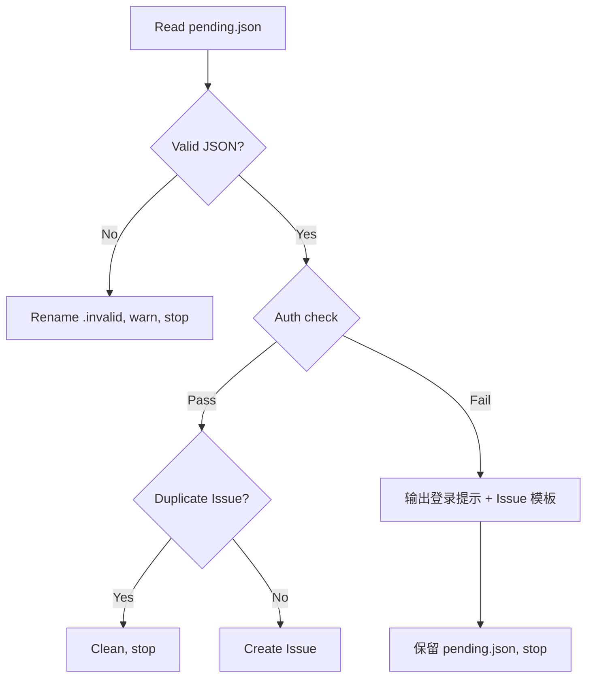

# 共建计划（Co-Contribution Plan）设计文档

**日期**: 2026-07-09
**状态**: Draft
**作者**: byx-darwin

## 概述

为 `gitflow-cli skills install` 添加"共建计划"功能。用户加入共建计划后，CLI 在非交互模式下遇到的错误将自动上报为 GitHub Issue，形成用户-项目的正向反馈循环。

## 动机

当前 `skills install` 安装的 Stop Hook 和 `gitflow-autoreport-bug` Skill 构成了完整的自动 bug 上报管道，但缺少一个关键环节：**安装时不验证 GitHub 登录状态**。未登录的用户安装了 hook 也无法成功创建 Issue。

共建计划解决三个问题：
1. **安装时验证 auth**：确保用户已登录 GitHub，使上报管道端到端可用。
2. **Opt-in 模型**：只有明确加入共建计划的用户才会上报 bug，尊重用户选择。
3. **未登录 fallback**：即使上报时 auth 失败，也给出可操作的指引（登录或手动创建 Issue）。

## 核心场景

共建计划主要服务于 **Agent/CI 工作流**（Claude Code / Codex 等非交互调用 gitflow-cli 的场景）。在这些场景中，CLI 错误对用户不可见，自动上报是唯一的质量反馈渠道。

普通控制台使用（交互模式）不受影响——用户能直接看到错误，不需要自动上报。

## 设计决策

| 决策 | 选择 | 理由 |
|------|------|------|
| 上报策略 | Opt-in（仅共建成员） | 尊重用户选择，明确同意后才收集 |
| 上报场景 | 仅非交互模式 | 交互模式下用户直接看到错误，无需自动上报 |
| Auth 失败处理 | 输出登录提示 + Issue 模板 | 给用户可操作的 fallback，而非静默失败 |
| 标记存储 | settings.json 自定义字段 | 与现有 hook 配置共存，不引入新存储位置 |
| Auth 检查方式 | 复用 `GitHubAuthProvider`（同步） | 与 `skills install` 的同步执行模型一致 |
| 交互方式 | 纯文本提示（无 TUI） | 简单直接，无需额外依赖 |

## 架构

### 数据流

```
Install 阶段:
  gitflow skills install
    ├── 安装 skills 文件（始终执行）
    ├── 安装 Stop Hook（始终执行）
    ├── 检测交互模式
    │   ├── 非交互 → 打印 "ℹ️ 非交互模式，已跳过共建计划" → return
    │   └── 交互 → 继续
    ├── 打印共建计划说明
    ├── 交互询问 "是否加入共建计划？[Y/n]"（默认接受）
    │   ├── 拒绝 → 打印 "已跳过" → return
    │   └── 接受 → 继续
    ├── 检查 gh auth status
    │   ├── 已登录 → 写 settings.json 标记 → "✅ 共建计划已激活"
    │   └── 未登录 → 引导登录流程
    │       ├── 询问 "是否现在执行 gh auth login？[Y/n]"
    │       │   ├── 接受 → 执行 gh auth login（继承 TTY）
    │       │   │   ├── 成功 → 写标记 → "✅ 共建计划已激活"
    │       │   │   └── 失败 → 打印手动指引
    │       │   └── 拒绝 → 打印手动指引
    │       └── gh binary 不存在 → 打印安装指引

运行阶段（CLI 报错）:
  gitflow-cli <command> 失败（非交互模式）
    ├── error_reporter 检查 co_contribution 标记
    │   ├── 有标记 → 写 pending.json
    │   └── 无标记 → 静默跳过（不上报）
    └── Stop Hook 检测 pending.json
        ├── gh auth status
        │   ├── 已登录 → 自动创建 Issue（现有流程）
        │   └── 未登录 → 输出登录提示 + Issue 内容模板
        └── 保留 pending.json（等待下次触发）
```

### settings.json 新增字段

```json
{
  "hooks": {
    "Stop": [
      {
        "matcher": "gitflow",
        "hooks": [
          {
            "type": "command",
            "command": "bash .claude/hooks/auto-report-bug.sh"
          }
        ]
      }
    ]
  },
  "gitflow": {
    "co_contribution": true,
    "joined_at": "2026-07-09T08:30:00Z"
  }
}
```

`gitflow` 字段为 gitflow-cli 自定义命名空间，不影响 Claude Code 或其他 Agent 的配置解析。

## 详细设计

### 1. Install 阶段（`apps/cli/src/commands/skills.rs`）

在 `install_skills()` 函数末尾（hook 安装之后）新增共建计划流程：

```rust
// 1. 检测交互模式
if !std::io::stderr().is_terminal() {
    println!("ℹ️ 非交互模式，已跳过共建计划");
    return Ok(());
}

// 2. 打印共建计划说明
println!();
println!("🤝 共建计划：加入后，CLI 错误将自动上报为 GitHub Issue，帮助改进 gitflow-cli。");
println!("   仅非交互模式（Agent/CI）下生效，普通控制台使用不受影响。");
println!();

// 3. 交互询问
if !confirm("是否加入共建计划？", true)? {
    println!("已跳过共建计划。你可以稍后运行 `skills install --force` 重新加入。");
    return Ok(());
}

// 4. 检查 GitHub auth
let auth_provider = gitflow_cli_github::GitHubAuthProvider::new();
if auth_provider.is_authenticated() {
    merge_co_contribution(global, platform)?;
    println!("✅ 共建计划已激活");
} else {
    // 引导登录
    println!("⚠️ 未检测到 GitHub 登录。");
    if confirm("是否现在执行 `gh auth login`？", true)? {
        let status = std::process::Command::new("gh")
            .args(["auth", "login"])
            .stdin(std::process::Stdio::inherit())
            .stdout(std::process::Stdio::inherit())
            .stderr(std::process::Stdio::inherit())
            .status();
        match status {
            Ok(s) if s.success() => {
                merge_co_contribution(global, platform)?;
                println!("✅ 共建计划已激活");
            }
            _ => {
                println!("登录失败。请手动运行 `gh auth login`，然后重新 `skills install --force`。");
            }
        }
    } else {
        println!("请手动运行 `gh auth login`，然后重新 `skills install --force` 激活共建计划。");
    }
}
```

**新增辅助函数**：

- `confirm(prompt: &str, default: bool) -> miette::Result<bool>`：读取 stdin 的 Y/n 确认。
  - 显示 `prompt` 后读取一行输入
  - 接受 `y/Y/yes/YES` → `true`
  - 接受 `n/N/no/NO` → `false`
  - 空输入 → 返回 `default` 参数值
  - EOF（stdin 关闭）→ 返回 `default` 参数值（非交互降级）
  - 其他输入 → 重新提示，最多重试 3 次，之后返回 `default`
  - 实现注意：使用 `std::io::BufRead::read_line()`，不依赖外部 crate

- `merge_co_contribution(global: bool, platform: AgentPlatform) -> miette::Result<()>`：将 `gitflow.co_contribution` 字段写入 settings.json。
  - 复用现有的 `resolve_hook_paths()` 定位 settings 文件
  - 读取现有 JSON → 合并 `gitflow.co_contribution = true` + `gitflow.joined_at = <ISO 8601>` → 写回
  - 保留已有的 `hooks` 字段和其他配置不变

### 2. Error Reporter 改动（`apps/cli/src/error_reporter.rs`）

在 `maybe_report_error()` 中增加共建计划标记检查：

```rust
pub(crate) fn maybe_report_error(
    command: &str,
    platform: &str,
    error_message: &str,
    error_code: &str,
) -> std::io::Result<()> {
    if should_skip_reporting() {
        return Ok(());
    }

    // 新增：检查共建计划标记
    if !is_co_contribution_enabled()? {
        return Ok(());
    }

    let report = ErrorReport::from_error(command, platform, error_message, error_code);
    let repo_root = find_repo_root()?;
    report.write_to_disk(&repo_root)
}
```

**新增函数** `is_co_contribution_enabled()`：

```rust
/// 检查 settings.json 中是否启用了共建计划。
///
/// 依次检查两个位置（项目级优先）：
/// 1. `<repo_root>/.claude/settings.json`（项目级安装）
/// 2. `~/.claude/settings.json`（全局安装 `-g`）
///
/// 任一位置的 `gitflow.co_contribution` 为 `true` 即返回 `true`。
/// 文件不存在或字段缺失时返回 `false`（opt-in 模型）。
/// 任何 I/O 或解析错误均静默降级为 `false`。
fn is_co_contribution_enabled() -> std::io::Result<bool> {
    // 1. 检查项目级 settings
    if let Ok(repo_root) = find_repo_root() {
        let project_settings = repo_root.join(".claude/settings.json");
        if read_co_contribution_flag(&project_settings) {
            return Ok(true);
        }
    }

    // 2. 检查全局 settings
    if let Some(home) = dirs::home_dir() {
        let global_settings = home.join(".claude/settings.json");
        if read_co_contribution_flag(&global_settings) {
            return Ok(true);
        }
    }

    Ok(false)
}

/// 从指定 settings.json 路径读取 `gitflow.co_contribution` 标志。
fn read_co_contribution_flag(path: &std::path::Path) -> bool {
    let content = match std::fs::read_to_string(path) {
        Ok(c) => c,
        Err(_) => return false,
    };
    let json: serde_json::Value = match serde_json::from_str(&content) {
        Ok(j) => j,
        Err(_) => return false,
    };
    json.pointer("/gitflow/co_contribution")
        .and_then(|v| v.as_bool())
        .unwrap_or(false)
}
```

**行为矩阵**：

| 项目级 settings | 全局 settings | 行为 |
|---|---|---|
| 不存在 / 无标记 | 不存在 / 无标记 | 不上报 |
| `co_contribution: true` | — | **上报** |
| — | `co_contribution: true` | **上报** |
| `co_contribution: false` | `co_contribution: true` | **上报**（全局覆盖） |
| `co_contribution: true` | `co_contribution: false` | **上报**（项目级覆盖） |
| `co_contribution: false` | `co_contribution: false` | 不上报 |
| JSON 解析失败 | — | 不上报（静默降级） |

### 3. Hook 改动（`hooks/auto-report-bug.sh`）

Auth 检查失败时的新逻辑：

```bash
# Auth 检查失败时：
if [ "$AUTH_CHECK_FAILED" = "true" ]; then
  echo ""
  echo "━━━━━━━━━━━━━━━━━━━━━━━━━━━━━━━━━━━━━━━━━━━━━━━━━━━━━"
  echo "  ⚠️  GitHub 未登录，无法自动创建 Issue"
  echo "━━━━━━━━━━━━━━━━━━━━━━━━━━━━━━━━━━━━━━━━━━━━━━━━━━━━━"
  echo ""
  echo "  方式 1: 登录后重新触发（推荐）"
  echo "    gh auth login"
  echo ""
  echo "  方式 2: 手动创建 Issue"
  echo "    URL: https://github.com/byx-darwin/gitflow-cli/issues/new"
  echo ""
  echo "  📋 报告内容（可复制）:"
  echo "  ---"
  echo "  **命令**: ${COMMAND}"
  echo "  **平台**: ${PLATFORM}"
  echo "  **错误码**: ${ERROR_CODE}"
  ERROR_MSG=$(echo "$PENDING_CONTENT" | grep -o '"error_message"[[:space:]]*:[[:space:]]*"[^"]*"' | head -1 | sed 's/.*: *"//;s/"$//')
  echo "  **错误信息**: ${ERROR_MSG}"
  echo "  **时间**: ${TIMESTAMP}"
  echo "  ---"
  echo ""
  # 保留 pending.json，等用户登录后下次触发
  exit 0
fi
```

### 4. Skill 改动（`skills/gitflow-autoreport-bug/SKILL.md`）

在 Decision Flow 中增加"未登录 fallback"分支：



Skill 正文中增加未登录处理说明：

> **Auth 失败处理**：当 `gitflow-cli auth status` 返回未登录时，不要尝试创建 Issue。改为：
> 1. 输出登录提示：`gh auth login`
> 2. 输出手动 Issue URL：`https://github.com/byx-darwin/gitflow-cli/issues/new`
> 3. 格式化 pending.json 内容为可复制的 Issue 模板
> 4. 保留 pending.json，不做清理

## 改动文件汇总

| 文件 | 改动类型 | 说明 |
|------|---------|------|
| `apps/cli/src/commands/skills.rs` | 新增逻辑 | 共建计划询问 + auth 检查 + settings.json 标记写入 |
| `apps/cli/src/error_reporter.rs` | 修改 | 增加 `is_co_contribution_enabled()` 检查 |
| `hooks/auto-report-bug.sh` | 修改 | Auth 失败时输出登录提示 + Issue 模板 |
| `skills/gitflow-autoreport-bug/SKILL.md` | 修改 | 增加未登录 fallback 分支 |

## 错误处理

| 场景 | 处理 |
|------|------|
| `skills install` 非交互模式 | 跳过共建询问，不写标记 |
| `skills install` 用户拒绝共建 | 打印 "已跳过"，不写标记 |
| `skills install` 用户接受但未登录 | 引导登录，失败则打印手动指引 |
| `skills install` gh binary 不存在 | 打印 "未找到 gh，请先安装 GitHub CLI" + 安装指引 |
| `error_reporter` 无 settings.json | `co_contribution` 视为 false，不上报 |
| `error_reporter` settings.json 解析失败 | 静默降级，不上报（不阻塞 CLI） |
| Hook auth 失败 | 输出登录提示 + Issue 模板，保留 pending.json |

## 测试策略

| 测试类型 | 覆盖范围 |
|---------|---------|
| 单元测试 | `merge_co_contribution()` JSON 合并逻辑 |
| 单元测试 | `is_co_contribution_enabled()` 各种 settings.json 状态 |
| 单元测试 | `should_skip_reporting()` 与 `is_co_contribution_enabled()` 的组合 |
| 单元测试 | `confirm()` 辅助函数的各种输入 |
| 集成测试 | `skills install` 交互流程（mock stdin/stdout） |
| E2E 测试 | 完整流程：install → 加入共建 → CLI 报错 → pending.json → Hook 触发 |

## 向后兼容

- `--report-bug` 默认行为不变（仍然安装 hook）
- 未加入共建计划的用户行为完全不变（不上报 bug）
- settings.json 新增 `gitflow` 字段不影响现有 `hooks` 字段解析
- 已有用户需重新运行 `skills install --force` 加入共建计划

## 已知问题（本次一并修复）

1. **`--report-bug=false` 不起作用**：当前只有 `ArgAction::SetTrue`，无法取反。需要改为 `ArgAction::Set` + `default_value_t = true` 以支持 `--report-bug=false`。
2. **bundled-counter 死代码**：`install_single_skill_bundled()` 中 `overwritten += 1` 分支不可达（line 419-421），需修复。

## 未来扩展

- 支持 GitLab/GitCode 平台的共建计划（当前仅 GitHub）
- 共建计划成员统计仪表盘
- 可选的错误类型过滤（只上报特定类型的错误）
