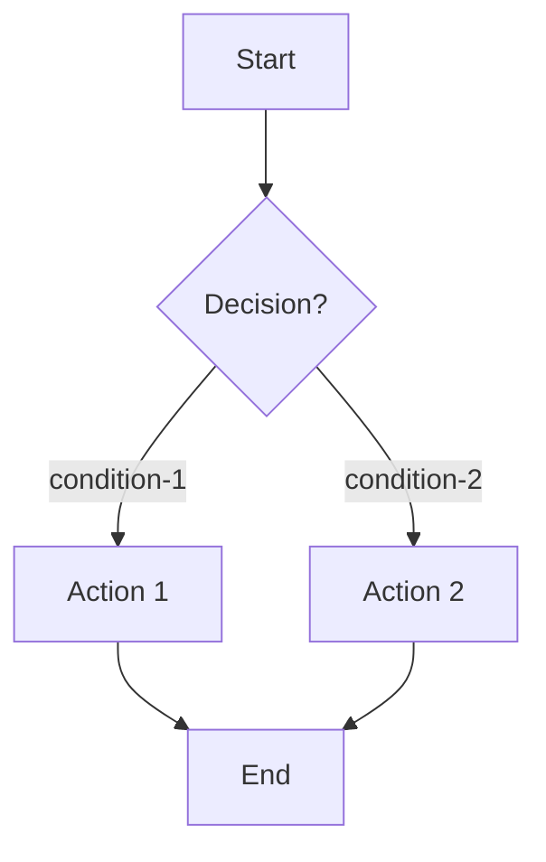

# Skill Conventions

> **Version:** 1.0.0
> **Date:** 2026-07-07
> **Scope:** Applies to all 26 skills in `.claude/skills/`
> **Companion:** `docs/superpowers/templates/skill-template.md`

---

## 1. Token Budget Policy

### 1.1 Hard Limit

Every `SKILL.md` MUST be ≤ **500 English/Chinese words** (excluding code blocks, YAML frontmatter, and HTML comments).

Rationale: Claude loads `SKILL.md` in full into context. At 26 skills, a single skill loaded in isolation must be self-contained within a small token envelope. 500 words ≈ 700–800 tokens, leaving headroom for user conversation and tool results.

### 1.2 How to Count

```bash
# Count words excluding fenced code blocks and frontmatter:
perl -0 -ne 's/^---\n.*?^---\n//ms; s/```.*?```//gs; s/`[^`]+`//g; print scalar(/\p{L}+/g), "\n"' SKILL.md
```

Gray-area elements excluded from the count:
- YAML frontmatter (`name`, `description`)
- Fenced code blocks (commands, JSON examples)
- HTML comments (`<!-- -->`)

Elements that count toward the limit:
- Prose paragraphs, table cell contents, bullet lists, headers
- Inline code (each inline-code token counts as 1 word)

### 1.3 Externalization Rules

When prose threatens the budget, externalize in this priority order:

| Content to Externalize | Externalize To |
|-----------------------|----------------|
| Parameter reference tables (20+ rows) | `docs/references/{skill-name}-params.md` |
| Long examples (> 3 lines) | `docs/examples/{skill-name}/<example>.md` |
| Schema definitions | `docs/schemas/{skill-name}.json` |
| Compliance checklists / audit templates | `docs/superpowers/templates/{template-name}.md` |
| Narrative walkthroughs | Do NOT externalize; rewrite as pattern language |

Externalized documents are referenced with a single-line link in `SKILL.md`:

```markdown
See [full parameter reference](../references/{skill-name}-params.md).
```

### 1.4 Pattern Language Over Narrative

Replace narrative examples ("Let's say a user named Alice encounters a 401 on line 42...") with pattern language:

```markdown
<!-- BAD: narrative -->
Alice runs `gitflow issue create` but gets a 401 because her token expired.

<!-- GOOD: pattern -->
Scenario: `gitflow-cli issue create` returns `401 Unauthorized`.
Recovery: Run `gitflow-cli auth login --platform {platform}` then retry.
```

Pattern language structure: **[Condition] → [Action] → [Expected Result]**. Each triplet is 5–10 words; a narrative equivalent is 25–50 words.

### 1.5 Enforcement

Phase 4 validation (TASK-59) runs word-count on every skill. If any skill exceeds 500 words, the reducer is responsible for externalization or compression. The fix must not weaken test coverage or remove red-flag entries.

---

## 2. Cross-Reference Convention (`## See Also`)

### 2.1 Required Every Skill

Every `SKILL.md` MUST contain a `## See Also` section with at least 2 cross-references.

### 2.2 Format

```markdown
## See Also

- `<skill-name>` — <present-tense verb phrase describing relationship>
- `<skill-name>` — <present-tense verb phrase>
```

Rules:
- Reference skills by their slash-command name (e.g., `/gitflow-commit`), NOT by file path.
- Use present-tense verb phrasing: "creates commits", "reviews PRs", "audits pipeline".
- Bidirectional consistency: if skill A references skill B, skill B MUST reference skill A.
- Order: most-related first, alphabetically within same relevance tier.

### 2.3 Cluster Coordination

Skills in the same functional cluster MUST cross-reference each other:

| Cluster | Skills |
|---------|--------|
| PR review | `gitflow-pr`, `gitflow-pr-review`, `gitflow-pr-inline-review`, `gitflow-pr-apply-feedback`, `gitflow-review` |
| Issue lifecycle | `gitflow-issue`, `gitflow-issue-create`, `gitflow-issue-review`, `gitflow-issue-triage` |
| Release | `gitflow-release`, `gitflow-release-helper` |
| Quality | `gitflow-precommit`, `gitflow-quality`, `gitflow-security-check` |
| Repo | `gitflow-repo`, `gitflow-repo-onboarding` |

### 2.4 External Documents

Reference external docs (templates, references) with relative paths:

```markdown
- `docs/superpowers/templates/skill-template.md` — Template this skill conforms to.
- `docs/references/{skill-name}-params.md` — Full parameter reference.
```

---

## 3. Test Scenario Format (`## Test Scenarios`)

### 3.1 Mandatory Scenarios

Each skill MUST define at minimum 4 scenarios:

| # | Type | Mandatory | Purpose |
|---|------|-----------|---------|
| 1 | Happy Path | Yes | Verify skill succeeds in normal conditions |
| 2 | Negative (Should Not Trigger) | Yes | Verify skill refusal when another skill should handle it |
| 3 | Boundary (Overstep Temptation) | Yes | Verify skill refuses to exceed its out-of-scope list |
| 4 | Error (CLI / Auth / Timeout) | Yes | Verify skill follows Error Handling recovery, does not improvise |

Optional (P2 phase):
| 5 | Baseline | No | Verify skill didn't regress after refactor |
| 6 | Stress | No | Verify skill holds under adversarial pressure combinations |

### 3.2 Scenario Structure

Each scenario uses this exact structure:

```markdown
### Scenario {N}: {Short Title}

- **Given** <starting state — existing files, auth state, platform>
- **When** <action — user utterance, hook event, CLI call>
- **Then** <expected outcome — concrete, observable, verifiable>
```

For negative scenarios:

```markdown
### Scenario {N}: Negative — {What Should Not Trigger}

- **Given** <state belonging to a different skill's domain>
- **When** "<exact user utterance that could cause misfire>"
- **Then** Claude does NOT load this skill. Claude redirects to `<correct-skill>`.
```

### 3.3 Stress Test Format (P2)

Stress tests are stored separately at `docs/superpowers/tests/skills/{skill-name}-test.md`. They follow the existing pattern in the repo (see `gitflow-workflow-test.md` and `gitflow-autoreport-bug-test.md` as reference):

- 5 stress scenarios minimum per skill
- Each scenario combines 2–3 pressure dimensions (time, authority, sunk cost, fatigue, information noise, urgency, boundary temptation)
- Table at bottom tracks run results: `| 场景 | 运行日期 | 结果 | 违反的行为 | 合理化借口 | 备注 |`

### 3.4 Verification Independence

Each scenario must be verifiable by an independent agent WITHOUT access to the skill source. The `Then` clause must reference only observable artifacts:
- CLI command output / exit code
- Files created or modified (paths, not content)
- Issue / PR URLs
- Hook trigger events
- Skill NOT loaded (negative case)

---

## 4. Trigger Keyword Convention (`description` + `## When to Use` + `## Trigger Keywords`)

### 4.1 Frontmatter `description` Format

The YAML `description` MUST use "Use when..." trigger-only format:

```yaml
description: |
  Use when <english trigger — past-tense adjective + damaged object, no functional description>.
  当 <中文触发条件> 时使用。
```

Rules:
- MUST start with `Use when` (English portion).
- MUST describe the **trigger condition**, NOT the skill's function.
  - ❌ `description: Creates and manages Issues on GitHub/GitLab/GitCode.`
  - ✅ `description: Use when the user needs to create, view, close, or comment on a repository issue.`
- MUST contain bilingual content (English + Chinese).
- MUST NOT contain: "This skill wraps...", "Encapsulates the CLI command...", "A skill for...".

### 4.2 Bilingual Trigger Keyword Table

Each skill MUST provide a `## Trigger Keywords` section with at least 3 English + 3 Chinese keywords:

```markdown
## Trigger Keywords

| English | 中文 |
|---------|------|
| create issue | 创建 issue |
| close issue | 关闭 issue |
| list issues | 列出 issues |
```

### 4.3 `## When to Use` Section

```markdown
## When to Use

| English | 中文 | Trigger Context |
|---------|------|-----------------|
| <keyword> | <关键词> | <when to fire> |
| <keyword> | <关键词> | <when NOT to fire — for negative cases> |
```

The third column disambiguates keywords that could cross skill boundaries.

---

## 5. Rationalization Excuse Counter-Table Format (`## Rationalization Excuses`)

### 5.1 Purpose

When Claude is tempted to skip a step, shortcut a workflow, or exceed its boundary, it generates "rationalization excuses" — seemingly reasonable justifications for non-compliance. The counter-table preemptively lists these excuses and their rebuttals.

### 5.2 Format

```markdown
## Rationalization Excuses

| Excuse | Reality |
|--------|---------|
| "<exact phrase Claude might say>" | <one-sentence logical rebuttal> |
| "<exact phrase>" | <rebuttal> |
```

### 5.3 Excuse Sourcing

Populate this table from:
1. Existing stress test scenarios (see `docs/superpowers/tests/skills/*-test.md`) — the "合理化借口" field in each scenario.
2. Common patterns from the Superpowers writing-skills methodology.
3. Skill-specific past incidents (if any).

### 5.4 Minimum Entries

- High-risk skills (publishes to remote): minimum 5 entries.
- Medium-risk skills (modifies state): minimum 3 entries.
- Low-risk (read-only) skills: minimum 1 entry (typically "skip the precondition check").

---

## 6. Red Flags Format (`## Red Flags`)

### 6.1 Purpose

Red Flags identify external pressure signals that MAY cause Claude to violate the skill's responsibility boundaries. They are runtime tripwires — when the user (or circumstance) triggers one, Claude MUST invoke the corresponding boundary defense.

### 6.2 Format

```markdown
## Red Flags

- 🚩 <signal pattern — e.g. user says "skip the {check}"> — <defense: e.g. cite {section}, refuse, stop>
- 🚩 <signal pattern> — <defense>
- 🚩 <signal pattern> — <defense>
```

### 6.3 Canonical Red Flag Patterns

These patterns appear across nearly every skill. Customize the `{placeholder}` per skill:

| Red Flag Signal | Defense |
|----------------|---------|
| User says "skip the {precondition}" | Refuse. Cite Preconditions section. Stop. |
| Authority figure says "you don't need to {step}" | Refuse. Steps are non-skippable regardless of authority. |
| User says "it's urgent, just {shortcut}" | Urgency does not override gates. Offer mode switch (e.g., `--fast`) instead. |
| User says "{out-of-something} while you're at it" | Refuse. That is Out of Scope. Redirect to `<other-skill>`. |
| Claude "already checked this before" | Each skill invocation is independent. Always verify. |
| "The user already knows the context" | Context must be verified programmatically, not assumed. |
| Tool fails Claude improvises alternative flow | Follow Error Handling table exactly. Do not improvise. |

### 6.4 Skill-Specific Red Flags

In addition to the canonical table above, each skill MUST include at least 1 skill-specific red flag. Examples:

- **gitflow-autoreport-bug**: User says "just fix the bug while you're reporting it" → Refuse. This skill reports only.
- **gitflow-pr-inline-review**: Claude wants to approve the PR after inline approval → Refuse. Inline review and approval are separate skills.
- **gitflow-security-check**: Claude wants to auto-fix a vulnerability → Refuse. Detection only.
- **gitflow-review**: Claude wants to merge after approval → Refuse. Review and merge are separate skills.

---

## 7. Responsibility Section Format (`## Responsibility`)

### 7.1 Required Three Sub-sections

```markdown
## Responsibility

### ✅ In Scope
- <bullet list>

### ❌ Out of Scope
- <bullet list>

### 🚫 Do Not
- ❌ <imperative prohibition>
- ❌ <imperative prohibition>
```

### 7.2 Rules

- **In Scope**: Maximum 6 bullets. If more, the skill is too large and should be split.
- **Out of Scope**: Every out-of-scope item MUST redirect to another skill or to manual user action.
- **Do Not**: Imperative, specific, verifiable. "Be careful" is not a Do Not. "❌ Do not call `gitflow-cli issue close` without explicit user confirmation" is.

### 7.3 Boundary Bidirectionality

If skill A lists skill B as out-of-scope, skill B MUST list skill A as in-scope for that capability (or vice-versa). Conflicts are resolved during Cluster Coordination (plan Section 5).

---

## 8. Quick Reference Format (`## Quick Reference`)

### 8.1 Structure

A command cheat-sheet table:

```markdown
## Quick Reference

| Goal | Command |
|------|---------|
| <action> | `gitflow-cli <cmd> <flags>` |
```

### 8.2 Rules

- 3–8 rows per skill.
- Each row MUST be a single command (not a multi-step workflow).
- Commands use placeholders (`<number>`, `<sha>`, `<platform>`) for user-supplied values.
- No prose explanations in this section.

---

## 9. Mermaid Flowchart Convention

### 9.1 When Required

Skills with 3+ decision branches in their control flow MUST include a Mermaid flowchart.

Applies to: `gitflow-issue` (7 subcommands), `gitflow-workflow` (4 phases), `gitflow-pr` (11 subcommands), `gitflow-review` (approve vs submit), `gitflow-precommit` (fix vs report), `gitflow-release-helper` (version decision), `gitflow-quality` (gate logic), `gitflow-regression` (pass/fail paths), `gitflow-label-milestone` (CRUD matrix), `gitflow-pr-apply-feedback` (evaluate vs implement).

### 9.2 Format

```markdown
## Flowchart


```

Count toward token budget: **0** (excluded as a code block).

---

## 10. Success Criteria Format (`## Success Criteria`)

### 10.1 Rules

- Every criterion MUST be a checkbox (`- [ ]`).
- Every criterion MUST be independently verifiable (observable artifact or CLI confirmation).
- 3–6 criteria per skill.

### 10.2 Template

```markdown
## Success Criteria

- [ ] <measurable outcome — e.g. "Issue #{number} created with URL returned to user">
- [ ] <boundary adherence — e.g. "No out-of-scope commands executed">
- [ ] <verification — e.g. "Precondition check passed before any mutation">
```

---

## 11. Common Mistakes Format (`## Common Mistakes`)

### 11.1 Structure

```markdown
## Common Mistakes

- ❌ **<mistake title>** — <one sentence explaining why wrong + what to do instead>
```

### 11.2 Minimum Entries

- 2 entries per skill minimum.
- Sourced from: existing skill gaps discovered during RED-phase analysis, stress test rationalization excuses, cluster boundary confusion patterns.

---

## 12. YAML Frontmatter Conventions

### 12.1 Required Fields

```yaml
---
name: gitflow-{skill-name}
description: |
  Use when <english trigger>.
  当 <中文触发条件> 时使用。
---
```

- `name`: MUST match directory name under `.claude/skills/`.
- `description`: MUST trigger-only. MUST be bilingual. MUST NOT exceed 2 lines.

### 12.2 NO Additional Fields

No `version`, `author`, `tags`, or custom fields. Keep the frontmatter minimal so the description has room for the trigger condition.

---

## 13. Prohibited Content

The following MUST NOT appear in any `SKILL.md`:

| Prohibited | Reason | Replacement |
|-----------|--------|-------------|
| `cargo build`, `cargo test`, `cargo clippy` | Build commands belong in `Makefile`, not skill docs | "Run `make build`" |
| `unwrap()`, `expect()`, `panic!` in examples | Error handling demonstration | Use `match` or `?` with context |
| Real email addresses, usernames, tokens | Security policy | Placeholders like `<user>`, `<token>` |
| Narrative walkthroughs ("Alice runs into...") | Token waste, ambiguous scope | Pattern language: Condition → Action → Result |
| Fictional example data | Misleading | Placeholder values: `<sha>`, `<number>`, `<platform>` |
| "TODO", "coming soon", "TBD" | Incomplete implementation | Remove; implement the real content |
| References to `docs/superpowers/specs/` or `docs/superpowers/plans/` | Specs/plans are not user-facing | Reference `docs/references/` or `docs/templates/` only |
| Full command parameter tables (if > 10 rows) | Token budget | Externalize to `docs/references/{skill-name}-params.md` |
| Deprecation notices or legacy compat layers | Dead code | Remove or replace with the current approach |

---

## 14. File Location Reference

```
.claude/skills/{skill-name}/
└── SKILL.md                          # ≤ 500 words, the only file in most cases

docs/
├── references/
│   └── {skill-name}-params.md        # Externalized parameter tables (if needed)
├── examples/
│   └── {skill-name}/
│       └── {example}.md              # Externalized long examples (if needed)
├── schemas/
│   └── {skill-name}.json             # Externalized schemas (if needed)
├── superpowers/
│   ├── templates/
│   │   ├── skill-template.md         # Canonical template (this document's companion)
│   │   └── skill-conventions.md      # This file
│   ├── tests/skills/
│   │   └── {skill-name}-test.md      # Stress test scenarios (P2 phase)
│   ├── specs/                        # Design specs (not linked from SKILL.md)
│   └── plans/                        # Implementation plans (not linked from SKILL.md)
```

---

## 15. Self-Review Checklist (per skill)

Before marking any task complete, the implementing agent MUST verify against this checklist (mirrors plan Section 2.5):

- [ ] `description` matches `/^Use when/i` (English portion) and contains no functional/workflow description
- [ ] Contains `## Overview` (1–2 sentences)
- [ ] Contains `## When to Use` with trigger keywords (English + Chinese)
- [ ] Contains `## Core Pattern` (executable skeleton)
- [ ] Contains `## Quick Reference` (command cheat-sheet)
- [ ] Contains `## Implementation` (step-by-step)
- [ ] Contains `## Common Mistakes`
- [ ] Contains `## Responsibility` with all 3 sub-sections
- [ ] Contains `## Red Flags`
- [ ] Contains `## Trigger Keywords`
- [ ] Contains `## See Also` (≥ 2 cross-references)
- [ ] Contains `## Test Scenarios` (≥ 4 scenarios including 1 negative)
- [ ] Contains `## Success Criteria`
- [ ] Word count ≤ 500 (excluding code blocks, frontmatter, HTML comments)
- [ ] No fictional data in examples
- [ ] No narrative examples
- [ ] Cross-references are bidirectional (verified against peer skills)
- [ ] Passes `superpowers:writing-skills` review

---

## 16. Rationalization Table: Common Excuses for Skipping Convention Compliance

| Excuse | Reality |
|--------|---------|
| "This skill is special, the rules don't apply" | The rules exist because every previous exception caused failures. |
| "500 words isn't enough for a skill this complex" | Complexity should be externalized, not crammed. |
| "The trigger description is too rigid" | Rigidity is a feature — it prevents misfires. |
| "We don't need test scenarios, this skill is simple" | Simple skills still fail under stress. Test scenarios are load-bearing. |
| "Red Flags will confuse the agent" | Red Flags help the agent recognize adversarial conditions. |
| "Cross-references are just busywork" | Cross-references enable skill routing and prevent boundary gaps. |
| "I'll fix it in Phase 4" | Phase 4 validates; it does not defer. Fix now. |
