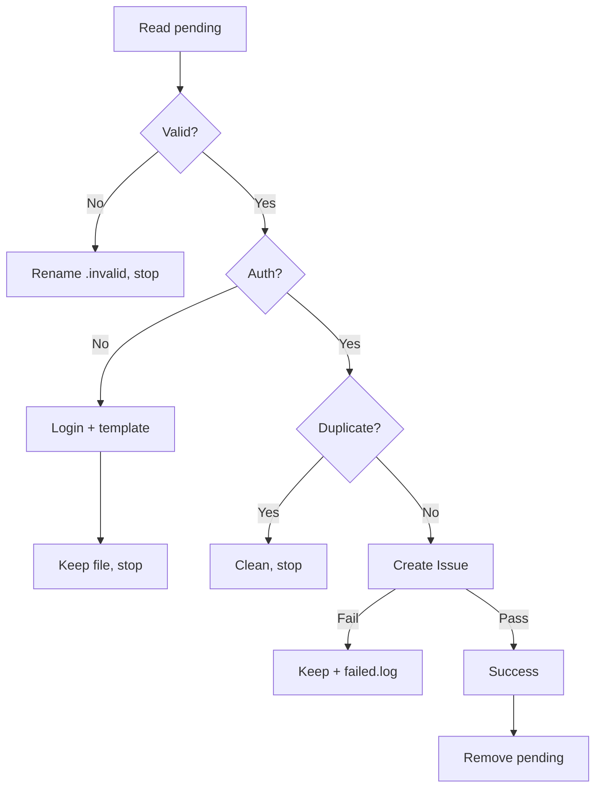

# gf-autoreport-bug

Processes `pending.json` → validate → auth → dedup → create → cleanup.

## CLI Requirement

MUST use `gh`, NOT `gf`.

**Why:** This skill reports bugs *about* `gf` itself — a broken `gf` can't report its own failure. Use `gh` (repo is GitHub-hosted).

## Preconditions

- `gh` installed: `command -v gh`
- `gh` authenticated: `gh auth status`
## When to Use

| EN | ZH |
|----|----|
| pending.json exists | 存在待处理 bug 报告 |
| auto-report a bug | 自动上报缺陷 |
| Stop Hook triggered | Stop Hook 触发 |
## When NOT to Use

| Scenario | Use Instead |
|----------|-------------|
| Manual bug Issue | `/gf-issue-create` |
| Fixing the reported bug | `/gf-workflow` |
| Other repos | Manual Issue creation |

## Decision Flow

## Workflow

1. **Validate** — require `id`, `command`, `platform`, `error_code`, `error_message`, `timestamp`. Invalid → rename `.invalid`, stop.
2. **Auth** — `gh auth status`. Fail → login guide + template, keep file, stop.
3. **Dedup** — `gh issue list --repo byx-darwin/gitflow-cli --search "[auto-report] {command} {error_code}" --state all`. Match → clean, stop.
4. **Create** — Analyze root cause + severity, then `gh issue create --repo byx-darwin/gitflow-cli --title "[auto-report] gf {command} — {error_code}" --label "auto-report"`. Fail → keep file + `failed.log`.
5. **Notify** — Output `✅ 已自动报告 bug: {issue_url}`.
6. **Cleanup** — `rm -f .cache/bug-reports/pending.json`.

## Error Handling

| Error | Action |
|-------|--------|
| Missing pending.json | "No pending reports", stop |
| Invalid JSON | Rename `.invalid`, warn, stop |
| Auth failure | Login guide + template, keep file |
| Dedup hit | Clean, show existing Issue |
| Create failure | Keep file + `failed.log` |
## Responsibility

- ✅ Report bugs only; never fix.
- ✅ Read, auth, dedup, create, cleanup.
- ❌ Modify code, launch fix flows, or analyze source.
- 🔧 Fix flow: user-initiated via `/gf-workflow --fast`.

## Red Flags

- 🔴 Reading `src/` to "understand the bug" — crosses the fix boundary.
- 🔴 "I'll just fix this too" — report only.
- 🔴 Skipping dedup — always search first.
- 🔴 Missing `--repo` — always target the fixed repo.

## Rationalization Excuses

| Excuse | Reality |
|--------|---------|
| "Only looking, not fixing" | Any source analysis crosses the boundary |
| "Same bug, fix together" | Report only; fixes need user workflow |
| "Dedup wastes time" | Duplicates pollute the tracker |