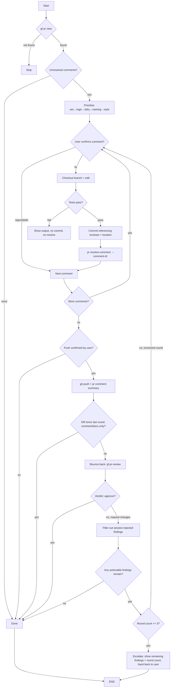

# gf-pr-apply-feedback

## CLI Requirement

**MUST use `gf` CLI, NOT `gh` CLI.**

| CLI | Scope | Platform Support |
|-----|-------|------------------|
| `gf` | This project | GitHub + GitLab + GitCode |
| `gh` | GitHub only | GitHub only |

**Why**: `gf` is the unified CLI for this project. Using `gh` breaks GitLab/GitCode compatibility.

## Preconditions
- `gf` installed: `command -v gf`
- `gf` authenticated: `gf auth status`
## Overview

Fetch pending review feedback · prioritize (security → logic → boundary → naming → style) · apply per-comment fix after user confirmation · mark resolved · push + notify reviewer. Does not review or merge.

## When to Use

| Trigger | 中文 | Redirect |
|---------|------|----------|
| apply / address / resolve feedback | 应用/处理审查反馈 | — |
| resolve comments | 解决评论 | — |
| apply / pick up review | 审查后续 | — |
| review PR initially | 初次审查 | → `gf-pr-review` |
| inline diff review | 行内审查 | → `gf-pr-inline-review` |

## When NOT to Use

| Scenario | Why Not | Use Instead |
|----------|---------|-------------|
| Performing initial PR code review | This skill applies existing feedback, not generates new reviews | `/gf-pr-review` for initial 6-dimension code review |
| Creating a Pull Request | This skill operates on existing PRs with pending feedback | `/gf-pr-create` for PR creation workflow |
| Merging or closing PRs | This skill applies feedback and resolves comments, not lifecycle ops | `/gf-pr` for merge/close/reopen operations |
| Leaving inline review comments | This skill resolves existing comments, not creates new ones | `/gf-pr-inline-review` for line-level review comments |
| Rejecting or disputing reviewer feedback | This skill applies feedback with user confirmation, not debates it | Discuss with reviewer directly before applying |
| Running quality checks after fixes | This skill focuses on applying feedback per-comment | `/gf-quality` for full 6-gate quality verification |

## Core Pattern

```bash
gf pr view <pr>                               # fetch + list pending
# prioritize → confirm each comment with user
git checkout <pr-branch>                                       # confirmed PR branch
# per comment: edit → test → commit (referencing reviewer + location)
# Note: resolve comments via platform web UI (GitHub/GitLab)
git push origin <pr-branch>                                    # ONLY after explicit confirmation
gf pr comment <pr> --body "<summary>"                 # notify

# Round loop: round starts at 1 on the first push above, caps at 3
DIFF_KIND=$(git diff --stat <last-round-sha>..HEAD)
if [[ only comments/docs changed in "$DIFF_KIND" ]]; then
  : # short-circuit — no re-review, DONE
else
  gf pr view <pr>                             # re-fetch verdict via gf-pr-review
  # gf-pr-review assesses 6 dimensions, submits via `gf review approve|request-changes <n>`
  # request-changes findings are filtered against this session's in-memory rejected list
  # (dimension + path:line fingerprint) before being re-confirmed with the user
  # if round == 3 and actionable findings remain: escalate to user, stop looping
fi
```

## Preconditions

```bash
git rev-parse --is-inside-work-tree    # inside git repo
command -v gf                  # CLI available
gf auth status                 # authenticated
git rev-parse --abbrev-ref HEAD == <pr-branch>
```

## Responsibility

**In:** prioritize · apply fixes (confirmed) · test · resolve · push (confirmed) · notify · bounce back to `gf-pr-review` · escalate to user at round cap.
**Out:** initial review · inline review · approve/merge.

### 🚫 Do Not

- ❌ Push without confirmation
- ❌ Resolve without passing tests
- ❌ Auto-accept all comments (user confirms each)

## Rationalization Excuses

| Excuse | Reality |
|--------|---------|
| "Comment is clear, just apply" | Every change needs user confirmation |
| "Small change, always OK" | Size never waives confirmation |
| "Reviewer rushing my PR" | Urgency ≠ skip verification |
| "Tests passed, resolve now" | User confirms per comment |

## Red Flags

- 🚩 "Apply all feedback" — confirm each comment
- 🚩 "Skip tests, resolve immediately" — tests must pass
- 🚩 "Push right now" — show summary; wait for explicit approval
- 🚩 Architectural change — discuss first, no auto-modify
- 🚩 PR branch unknown — confirm before `git checkout`

## Error Handling

| Error | Recovery |
|-------|----------|
| `pr view` — PR not found | Stop; report invalid PR number |
| Branch already on `pr-branch` | Fetch latest; confirm no uncommitted local work |
| Edit produces test failure | Do not commit; do not resolve; ask user to proceed or abort |
| `resolve-comment` fails | Log failure; continue to next comment; report at end |
| `git push` conflict | Stop; print conflict files; ask user to resolve |
| User rejects a comment | Skip; record as "rejected — user decision" |
| Ambiguous reviewer location (no line) | Ask user to disambiguate or skip |
| Test exit code captured after `\|\| true` (e.g. `wait ... \|\| true; EXIT=$?`) | `EXIT` is always 0 — capture immediately after the command, never after a `\|\| true` guard |

## Flowchart



## Test Scenarios

### 1: Happy Path
- **Given** 3 pending comments · **When** "apply feedback" · **Then** Apply each (confirmed), test, commit, resolve, push (confirmed), notify

### 2: Negative
- **Given** "review PR" · **Then** → `gf-pr-review`

### 3: Boundary
- **Given** applied locally · **When** Claude tries push without confirmation · **Then** Violation — must show and wait

### 4: Error
- **Given** edit fails test · **Then** No commit/resolve; continue to next

### 5: Loop Continues
- **Given** post-push `gf-pr-review` returns `request-changes` with 2 unresolved findings · **When** round < 3 · **Then** filter session-rejected findings, re-confirm remaining with user, loop back to fix step

### 6: Rejected Finding Not Repeated
- **Given** user rejected a finding at `path:line` in round 1 · **When** round 2 re-review flags the same `path:line` again · **Then** filtered out silently, not re-shown to user

### 7: Comment-Only Diff Short-Circuits
- **Given** round's diff is entirely comment/doc changes (`git diff --stat` shows no code lines) · **When** push completes · **Then** skip `gf-pr-review` bounce-back entirely, go straight to DONE

### 8: Round Cap Escalation
- **Given** round 3 push completes and `gf-pr-review` still returns `request-changes` with actionable findings · **When** loop would continue · **Then** stop automatic looping, show remaining findings + round count, hand decision back to user

## Success Criteria

- [ ] Each modification confirmed before commit
- [ ] Tests pass before resolve
- [ ] Push only after user confirmation
- [ ] Reviewer notified via `gf pr comment <pr>`
- [ ] No out-of-scope commands
- [ ] Loop terminates on findings reaching zero, not on comment list exhaustion
- [ ] Round cap is 3; exceeding it escalates to the user instead of retrying silently
- [ ] Test exit codes are captured immediately after the command, never after `|| true`

## Common Mistakes

- ❌ **Pushing without confirmation** — always show draft and await user OK.
- ❌ **Merging after applying feedback** — merging is a separate skill.

## See Also

- `gf-pr-review` — initial code review
- `gf-pr-inline-review` — inline per-line review
- `gf-pr` — PR lifecycle
- `gf-commit` — commit conventions
- `gf-precommit` — pre-commit gates before push
- `gf-quality` — post-fix quality verify

## Trigger Keywords

| English | 中文 |
|---------|------|
| apply feedback, address feedback | 应用反馈, 处理反馈 |
| resolve comments, pick up comments | 解决评论, 处理评论 |
| review follow-up, review changes | 审查后续, 审查修改 |
