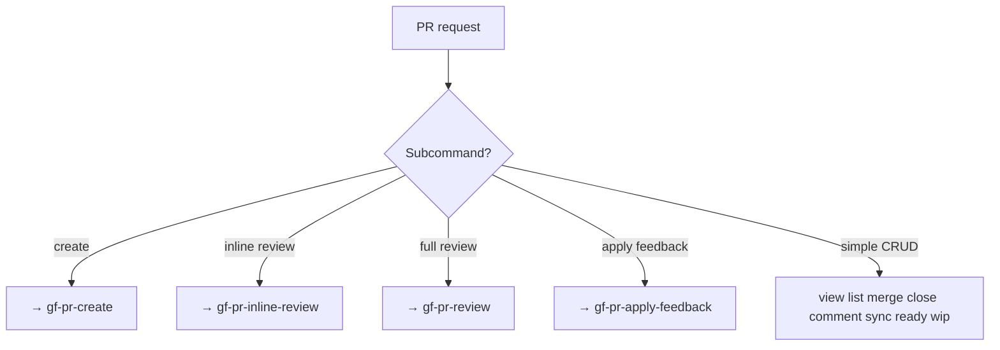

# gf-pr — PR Command Router

Top-level entry for `gf pr` (11 subcommands). Simple CRUD; complex workflows delegate.

## CLI Requirement

**MUST use `gf` CLI, NOT `gh` CLI.**

| CLI | Scope | Platform Support |
|-----|-------|------------------|
| `gf` | This project | GitHub + GitLab + GitCode |
| `gh` | GitHub only | GitHub only |

**Why**: `gf` is the unified CLI for this project. Using `gh` breaks GitLab/GitCode compatibility.

## Preconditions
- `gf` installed: `command -v gf`
- `gf` authenticated: `gf auth status`
## When to Use

| EN | ZH |
|----|----|
| create PR | 创建PR |
| list / view / close / merge | 列出/查看/关闭/合并 |
| checkout / comment / sync | 检出/评论/同步 |
| ready / wip / draft | 标记就绪/草稿 |
| PR review | delegate → review skill |

## When NOT to Use

| Scenario | Why Not | Use Instead |
|----------|---------|-------------|
| Creating a PR with full validation | This skill routes to `gf-pr-create` for validated creation | `/gf-pr-create` for branch validation + title/body collection |
| Performing code review | This skill handles simple CRUD, not review analysis | `/gf-pr-review` for overall review, `/gf-pr-inline-review` for inline |
| Applying review feedback | This skill does not apply code changes from feedback | `/gf-pr-apply-feedback` for addressing reviewer comments |
| Analyzing CI/CD pipeline health | This skill manages PR state, not pipeline metrics | `/gf-pipeline-analyzer` for CI/CD analysis |
| Merging without review | This skill requires review before merge, never merges on CI alone | Complete `/gf-pr-review` before merge |

## Flowchart



## Quick Reference

| Goal | Command |
|------|---------|
| List/View | `gf pr list` / `pr view <n>` |
| CRUD local | `pr close/reopen/comment <n>` |
| Merge | `pr merge <n> --strategy <s> [--auto]` — 先过 Merge Gate |
| Sync | `pr sync <n>` |

## Merge Gate（合并前必走）

`gf pr merge` 之前必须执行以下步骤。`gf pr view` 能报 `mergedAt`（区分已合并与关闭未合并），
但**仍不含必需检查状态**，所以 CI 判定必须另走 `gf pipeline status`。

1. **取 head 分支** — `gf pr view <n>` → `head_branch`
2. **读 CI 状态** — `gf pipeline status --branch <head_branch>`
   单次调用约 2.5 秒返回，**不轮询、不等待**
3. **按状态分流**

| CI 状态 | 行为 |
|---------|------|
| `success` | 直接 `pr merge <n> --strategy <s>` |
| `running` / `pending` | ✋ **PAUSE 询问**（见下） |
| `failed` | 拒绝合并，打印 pipeline URL |
| GitCode（无 CI 语义） | 询问用户确认已由其他途径把关 |

```
CI 仍在跑（<branch>，已 N 分钟）。请选择：
  1) 排队自动合并（推荐）—— pr merge <n> --auto，立即返回，绿了平台自动合
  2) 立即合并 —— 绕过必需检查，代码未经完整校验即进入目标分支
  3) 取消
```

选 1 → `gf pr merge <n> --strategy <s> --auto`；返回 `merged: false` 表示**已排期而非已合并**，
必须把 `message` 原样回给用户，不得报"已合并"。
选 2 → 属于策略覆盖，只能由用户明确点选，agent 不得自行选择（见 Do Not）。
选 3 → 停止，不动分支状态。

## Responsibility

**In:** route sub-commands · execute simple CRUD · run the Merge Gate · delegate complex workflows.
**Out:** skip merge confirmation · merge on CI-only basis · choose the CI-override option.

### 🚫 Do Not

- ❌ Merge without explicit user confirm
- ❌ Merge when CI fails
- ❌ Poll CI until green — read status once, then ask
- ❌ `gh pr merge --admin` / any bypass not explicitly chosen by the user

## Rationalization Excuses

| Excuse | Reality |
|--------|---------|
| "CI passed — just merge" | PR review must precede merge; CI is necessary not sufficient. |
| "Rebase faster" | Rewriting shared history requires explicit consent. |
| "Waiting for CI is the only safe option" | No — `--auto` queues the merge so nobody blocks. Polling to green wastes the human's turn; overriding without asking wastes their code review. |
| "They're the admin, so merging past checks is implied" | Role is not consent. The override is an explicit Merge Gate choice, never inferred. |

## Red Flags

- 🚩 "Skip strategy confirm" — refuse; merge strategy must be explicit
- 🚩 "Merge now, review later" — refuse; review precedes approval
- 🚩 "Force push after rebase" — refuse; confirm non-shared state
- 🚩 "Use `--admin` to save the wait" — refuse; offer `--auto`, or surface the override as an explicit user choice
- 🚩 "Poll CI until it goes green" — refuse; read status once, then ask

## Common Mistakes

- ❌ **Creating PR outside `gf-pr-create`** — always delegate creation.
- ❌ **Approving inline comments as PR approval** — different skills.

## Trigger Keywords

| EN | ZH |
|----|----|
| create PR, list PR, view PR | 创建PR, 列出PR, 查看PR |
| close PR, merge PR, comment PR | 关闭PR, 合并PR, 评论PR |
| sync PR, ready, wip | 同步PR, 标记就绪, 草稿 |

## Test Scenarios

### 1: Happy
- **Given** "squash merge #101" · **When** "confirm strategy" · **Then** `pr merge 101 --strategy squash` → output SHA

### 2: Negative
- **Given** "review PR #55" · **Then** NOT loaded → `/gf-pr-review`

### 3: Boundary
- **Given** CI passes · **When** "merge now" · **Then** Refuse — review required

### 4: Error
- **Given** 404 on close · **Then** "PR not found" ; stop

## Success Criteria

- [ ] Sub-command correctly routed
- [ ] Destructive ops require confirm
- [ ] No out-of-scope commands executed

## See Also

- `/gf-pr-create` — PR creation workflow
- `/gf-pr-review` — full review
- `/gf-pr-inline-review` — line-level review
- `/gf-pr-apply-feedback` — post-review code changes
