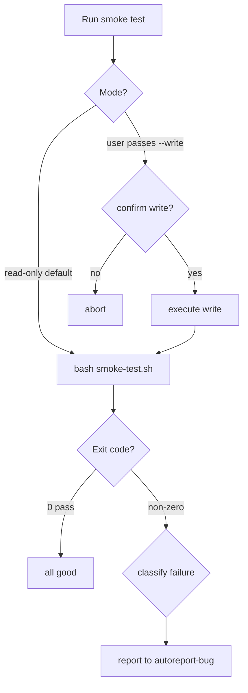

# gf-regression

Runs `scripts/smoke-test.sh`, parses PASS/FAIL/SKIP, delegates real failures to `/gf-autoreport-bug`. Defaults to `--read-only`. Does not fix bugs, edit scripts, or modify remotes.

## When to Use

Use this skill when you need to verify that the `gf` CLI is working correctly
after changes, before release, or when debugging CLI-related issues.

### Specific Scenarios

| # | Scenario | Trigger Phrase | Expected Action |
|---|----------|----------------|-----------------|
| 1 | Post-change verification | "verify my changes didn't break gf" | Run read-only smoke test, report PASS/FAIL |
| 2 | Pre-release gate | "run pre-release checks" | Run smoke test as part of release preparation |
| 3 | Debugging CLI issues | "gf commands are failing" | Run smoke test to identify which operations fail |
| 4 | Quick health check | "is gf working?" | Run minimal smoke test, report status |
| 5 | Regression detection | "check for regressions" | Run full smoke test, compare with baseline |

### Language-Specific Triggers

| English | 中文 | Context |
|---------|------|---------|
| smoke test | 冒烟测试 | Quick CLI health check |
| regression test | 回归测试 | Post-change verification |
| pre-release check | 发版前检查 | Before publishing release |
| verify CLI | 验证 CLI | Confirm CLI functionality |
| gf is broken | gf 坏了 | Debug CLI failures |

## When NOT to Use

Do NOT use this skill in the following scenarios:

| Scenario | Why Not | Use Instead |
|----------|---------|-------------|
| Fixing a bug | This skill only detects and reports bugs, doesn't fix them | `/gf-workflow` for bug fixes |
| Code review | This skill runs tests, doesn't review code | `/gf-pr-review` for code review |
| Full quality gate | This skill only runs smoke tests, not full CI | `/gf-quality` for complete quality checks |
| Testing other projects | This skill is designed for `gf` CLI only | Use project-specific test commands |
| CI pipeline | Smoke tests with autoreport shouldn't run in CI | Use `scripts/smoke-test.sh` directly with exit code |
| Performance testing | This skill checks functionality, not performance | Use benchmarking tools |

### Common Misconceptions

| Misconception | Reality |
|---------------|---------|
| "This will fix the bug" | No — it reports bugs via `/gf-autoreport-bug` |
| "This replaces CI" | No — it's a quick local check, not a CI replacement |
| "This works for any project" | No — it's hardcoded to `scripts/smoke-test.sh` |

## Core Pattern

```bash
test -f scripts/smoke-test.sh
bash scripts/smoke-test.sh --platform github 2>&1
# parse EXIT + PASS/FAIL/SKIP
# FAIL>0 → classify → /gf-autoreport-bug
```

## Quick Reference

| Goal | Command |
|------|---------|
| Read-only | `bash scripts/smoke-test.sh --platform github` |
| Verbose | `bash scripts/smoke-test.sh --platform github --verbose` |
| Write mode | `bash scripts/smoke-test.sh --platform github --write` |

Platforms: github, gitlab, gitcode. Default mode: read-only; `--write` requires explicit user confirmation.

## Flowchart



## Implementation

### Preconditions

- In git repo — `git rev-parse --show-toplevel`
- `scripts/smoke-test.sh` executable
- `gf` on PATH — `command -v gf`
- Auth valid — `gf auth status` (auth-fail → `gitflow auth login`, stop)

### Steps

1. **Parameters** — platform default `github`; `--write` only on explicit user request.
2. **Run** — `bash scripts/smoke-test.sh --platform <p> [--write] [--verbose]`; capture output + exit code.
3. **Parse** — extract `PASS_COUNT`, `FAIL_COUNT`, `SKIP_COUNT`. Exit 0 → report, done. Else Step 4.
4. **Classify** — per `[FAIL]` line: `command not found` / `auth` (🔴 critical, skip report); `4xx`/`5xx` / `timeout` (🟠); `mismatch` (🟡). Auth/network = transient → no autoreport. Real bug → write `.cache/bug-reports/pending.json`, invoke `/gf-autoreport-bug`.
5. **Report** — render markdown summary table + per-failure detail + reported Issue URLs.

### Error Handling

| Error | Recovery |
|-------|----------|
| script missing | `chmod +x` or stop |
| auth/network fail | Stop. Advise `gitflow auth login` |
| flaky | Re-run once; flag if persists |
| >5 failures | Single collective Issue |

## Responsibility

### ✅ In Scope

- Run script, parse output, classify, delegate to autoreport, render report

### ❌ Out of Scope

- Fixing bugs — autoreport-bug reports only
- Editing `scripts/smoke-test.sh`
- Closing reported Issues

### 🚫 Do Not

- ❌ Run `--write` without explicit confirmation
- ❌ Report transient auth/network failures
- ❌ Invoke autoreport-bug from CI pipelines
- ❌ Duplicate-report known flaky failures

## 🔁 Delegation

| Intent | Delegate To |
|--------|-------------|
| Run smoke test | This skill |
| File bug | `/gf-autoreport-bug` |
| Fix root cause | `/gf-workflow` |
| Pre-release gate | `/gf-release` |

## Rationalization

| Excuse | Reality |
|--------|---------|
| "Just a smoke test" | Write mode still mutates remotes |
| "Auth later" | Auth-less runs yield false failures |

## Red Flags

- 🚩 "Run write mode" — Confirm non-production env
- 🚩 "Ignore auth" — Refuse. Auth-fix first
- 🚩 "Report every failure" — Suppress transient
- 🚩 CI + autoreport — Refuse; CI uses exit code only

## Trigger System

This skill is triggered when the user's intent matches these scenarios:

### Primary Triggers (High Confidence)

| EN Trigger | ZH Trigger | Context Required | Action |
|------------|------------|------------------|--------|
| `run smoke test` | `跑冒烟测试` | Testing gf CLI | Execute smoke-test.sh |
| `check for regressions` | `检查回归` | Post-change verification | Execute smoke-test.sh |
| `verify gf works` | `验证 gf 是否正常` | CLI health check | Execute smoke-test.sh |
| `pre-release check` | `发版前检查` | Before release | Execute smoke-test.sh |

### Secondary Triggers (Medium Confidence)

| EN Trigger | ZH Trigger | Context Required | Action |
|------------|------------|------------------|--------|
| `gf is broken` | `gf 坏了` | CLI debugging | Diagnose + smoke test |
| `test failed after changes` | `改动后测试失败` | Post-change issue | Run regression check |

### Negative Triggers (Do NOT Load)

| Phrase | Likely Intent | Correct Skill |
|--------|---------------|---------------|
| `fix bug` | Bug fixing | `/gf-workflow` |
| `review code` | Code review | `/gf-pr-review` |
| `run tests` (for user's project) | Project testing | Project-specific commands |
| `quality check` | Full quality gate | `/gf-quality` |

### Trigger Decision Tree

```
User says something about "test" or "check"
    │
    ├─ Is it about gf CLI specifically?
    │   ├─ YES → Load gf-regression
    │   └─ NO → Is it about code review?
    │       ├─ YES → Load gf-pr-review
    │       └─ NO → Is it about full quality?
    │           ├─ YES → Load gf-quality
    │           └─ NO → Ask for clarification
    │
    └─ Is it about fixing a bug?
        └─ YES → Load gf-workflow
```

## Test Scenarios

### 1: Happy Path — git repo, script present, auth valid, "run smoke test" → read-only, EXIT=0, summary report, done.

### 2: Negative — "fix login bug" → NOT loaded. → `/gf-workflow`.

### 3: Boundary — 3 auth-related failures → classified transient, autoreport NOT called, user advised `auth login`.

### 4: Error — `--write` in production → Refuses. Confirm scope first.

### 5: Error — script missing → Stop.

## Usage Examples

### Example 1: Quick Health Check

**User**: "Is gf working?"

**Action**:
```bash
bash scripts/smoke-test.sh --platform github
```

**Expected Output**:
```
=== Smoke Test Results ===
Platform: github
Mode: read-only

✅ PASS: auth status
✅ PASS: issue list
✅ PASS: repo view

Summary: 3 passed, 0 failed, 0 skipped
```

---

### Example 2: Post-Change Verification

**User**: "I made some changes, verify nothing is broken"

**Action**:
```bash
bash scripts/smoke-test.sh --platform github --verbose
```

**Expected Output** (if failure):
```
=== Smoke Test Results ===
Platform: github
Mode: read-only

✅ PASS: auth status
❌ FAIL: issue list
   Error: 404 Not Found
✅ PASS: repo view

Summary: 2 passed, 1 failed, 0 skipped

Classifying failures...
🟠 issue list: 4xx error (possible API change)

Creating bug report...
Issue created: https://github.com/.../issues/123
```

---

### Example 3: Pre-Release Check

**User**: "Run pre-release checks before publishing"

**Action**:
```bash
# Run smoke test first
bash scripts/smoke-test.sh --platform github
# Then run full quality gate (delegate to gf-quality)
```

**Expected Workflow**:
1. Smoke test passes → proceed to release
2. Smoke test fails → stop, investigate failures

---

### Example 4: Debugging CLI Issues

**User**: "gf commands are failing, what's wrong?"

**Action**:
1. Check auth: `gf auth status`
2. If auth valid → run smoke test to identify which operations fail
3. Classify failures and report

---

## Quick Start

```bash
# 1. Verify prerequisites
test -f scripts/smoke-test.sh && echo "Script ready" || echo "Script missing"
command -v gf && echo "gf installed" || echo "gf not found"
gf auth status && echo "Auth valid" || gf auth login

# 2. Run smoke test
bash scripts/smoke-test.sh --platform github

# 3. Check results
# Exit code 0 = all passed
# Exit code non-zero = failures detected (see report)
```

## Success Criteria

- [ ] Read-only unless user opts into write
- [ ] PASS/FAIL/SKIP parsed and reported
- [ ] Transient failures filtered
- [ ] Real bugs delegated to autoreport
- [ ] Markdown report rendered

## Common Mistakes

- ❌ **Defaulting to write mode** — read-only is default
- ❌ **Reporting auth failures** — `auth status` first
- ❌ **Ignoring non-zero exit** — always triggers Step 4

## See Also

- `gf-autoreport-bug` — bug reporting
- `gf-release` — pre-release gate
- `gf-quality` — quality checks
- `gf-pipeline-analyzer` — CI inspection
