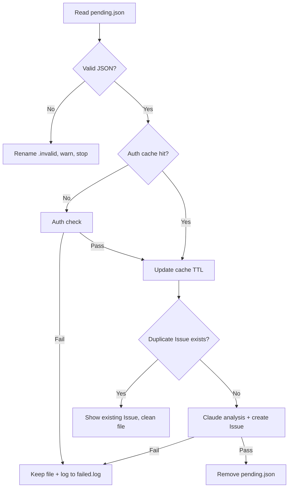

# gitflow-autoreport-bug

Detects `pending.json` → validates → auth cache check → dedup → Claude analysis → creates Issue → cleans up.

## Decision Flow

## ⚠️ Responsibility Boundary

**This skill ONLY detects and reports bugs. It NEVER fixes bugs.**

### 🚫 Forbidden

- ❌ Modify any code files — even if you think you know the bug cause
- ❌ Launch subagents to fix — no code modification flows
- ❌ Trigger `gitflow-workflow` repair — no auto-repair workflows
- ❌ Analyze source code or attempt fixes — analysis only, no remediation
- ❌ Continue after Issue creation — end immediately after Issue is created

### ✅ Scope

- Read `pending.json`, validate JSON
- Auth cache check (TTL-based)
- Dedup via existing Issue search
- Analyze root cause (analysis only, no fixes)
- Create Issue with `[auto-report]` prefix
- Clean up `pending.json` on success

### 🔧 Fix Flow (User-Initiated Only)

User must manually run `/gitflow-workflow --fast` or explicitly request fix.

## Workflow

1. **Read & Validate** — `.cache/bug-reports/pending.json`. Required: `id`, `command`, `platform`, `error_code`, `error_message`, `timestamp`. Invalid → rename `.invalid`, stop. Pre-check: `command -v gitflow-cli`.
2. **Auth Cache** — `.cache/auth-cache/{platform}.ttl`. Hit → proceed. Miss → `gitflow-cli auth status --platform {platform}`. Fail → keep file + `failed.log`. Success → update TTL.
3. **Claude Analysis** — root cause, fix direction, severity. Title: `[auto-report] gitflow {command} — {error_code}`.
4. **Dedup** — `gitflow-cli issue list --search "[auto-report] {command} {error_code}"`. Match → clean, stop.
5. **Create Issue** — `gitflow-cli issue create --title "[auto-report] ..." --label "auto-report"`. Fail → keep file + `failed.log`.
6. **Cleanup** — `rm -f .cache/bug-reports/pending.json`.

## `pending.json` Schema

`id` (uuid), `command`, `platform`, `error_code`, `error_message`, `timestamp`, `auth_cache_ttl` (optional, default 86400).

## `failed.log` Format

`[timestamp] 命令: {command} | 平台: {platform} | 错误: {error_code} | 失败原因: {reason}`

## Error Handling

| Error | Action |
|-------|--------|
| Missing `pending.json` | "No pending reports", stop |
| Invalid JSON | Rename to `.invalid`, warn, stop |
| Auth check failure | Keep `pending.json` + log to `failed.log` |
| Dedup hit | Clean `pending.json`, show existing Issue |
| Issue creation failure | Keep `pending.json` + log to `failed.log` |

## Trigger

Auto-triggered by Stop Hook (`hooks/auto-report-bug.sh`) after Claude completes a response.

## Common Mistakes

- ❌ **Attempting to fix the bug** — this skill reports only; fixes require user-initiated workflow
- ❌ **Skipping dedup** — always search before creating to avoid duplicate Issues
