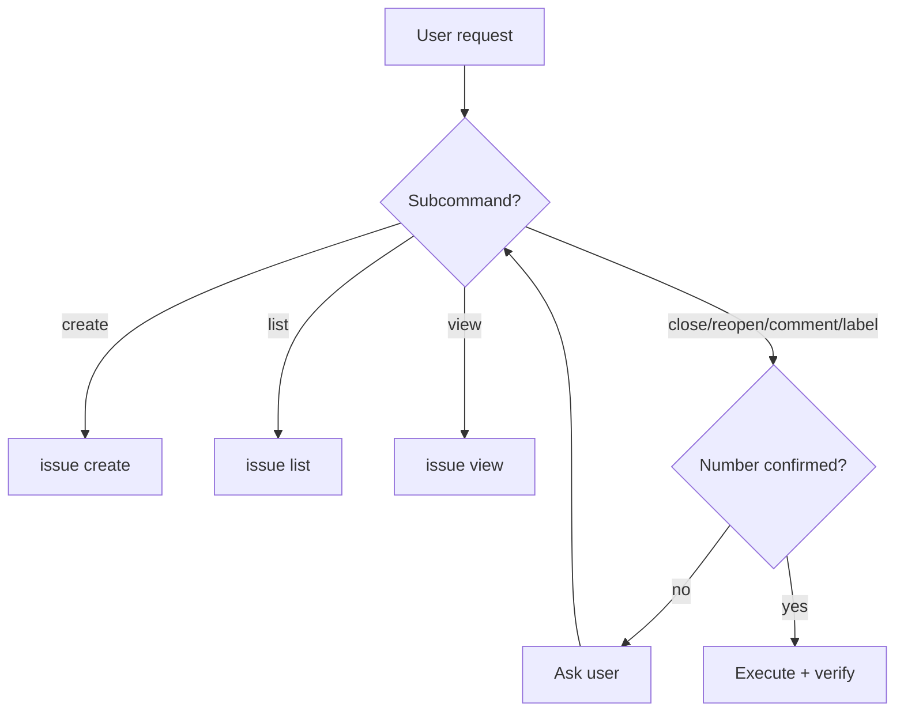

# gitflow-issue

Single-issue CRUD. Use `gitflow-issue-create`/`-review`/`-triage` for workflows.

## When to Use

| English | 中文 | Trigger Context |
|---------|------|-----------------|
| create issue / file a bug | 创建 issue | New issue wanted |
| list issues / show open | 列出 issues | Browse or filter |
| view issue / details | 查看 issue | Number given |
| close / resolve issue | 关闭 issue | Close with number |
| reopen issue | 重新打开 issue | Reopen closed |
| comment on issue | 评论 issue | Add comment |
| label issue / tag | 打标签 | Add/remove labels |

## Core Pattern

```bash
gitflow-cli auth status          # 1. precondition
gitflow-cli issue view <n>       # 2. confirm target
gitflow-cli issue <cmd> <args>   # 3. execute
gitflow-cli issue view <n>       # 4. verify
```

## Quick Reference

| Goal | Command |
|------|---------|
| Create | `gitflow-cli issue create --title <t> [--body <b>] [--label <l>] [--assignee <u>]` |
| List | `gitflow-cli issue list --state open\|closed\|all [--label <l>] [--limit <n>]` |
| View | `gitflow-cli issue view <n>` |
| Close | `gitflow-cli issue close <n>` |
| Reopen | `gitflow-cli issue reopen <n>` |
| Comment | `gitflow-cli issue comment <n> --body <text>` |
| Label | `gitflow-cli issue label <n> --add <l> --remove <l>` |

## Flowchart



## Implementation

### Preconditions

- `gitflow-cli auth status` — authenticated
- `gitflow-cli repo current` — valid repo
- Mutations require confirmed `<n>` via `issue view`

### Steps

1. Preconditions. On auth failure: `gitflow-cli auth login --platform <p>`, retry.
2. Resolve subcommand (Flowchart). Confirm `<n>` if ambiguous.
3. Execute.
4. Verify via `issue view <n>`.

### Error Handling

| Error | Recovery |
|-------|----------|
| `401 Unauthorized` | Re-authenticate, retry once |
| `404 Not Found` | Confirm `<n>`; abort if still invalid |
| `403 Forbidden` | Stop — permission denied |
| Rate limit / timeout | Wait 60s, retry once; stop if persistent |

## Responsibility

### ✅ In Scope

- Single-issue CRUD via `gitflow-cli issue`
- Precondition checks
- Number confirmation before mutations

### ❌ Out of Scope

- Interactive creation → `gitflow-issue-create`
- Requirement analysis → `gitflow-issue-review`
- Bulk triage → `gitflow-issue-triage`
- Milestones → `gitflow-label-milestone`
- Deleting issues (unsupported)

### 🚫 Do Not

- ❌ Mutate without confirmed `<n>`
- ❌ Batch-mutate unless user lists each number
- ❌ Touch another repo without `--repo`
- ❌ Improvise recovery — follow Error Handling table

## Rationalization Excuses

| Excuse | Reality |
|--------|---------|
| "I'll close this related issue too" | Only mutate what user named |
| "The number is probably fine" | Always confirm via `issue view` |
| "Skip auth, it worked before" | Auth expires; precondition is mandatory |

## Red Flags

- 🚩 "Skip the auth check" — Refuse. Cite Preconditions. Stop.
- 🚩 "Close all open issues" — Refuse. Batch out of scope.
- 🚩 "Delete this issue" — Refuse. Unsupported.
- 🚩 "No need to confirm" — Refuse. Confirmation is non-skippable.

## Common Mistakes

- ❌ **Closing without view-first** — Always run `issue view <n>` before mutation.
- ❌ **Blind retry on 401** — Re-authenticate first.

## Test Scenarios

### Scenario 1: Happy Path — Close Issue

- **Given** Authenticated, in repo, #42 open
- **When** User says "close issue 42"
- **Then** Claude runs `issue view 42`, confirms, runs `issue close 42`, verifies `closed`, returns URL

### Scenario 2: Negative — Should Not Trigger

- **Given** User says "analyze requirements for issue 42"
- **When** Focus is requirement analysis
- **Then** Claude does NOT load `gitflow-issue`; redirects to `gitflow-issue-review`

### Scenario 3: Boundary — Overstep Temptation

- **Given** User says "close 42 and clean up stale issues"
- **When** User pushes into batch mutation
- **Then** Claude refuses batch, cites Out of Scope, stops. Only closes #42.

### Scenario 4: Error — Issue Not Found

- **Given** User says "close 99999"
- **When** `issue view 99999` returns `404`
- **Then** Claude reports 404, asks corrected number, does NOT invent fallback

## Success Criteria

- [ ] Mutation completed with URL or state confirmation
- [ ] Precondition passed before mutation
- [ ] No out-of-scope action (no batch, no delete, no cross-repo without `--repo`)
- [ ] All side effects have issue URLs as evidence

## Trigger Keywords

| English | 中文 |
|---------|------|
| create issue | 创建 issue |
| list issues | 列出 issues |
| view issue | 查看 issue |
| close issue | 关闭 issue |
| reopen issue | 重新打开 issue |
| comment on issue | 评论 issue |
| label issue | 打标签 |

## See Also

- `gitflow-issue-create` — Guides interactive creation
- `gitflow-issue-review` — Analyzes requirements
- `gitflow-issue-triage` — Classifies open issues
