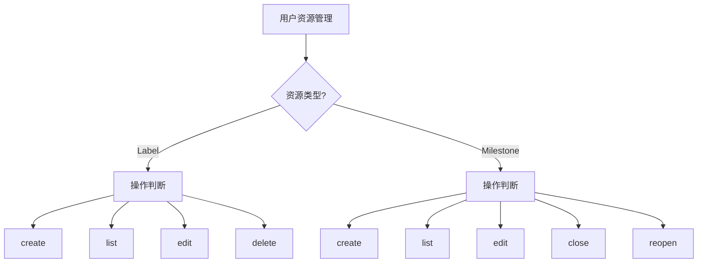

# gitflow-label-milestone — Label & Milestone CRUD

封装 `gitflow-cli label` 与 `milestone` 两个命令族的 CRUD 操作。
详细参数: docs/references/gitflow-label-milestone-params.md

## Overview / 概述

Labels (4 ops) + Milestones (5 ops) 的统一 CRUD 路由器。

## 触发关键词 / Trigger Keywords

CN 创建标签 标签颜色 编辑里程碑 关闭里程碑 版本规划 删除标签
EN manage labels milestone CRUD label color due date close reopen
CLI `gitflow-cli label|milestone <subcommand>`

## 命令矩阵 / CRUD Matrix

## 快速参考 / Quick Reference

| Command | Key Flags |
|---------|-----------|
| `label create` | `--name` `--color` [`--description`] |
| `label edit <name>` | [`--name`] [`--color`] [`--description`] |
| `label delete <name>` | — |
| `label list` | — |
| `milestone create` | `--title` [`--description`] [`--due-on`] |
| `milestone edit <n>` | [`--title`] [`--description`] [`--due-on`] |
| `milestone close/reopen <n>` | — |
| `milestone list` | — |

参数类型见外部文档。

## 核心模式 / Pattern Triplets

| 用户输入 | 处理 |
|---------|------|
| "创建 bug 标签" | `label create --name bug --color d73a4a` |
| "新建 v1.0 里程碑" | `milestone create --title "v1.0" --due-on 2026-06-01T00:00:00Z` |
| "关闭里程碑 #1" | `milestone close 1` |

## ✅ 职责 / 🚫 禁止

✅ CRUD 命令路由与参数速查
🔴 禁止自动为 issue 加 label / 批量删除 / 绕过确认 delete

## 红旗与防御 / Red Flags + Defense

- "把所有 bug issue 关了" → 非本 skill 职责
- "截止日期用过去时间" → 拒绝，要求未来时间

## 常见错误 / Common Mistakes

| 错误 | 修正 |
|------|------|
| 颜色未带 `#` | 期望不带 `#` 的 6 位 hex |
| 日期格式非 ISO 8601 | 提示修正 |

## 合理化反驳 / Rationalization

"顺手给 issue 加几个 label" → 不属于 CRUD，分类决策应交给分类 skill

## 错误处理 / Error Handling

| 错误 | 处理 |
|------|------|
| 颜色非法 hex | 提示必须 6 位 0-9 a-f |
| 删除被引用的 label | 警告后需显式 `--force` 否则拒绝 |
| `due-on` 非 ISO 8601 | 拒绝并示例格式 |

## 场景测试 / Test Scenarios

- **Happy**: "创建 bug 标签" → `label create --name bug --color d73a4a` → 详情
- **Negative**: "把所有 issue 标上 bug" → 拒绝；建议先用分类 skill
- **Boundary**: "删除 label bug" 但 bug 被 3 个 issue 引用 → 警告关联
- **Error**: "编辑不存在的 label xxx" → 404 → 提示确认

## 成功标准 / Success Criteria

- CRUD 命令路由正确
- 颜色/due-on 格式校验在命令失败前提示
- 破坏性操作需确认

## See Also

- gitflow-issue — 为 issue 分配 label 和 milestone
- gitflow-issue-triage — 分类时依赖 label
- gitflow-release — 发布时关联 milestone
- gitflow-weekly-report — 统计 milestone 进度
