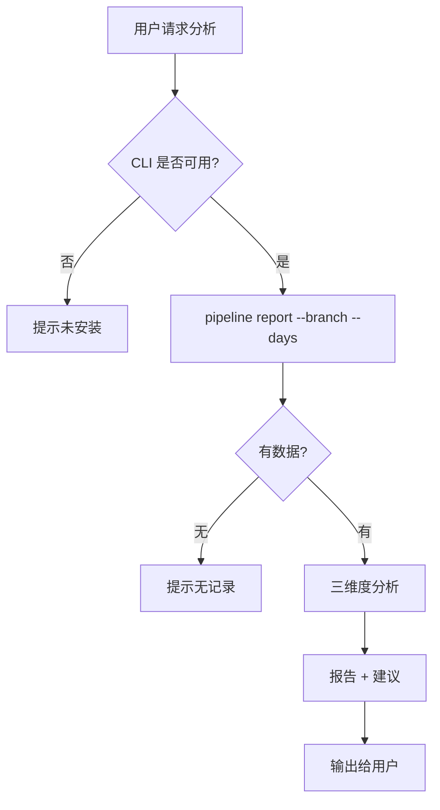

# gitflow-pipeline-analyzer — CI/CD Pipeline Health Analyzer

三维度分析：成功率趋势 / 失败模式 / 耗时分布 → 报告 + 优先级改进建议。
Read-only: never triggers/reruns/cancels pipelines.
Full params & report template: docs/references/gitflow-pipeline-analyzer-params.md

## Overview / 概述

只读分析 CI/CD 三维度健康指标，按优先级排序改进建议。

## 触发关键词 / Trigger Keywords

CN 流水线分析 CI失败 flaky test 耗时分析
EN pipeline health analyze flaky test CI slow success rate
CLI `gitflow-cli pipeline report --branch <B> --days <N>`

## 路由决策 / Data Sufficiency Flow

## 快速参考 / Quick Reference

| Step | Command |
|------|---------|
| 报告 | `gitflow-cli pipeline report --branch <B> --days <N>` |
| 状态 | `gitflow-cli pipeline status --branch <B>` |
| Jobs | `gitflow-cli pipeline jobs --pipeline-id <ID>` |
| Logs | `gitflow-cli pipeline logs --pipeline-id <ID>` |

## 核心模式 / Pattern Triplets

| 用户输入 | 处理 |
|---------|------|
| "流水线老挂" | `report --days 7` → success <80% → 🟡/🔴 告警 |
| "CI 太慢" | `jobs --pipeline-id <longest>` → 瓶颈 + 缓存建议 |
| "flaky test" | 间歇失败 ≥2 次 → 标记 flaky |

## ✅ 职责 / 🚫 禁止

✅ read-only 三维度分析 + 报告 + 建议
🔴 禁止 trigger/rerun/cancel / 改 CI 配置 / 自动创建 Issue

## 红旗与防御 / Red Flags + Defense

- "自动修复流水线" → 仅分析；修复需用户决定
- "重试所有失败" → 拒绝；需用户确认每次

## 常见错误 / Common Mistakes

| 错误 | 修正 |
|------|------|
| 仅看平均成功率 | 看 P90/P95 更有信号 |
| 间歇失败当持续 | 连续 ≥3 才是持续；否则 flaky |

## 合理化反驳 / Rationalization

"重试失败 pipeline" → 写操作超出只读范围

## 错误处理 / Error Handling

| 错误 | 处理 |
|------|------|
| `report` 空 | 提示无记录；建议扩大 --days |
| `jobs` 失败 | 提示权限或 pipeline ID 不存在 |
| 字段缺失 | 跳过耗时分析；仅做成功率+失败模式 |

## 场景测试 / Test Scenarios

- **Happy**: 分析 main 7 天 → 三维度报告 + 改进建议
- **Negative**: "帮我重试失败" → 拒绝，建议手动
- **Boundary**: 新分支无记录 → 提示不足，建议 --days 30
- **Error**: `report` 403 → 提示权限，建议检查 auth

## 成功标准 / Success Criteria

- 三维度覆盖 ≥2
- 建议按优先级排序
- 不足时优雅降级
- 全程无写操作

## See Also

- gitflow-precommit — 本地检查避免失败
- gitflow-quality — 代码质量 6-gate
