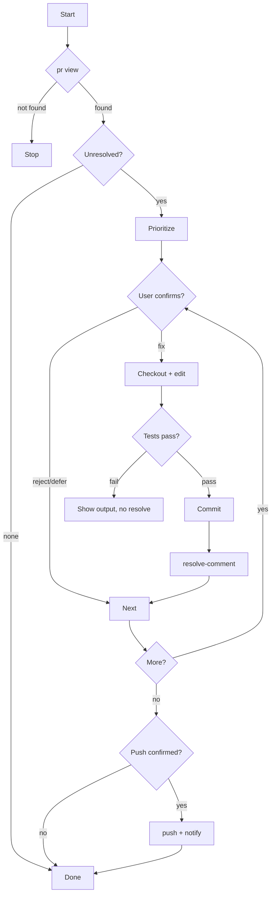

# gitflow-pr-apply-feedback

## Overview

Fetches PR review feedback, prioritizes pending items, applies per-comment fixes (user-confirmed), marks comments resolved, pushes only after explicit approval; does not review or merge.

## When to Use

| English | 中文 | Context |
|---------|------|---------|
| apply feedback | 应用反馈 | address reviewer comments |
| resolve comments | 解决评论 | mark comments resolved |
| review follow-up | 审查后续 | NOT initial review → `/gitflow-pr-review` |

## Core Pattern

```bash
gitflow-cli pr view <pr>                                  # 1. fetch comments
# 2. prioritize: security > logic > boundary > naming > style
# 3. per comment (user confirms): checkout → edit → test → commit
gitflow-cli pr resolve-comment <pr> --comment-id <id>     # 4. mark resolved
git push origin <branch>                                  # 5. push (confirmed)
gitflow-cli pr comment <pr> --body "<summary>"            # 6. notify
```

## Quick Reference

| Goal | Command |
|------|---------|
| View PR + comments | `gitflow-cli pr view <pr-number>` |
| Mark resolved | `gitflow-cli pr resolve-comment <pr-number> --comment-id <id>` |
| Push | `git push origin <branch>` |

## Implementation

### Preconditions

- Git repo — `git rev-parse --is-inside-work-tree`; CLI installed — `command -v gitflow-cli`
- Authenticated — `gitflow-cli auth status`; PR branch confirmed before checkout

### Step 1: Fetch + Prioritize — `pr view`, filter unresolved, order security→logic→boundary→naming→style.

### Step 2: Fix Per Comment — checkout, edit, test, commit (referencing reviewer + location). Test fail → no commit.

### Step 3: Resolve, Push, Notify

`gitflow-cli pr resolve-comment <pr-number> --comment-id <comment-id>` per fix (fail → log, continue). Require explicit confirmation before `git push origin <branch>`. Then `gitflow-cli pr comment <pr-number>` with summary. Push conflict → show, user resolves.

## Flowchart



## Responsibility

### ✅ In Scope

- Fetch, prioritize, display PR review comments
- Apply fixes, test, commit
- Mark resolved, push (confirmed), notify reviewer

### ❌ Out of Scope

- Initial review → `/gitflow-pr-review`
- Inline review → `/gitflow-pr-inline-review`
- Approve/merge → `/gitflow-pr`
- Accept/reject → user decides (out of scope)

### 🚫 Do Not

- ❌ Push without confirmation
- ❌ Resolve without passing tests
- ❌ Modify unrelated code
- ❌ Auto-accept all comments

## 🔁 Delegation Rules

| User Intent | Delegate To | Reason |
|-------------|-------------|--------|
| Apply feedback | This skill | Code changes + resolve |
| Initial review | `/gitflow-pr-review` | 6-dim checklist |
| Inline review | `/gitflow-pr-inline-review` | Per-line diff |
| Merge / close | `/gitflow-pr` | Lifecycle |

## Rationalization Excuses

| Excuse | Reality |
|--------|---------|
| "Comment is clear, skip" | Every change needs confirmation |
| "Small change, just commit" | Size never waives confirmation |
| "Reviewer rushing" | Urgency ≠ skip |
| "Tests passed, resolve now" | User confirms |

## Red Flags

- 🚩 "Apply all feedback" — Needs confirmation.
- 🚩 "Skip tests, resolve" — Tests must pass.
- 🚩 "Push right away" — Needs confirmation.
- 🚩 Architectural change — Discuss first.

## Test Scenarios

### 1: Happy Path

- **Given** 3 pending comments; **When** "apply feedback"; **Then** Applies each (confirmed), tests, commits, resolves, pushes (confirmed), notifies

### 2: Negative

- **Given** "review PR"; **When** initial review; **Then** NOT loaded. → `/gitflow-pr-review`.

### 3: Boundary

- **Given** applied locally; **When** Claude pushes without confirmation; **Then** Violation; must show summary

### 4: Error

- **Given** edit fails test; **When** `cargo test` fails; **Then** No commit/resolve; continues

## Success Criteria

- [ ] Comments classified by priority
- [ ] Modifications confirmed before commit
- [ ] Tests pass before resolve
- [ ] Push only after user confirmation
- [ ] Reviewer notified with PR URL
- [ ] No out-of-scope commands

## Common Mistakes

- ❌ **Push without confirmation** — Show summary, wait for explicit approval before `git push`.
- ❌ **Resolve without tests** — Resolve only after tests pass.

## Trigger Keywords

| English | 中文 |
|---------|------|
| apply feedback | 应用反馈 |
| resolve comments | 解决评论 |
| review follow-up | 审查后续 |

## See Also

- `/gitflow-pr-review` — initial code review
- `/gitflow-pr-inline-review` — inline review comments
- `/gitflow-pr` — PR lifecycle management
- `docs/superpowers/templates/skill-conventions.md` — template conventions this skill conforms to
