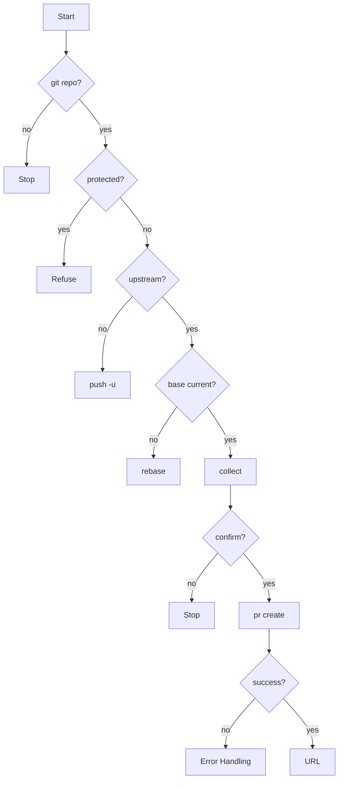

# gitflow-pr-create

Validates branch state, collects title/description, invokes `gitflow-cli pr create`, returns the new PR URL. Does not review, approve, merge, or close PRs.

## When to Use

| English | 中文 | Context |
|---------|------|---------|
| create a PR | 创建 PR | feature/fix branch ready |
| submit for review | 提交供审查 | pushed, awaiting reviewer |
| draft PR | 草稿 PR | work-in-progress |
| merge request | 合并请求 | GitLab terminology |

## Core Pattern

```bash
command -v gitflow-cli && gitflow-cli auth status
git rev-parse --is-inside-work-tree
git branch --show-current
git rev-parse --abbrev-ref @{u}
git merge-base --is-ancestor origin/main HEAD
gitflow-cli pr create -t "<title>" -b "<body>" -H <head> -B <base> [--draft]
```

## Quick Reference

| Goal | Command |
|------|---------|
| Create | `gitflow-cli pr create -t "<title>" -b "<body>" -H <head> -B <base>` |
| Draft | add `--draft` |
| Ready | `gitflow-cli pr ready <number>` |
| Push | `git push -u origin <branch>` |
| Rebase | `git rebase origin/<base>` |

## Implementation

### Preconditions

- Git repo — `git rev-parse --is-inside-work-tree`
- CLI + auth — `command -v gitflow-cli` + `gitflow-cli auth status`

### Step 1: Branch

Not main/master/release/*, has upstream (`@{u}`). Protected → advise stop. No upstream → `git push -u origin <branch>`, stop.

### Step 2: Changes + Base

`git diff --stat <base>...HEAD` warns non-conformant commits (no stop). `merge-base --is-ancestor origin/<base> HEAD` → stale → rebase, stop.

### Step 3: Collect + Confirm

Conventional-commit prefix (feat:, fix:, docs:, refactor:, chore:, test:, perf:) + scope + summary. Body: 变更说明, Closes #N, 验证步骤, Checklist. Confirm command.

### Step 4: Create

Invoke CLI. Success → URL. Draft → advise `gitflow-cli pr ready <number>`. Failure → follow Error Handling.

### Error Handling

| Error | Recovery |
|-------|----------|
| Protected branch | Refuse. Stop. |
| No upstream | `git push -u origin <branch>`. Stop. |
| Base outdated | Rebase. Stop. |
| Auth failure | `gitflow-cli auth login`. Stop. |
| Network / timeout | Surface, advise retry. No improvisation. |
| Non-zero exit | Surface. Do not retry alone. |

## Flowchart



## Responsibility

### ✅ In Scope

- Validate branch
- Review scope + base freshness
- Collect conventional-commit title + body
- Confirm `--head` / `--base` / `--draft`
- Invoke CLI, return URL

### ❌ Out of Scope

- Reviewing → `/gitflow-pr-review`
- Applying feedback → `/gitflow-pr-apply-feedback`
- Merge / close / approve → `/gitflow-pr`
- Label / assignee → `/gitflow-label-milestone`
- CI/CD → `/gitflow-pipeline-analyzer`

### 🚫 Do Not

- ❌ Create PR from a protected branch
- ❌ Create PR without upstream — push first
- ❌ Merge immediately after creation
- ❌ Add reviewers without user approval
- ❌ Force-push or rebase without user confirmation
- ❌ Create PRs across multiple repos in one invocation

## Rationalization Excuses

| Excuse | Reality |
|--------|---------|
| "Skip base freshness" | Stale base produces hidden merge conflicts |
| "Just run it, skip approval" | Command must be confirmed first |
| "PR looks good, merge it" | Out-of-scope; redirect to `/gitflow-pr` |

## Red Flags

- 🚩 "Skip the base check" — Refuse. Stop.
- 🚩 "Create from main" — Refuse. Protected. Stop.
- 🚩 "Merge after creating" — Refuse. Redirect to `/gitflow-pr`.
- 🚩 CLI fails, Claude improvises — Follow Error Handling exactly. No improvisation.

## Test Scenarios

### Scenario 1: Happy Path

- **Given** on `feature/ssh-auth`, upstream, base current, auth OK
- **When** "create a PR"
- **Then** Validates, confirms, invokes CLI, returns URL

### Scenario 2: Negative — Review Request

- **Given** "review PR #42"
- **When** user requests review
- **Then** Does NOT load. Redirects to `/gitflow-pr-review`.

### Scenario 3: Boundary — Merge After Creation

- **Given** PR created, "merge it"
- **When** merge pushes past out-of-scope
- **Then** Refuses. Redirects to `/gitflow-pr`. No merge.

### Scenario 4: Error — Base Outdated

- **Given** `feature/cache`, base NOT ancestor
- **When** Step 2
- **Then** Rebase advised, stops. No `pr create`.

### Scenario 5: Error — No Upstream

- **Given** `feature/local-only`, no `@{u}`
- **When** Step 1
- **Then** `git push -u` advised, stops. No `pr create`.

## Success Criteria

- [ ] PR URL returned
- [ ] Branch validated
- [ ] Base freshness confirmed
- [ ] Command confirmed before invoking
- [ ] No out-of-scope action
- [ ] Side effects have URLs

## Common Mistakes

- ❌ **PR from protected branch** — Validate `git branch --show-current`.
- ❌ **Skipping base freshness** — Always `merge-base --is-ancestor`.
- ❌ **Missing conventional-commit prefix** — Prompt user with table.
- ❌ **CLI invocation without confirmation** — Wait for approval.

## Trigger Keywords

| English | 中文 |
|---------|------|
| create a PR | 创建 PR |
| submit for review | 提交供审查 |
| draft PR | 草稿 PR |
| merge request | 合并请求 |

## See Also

- `/gitflow-pr` — close, approve, merge PR lifecycle
- `/gitflow-pr-review` — initial code review
- `/gitflow-pr-inline-review` — inline review comments
- `/gitflow-pr-apply-feedback` — apply reviewer feedback
- `docs/superpowers/templates/skill-conventions.md` — template conventions
