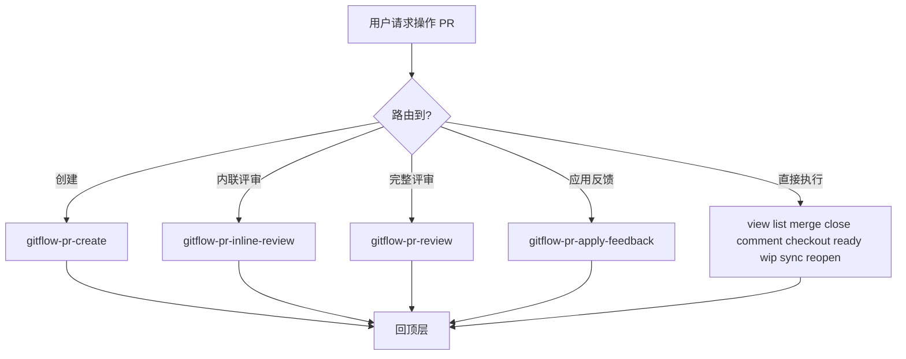

# gitflow-pr — PR Command Router

Top-level entry for `gitflow-cli pr` (11 subcommands).
Simple CRUD; complex workflows delegate.
Full params: docs/references/gitflow-pr-params.md

## Overview / 概述

路由器子命令到 PR 全家桶：11 个操作由本 skill 执行或委派子 skill。

## 触发关键词 / Trigger Keywords

CN 创建PR 查看PR 合并PR 关闭PR 评论PR 列出PR 检出PR 同步PR 草稿PR 标记就绪
EN create PR list view close merge checkout comment sync draft ready reopen
CLI `gitflow-cli pr <subcommand>`

## 路由决策 / Router Flow

## 快速参考 / Quick Reference

| subcommand | 命令 | 执行位置 |
|-----------|------|---------|
| list / view / close / reopen / comment / merge / checkout | `pr <n> ...` | 本 skill |
| ready / wip / sync | `pr <op> <n>` | 本 skill |
| 创建 / 合并 | 校验+模板 / squash 策略 | → gitflow-pr-create |

## 委派规则 / Delegation Rules

| 用户意图 | 委派目标 |
|---------|---------|
| 创建含校验的 PR | gitflow-pr-create |
| 行级代码评审 | gitflow-pr-inline-review |
| 完整评审 | gitflow-pr-review |
| 按评审意见改代码 | gitflow-pr-apply-feedback |

## ✅ 职责 / 🚫 禁止

✅ 简单 CRUD + 路由判决 + 参数速查
🔴 禁止跳过策略确认合并 / 关闭 PR 不留说明 / CI 未通过时静默合并

## 红旗与防御 · 合理化反驳 / Red Flags + Rationalization

- 未评审 PR 请求合并 → 强制确认策略。 *"CI 过了就能合并"* → 必要但非充分；确认仍必须
- `merge --rebase` 跨 fork → 二次确认。 *"rebase 更快更干净"* → 改写公共历史，需明确同意

## 常见错误 / Common Mistakes

- "创建 PR" 直接执行 → 委派 gitflow-pr-create
- `ready`/`wip` 混淆 → ready 可合并 / wip 工作中

## 错误处理 / Error Handling

- 403/404 → 提示检查 auth 或确认编号
- 409 → 提示先 `pr sync` 或本地解决冲突

## 场景测试 / Test Scenarios

- **Happy**: "squash 合并 #101" → 确认 → `pr merge 101 --strategy squash` → SHA
- **Negative**: "帮我 review #55" → 路由 gitflow-pr-inline-review
- **Boundary**: "关闭 #9999" → 404 → 提示确认编号
- **Edge**: "同步 #30" 但已合并 → 警告 noop → 建议删除

## 成功标准 / Success Criteria

- 需求正确路由到子命令或委派子 skill
- 破坏性操作（merge/close）经用户二次确认
- PR 编号先验证存在性

## See Also

- gitflow-pr-create — 创建 PR 工作流
- gitflow-pr-review — 完整评审
- gitflow-pr-inline-review — 行级内联评审
- gitflow-pr-apply-feedback — 按评审意见修改代码
