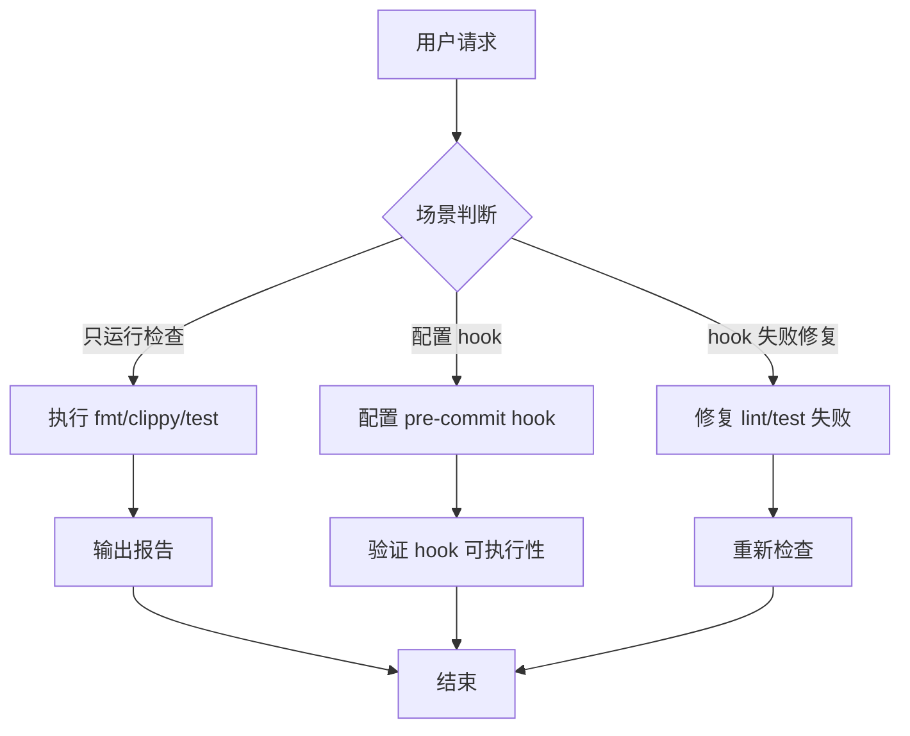

# gitflow-precommit — Pre-commit Quality Gate

Run fmt/clippy/test → report → (optional) configure Git hook.
Full params: docs/references/gitflow-precommit-params.md

## Overview / 概述

三项检查（fmt/clippy/test）汇总报告，可选配置 .git/hooks/。

## 触发关键词 / Trigger Keywords

CN 提交前检查 pre-commit hook 格式化检查 clippy 检查 测试失败
EN pre-commit cargo fmt cargo clippy cargo test quality gate
CLI `gitflow-cli precommit <subcommand>`

## 路由决策 / Fix vs Report Flow

## 快速参考 / Quick Reference

| Check | Command |
|-------|---------|
| 格式化 | `cargo fmt -- --check` |
| 静态分析 | `cargo clippy --all-targets --all-features -- -D warnings` |
| 测试 | `cargo test --workspace` |
| 严格模式 | 追加 `-W clippy::pedantic` |
| 修复格式 | `cargo fmt` |
| 修复 lint | `cargo clippy --fix --allow-dirty` |

非 Rust: 解析 `.pre-commit-config.yaml` → `pre-commit run --all-files`。

## 核心步骤 / Pattern Triplets

| 用户输入 | 处理 |
|---------|------|
| "跑一次检查" | 依次执行三项 → 汇总表格 ✅/❌ |
| "fmt 失败" | `cargo fmt` 自动修复 → 重新 check |
| "配置 hook" | 未用框架写 .git/hooks/；否则 `pre-commit install` |

## ✅ 职责 / 🚫 禁止

✅ 解析配置 / 运行三项检查 / 汇总报告
🔴 禁止代为 git add/commit / 自动配置 hook / 自动 `cargo clippy --fix`

## 红旗与防御 / Red Flags + Defense

- "自动修复所有 lint" → 需先看 diff，不可无一审到底
- "CI 中用 pre-commit hook" → 不合适，CI 用独立检查目标

## 常见错误 / Common Mistakes

| 错误 | 修正 |
|------|------|
| 忘 `--allow-dirty` | 修复前提示 |
| hook 未加可执行权限 | `chmod +x .git/hooks/pre-commit` |

## 合理化反驳 / Rationalization

"hook 顺手配了" → 写入 .git/hooks/ 是副作用，需授权

## 错误处理 / Error Handling

| 错误 | 处理 |
|------|------|
| `Cargo.toml` 不存在 | 降级为仅运行 .pre-commit-config.yaml |
| fmt 失败 | 输出差异 → 提示 `cargo fmt` 或确认后 fix |
| `cargo clean` | 立即中止（CLAUDE.md 禁止） |

## 场景测试 / Test Scenarios

- **Happy**: "跑一次检查" → 三项全通过 → `✅ 全部通过`
- **Negative**: "帮我把代码提交一下" → 拒绝代为 commit
- **Boundary**: "自动 fix 所有 clippy" → 提示 diff 需确认后才 `--fix`
- **Error**: Cargo.toml 缺失 → 非 Rust → 尝试 .pre-commit-config.yaml

## 成功标准 / Success Criteria

- 三项覆盖 fmt + clippy + test
- 非 Rust 优雅降级至 pre-commit 框架
- 修复操作经用户确认后才执行
- hook 文件权限正确

## See Also

- gitflow-commit — commit 与 pre-commit 衔接
- gitflow-quality — 6-gate 质量检查
