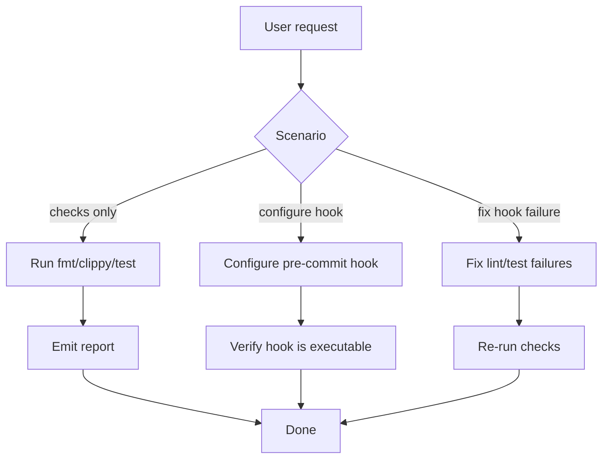

# gitflow-precommit — Pre-commit Quality Gate

Run fmt/clippy/test → report → (optional) configure Git hook.
Full params: docs/references/gitflow-precommit-params.md

## Overview

Runs three checks (fmt/clippy/test) and produces a summary report. Optionally configures `.git/hooks/`.

## Trigger Keywords

CN 提交前检查 pre-commit hook 格式化检查 clippy 检查 测试失败
EN pre-commit cargo fmt cargo clippy cargo test quality gate
CLI `gitflow-cli precommit <subcommand>`

## Fix vs Report Flow

## Quick Reference

| Check | Command |
|-------|---------|
| Format | `cargo fmt -- --check` |
| Lint | `cargo clippy --all-targets --all-features -- -D warnings` |
| Test | `cargo test --workspace` |
| Strict mode | Append `-W clippy::pedantic` |
| Fix formatting | `cargo fmt` |
| Fix lints | `cargo clippy --fix --allow-dirty` |

Non-Rust: parse `.pre-commit-config.yaml` → `pre-commit run --all-files`.

## Pattern Triplets

| User input | Handling |
|------------|----------|
| "run the checks" | Run all three in sequence → summary table ✅/❌ |
| "fmt failed" | Auto-fix with `cargo fmt` → re-check |
| "configure hook" | No framework: write `.git/hooks/`; otherwise `pre-commit install` |

## ✅ In Scope / 🚫 Out of Scope

✅ Parse config / run all three checks / summarize report
🔴 Do not run git add/commit on the user's behalf / auto-configure the hook / auto-run `cargo clippy --fix`

## Red Flags + Defense

- "Auto-fix all lints" → Review the diff first; never fix blindly end-to-end
- "Use a pre-commit hook in CI" → Inappropriate; CI should use dedicated check targets

## Common Mistakes

| Mistake | Fix |
|---------|-----|
| Forgetting `--allow-dirty` | Prompt before fixing |
| Hook missing executable permission | `chmod +x .git/hooks/pre-commit` |

## Rationalization

"Configured the hook while I was at it" → Writing to `.git/hooks/` is a side effect and requires authorization

## Error Handling

| Error | Handling |
|-------|----------|
| `Cargo.toml` not found | Fall back to running `.pre-commit-config.yaml` only |
| fmt failed | Emit diff → suggest `cargo fmt`, or fix after confirmation |
| `cargo clean` | Abort immediately (forbidden by CLAUDE.md) |

## Test Scenarios

- **Happy**: "run the checks" → all three pass → `✅ all passed`
- **Negative**: "commit my code for me" → refuse to commit on the user's behalf
- **Boundary**: "auto-fix all clippy" → prompt that the diff needs confirmation before `--fix`
- **Error**: Cargo.toml missing → non-Rust → try `.pre-commit-config.yaml`

## Success Criteria

- All three checks cover fmt + clippy + test
- Graceful fallback to the pre-commit framework for non-Rust projects
- Fix operations run only after user confirmation
- Hook file permissions are correct

## See Also

- gitflow-commit — bridges commit and pre-commit
- gitflow-quality — 6-gate quality check
