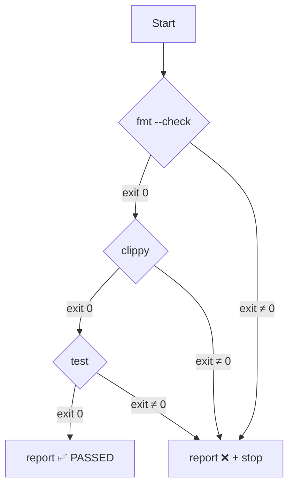

# gitflow-precommit

Run fmt/clippy/test gates before commit. Diagnosis + report only. Hook setup is a separate explicit-confirmation path.

## When to Use

| English | 中文 | Trigger Context |
|---------|------|-----------------|
| pre-commit checks | 提交前检查 | run 3 gates before commit |
| setup pre-commit hook | 配置 pre-commit hook | user explicitly asks |
| commit failed checks | 提交被检查拒绝 | diagnose + report |
| run lint / fmt check | 跑 lint / 格式检查 | partial gate run |
| CI quality gate | CI 质量门禁 | NOT for hook setup |

## Core Pattern

```bash
git rev-parse --show-toplevel && [ -f Cargo.toml ] || echo "non-rust"
cargo +nightly fmt -- --check 2>&1 || exit 1
cargo clippy --all-targets --all-features -- -D warnings 2>&1 || exit 1
cargo test --workspace 2>&1 || exit 1
```

## Quick Reference

| Goal | Command |
|------|---------|
| Format check | `cargo +nightly fmt -- --check` |
| Format fix (user-only) | `cargo +nightly fmt` |
| Lint check | `cargo clippy --all-targets --all-features -- -D warnings` |
| Lint fix (user-only) | `cargo clippy --fix --all-targets --all-features --allow-dirty` |
| Test | `cargo test --workspace` |

## Implementation

### Preconditions
- Git repo — `git rev-parse --show-toplevel`
- `Cargo.toml` present → Rust gates; else `pre-commit run --all-files`; else stop

### Step 1: Run Gates (Fast-Fail)



Each gate: exit ≠ 0 → record `❌` + suggest fix command (user runs) → stop.

### Step 2: Report

```markdown
## Pre-commit Report — YYYY-MM-DD
| Gate | Status | Detail |
**Result: ✅ PASSED** or **Result: ❌ FAILED — fix and re-run**
```

### Step 3: Hook Setup — CONFIRMATION REQUIRED (P0)

🚩 **Only when user explicitly asks.**
Ask: "Write `.git/hooks/pre-commit`?" → Yes → write from [hook template](../references/gitflow-precommit-hook-template.md) → `chmod +x` → verify. No → stop. Never auto-write. Never `pip install` without confirmation.

## Responsibility

### ✅ In Scope
- Run fmt/clippy/test gates
- Parse Cargo.toml / .pre-commit-config.yaml
- Generate report
- Write hook ONLY after explicit confirmation

### ❌ Out of Scope
- Auto-fixing (`cargo fmt`, `cargo clippy --fix`)
- `git add` / `git commit` — see `/gitflow-commit`
- Modifying configs
- `pip install pre-commit` — user installs
- Full 6-gate audit — see `/gitflow-quality`

### 🚫 Do Not
- ❌ Run `cargo fmt` / `cargo clippy --fix` without explicit confirmation
- ❌ Write hook without explicit user request
- ❌ Run `pip install` or any system install
- ❌ Execute `git add` / `git commit`
- ❌ Mark failing gate as `N/A`

## Rationalization Excuse

| Excuse | Reality |
|--------|---------|
| "Auto-fix fmt to unblock" | Out of Scope. User runs fix. |
| "Just set up the hook — standard" | Requires explicit confirmation. |
| "User in hurry — skip clippy" | Urgency does not override gates. |

## Red Flags

- 🚩 "skip the {check} / ship it" — refuse; stop
- 🚩 "you don't need clippy" (authority) — non-skippable
- 🚩 "auto-fix" / "set up hook while you're at it" — detect + confirm only
- 🚩 "urgent — just commit" — redirect to `/gitflow-commit`; no bypass

## Test Scenarios

### Scenario 1: Happy Path
- **Given** Rust workspace, staged changes, all gates pass
- **When** "run pre-commit checks"
- **Then** 3 gates → ✅ PASSED → stops. No hook. No fix.

### Scenario 2: Negative
- **Given** user wants to commit
- **When** "帮我提交代码"
- **Then** No load. Redirects to `/gitflow-commit`.

### Scenario 3: Boundary
- **Given** fmt gate fails
- **When** "自动修复格式"
- **Then** Refuses; cites §Out of Scope; suggests command; does NOT execute.

### Scenario 4: Error
- **Given** no `Cargo.toml`, `.pre-commit-config.yaml` present
- **When** "run pre-commit checks"
- **Then** Runs `pre-commit run --all-files`; no Rust commands.

## Success Criteria

- [ ] 3 gates in order; fast-fail on first non-zero
- [ ] Report has date + 3 rows + Result line
- [ ] No auto-fix without confirmation
- [ ] No hook without explicit request
- [ ] No `git add` / `git commit`
- [ ] Non-Rust fallback works

## Common Mistakes

- ❌ **Running `cargo clippy --fix` automatically** — never execute; suggest only
- ❌ **Writing hook every invocation** — only after explicit request

## Trigger Keywords

| English | 中文 |
|---------|------|
| pre-commit checks | 提交前检查 |
| setup pre-commit hook | 配置 pre-commit hook |
| commit failed checks | 提交被检查拒绝 |
| run lint / fmt check | 跑 lint / 格式检查 |
| cargo clippy | cargo clippy |

## See Also

- `gitflow-commit` — commits after pre-commit passes
- `gitflow-quality` — full 6-gate quality audit
- `gitflow-security-check` — security dimension
- `docs/superpowers/templates/skill-conventions.md` — conventions
