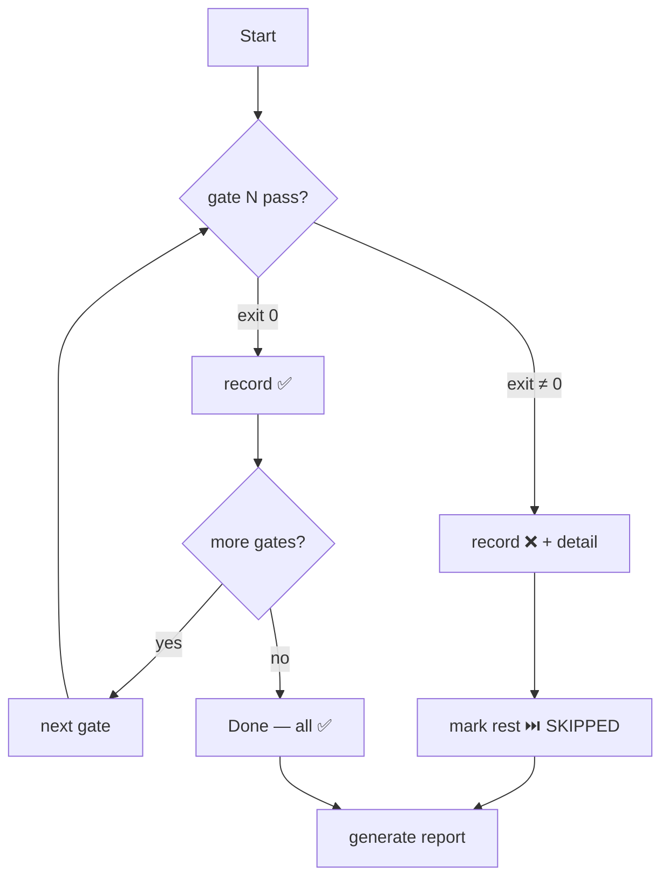

# gitflow-quality

6 quality gates with fast-fail. Diagnosis only. Non-Rust: see [command matrix](../references/gitflow-quality-params.md).

## When to Use

| English | 中文 | Trigger Context |
|---------|------|-----------------|
| quality gate | 质量关卡 | full 6-gate pre-delivery |
| coverage too low | 覆盖率太低 | coverage regression |
| clippy warnings | clippy 警告 | lint regression |
| pre-commit failed | pre-commit 挂了 | partial → full audit |
| is this ready | 能交付了吗 | readiness gate |

## Core Pattern

```bash
git rev-parse --show-toplevel && [ -z "$(git status --porcelain)" ]
cargo build --workspace 2>&1 || exit 1
cargo test --workspace 2>&1 || exit 1
cargo tarpaulin --workspace 2>&1 || exit 1
cargo +nightly fmt -- --check 2>&1 || exit 1
cargo clippy --workspace --all-targets -- -D warnings 2>&1 || exit 1
[ -f .pre-command-config.yaml ] && pre-command run --all-files 2>&1 || echo "N/A"
```

## Quick Reference

| Goal | Command |
|------|---------|
| Build | `cargo build --workspace` |
| Test | `cargo test --workspace` |
| Coverage (threshold `${COVERAGE_THRESHOLD:-80}`) | `cargo tarpaulin --workspace` |
| Format check / fix | `cargo +nightly fmt -- --check` / `cargo +nightly fmt` |
| Lint check / fix | `cargo clippy --workspace --all-targets -- -D warnings` |
| Pre-commit | `pre-command run --all-files` |

## Implementation

### Preconditions
- `git rev-parse --show-toplevel`
- `git status --porcelain` empty
- `cargo-tarpaulin` present — else prompt install

### Step 1: Fast-fail 6-gate



Coverage: `$COVERAGE_THRESHOLD` (default 80%, strict `>`). Pre-command `N/A` when `.pre-command-config.yaml` absent.

### Step 2: Quality Report

```markdown
## Quality Report — YYYY-MM-DD
| Check | Status | Details |  ← build, test, coverage, format, static, pre-command
**Result: ✅ ALL CHECKS PASSED — Ready for delivery** or **Result: ❌ QUALITY GATE FAILED — Fix and re-run**
```

### Step 3: Issue Publish — CONFIRMATION GATE (P0)

🚩 **ALWAYS ask: "Post Quality Report to Issue?"**
- No → terminal only. Yes → read `<number>` from `.claude/gh-issue/current-issue.txt` → `gitflow-cli issue comment <number> --body-file quality-report.md` → return URL. Else skip.

## Responsibility

### ✅ In Scope
- Run 6 gates, fast-fail
- Generate Quality Report (6 statuses + result)
- Publish to Issue AFTER user confirmation
- Suggest fix commands — never execute them

### ❌ Out of Scope
- Fixing source / auto-fixing (`cargo fmt`, `cargo clippy --fix`, `cargo clean`)
- Modifying configs
- `git add`/`git commit`
- `cargo install …`
- Language detection — see [command matrix](../references/gitflow-quality-params.md)

### 🚫 Do Not
- ❌ Publish without per-invocation user confirmation
- ❌ Run `cargo fmt`/`cargo clippy --fix`/`cargo clean`
- ❌ Mark coverage/lint/format `N/A` when tool missing

## Rationalization Excuse

| Excuse | Reality |
|--------|---------|
| "Report has no secrets — safe" | Always ask user. |
| "Issue linked — implied consent" | Confirm per invocation. |
| "Skip coverage — tarpaulin missing" | Prompt install. |
| "Auto-fix fmt to unblock" | Out of Scope. |
| "User in hurry — bypass" | Urgency does not override gates. |

## Red Flags

- 🚩 "skip the {check} / ship it" — refuse; stop
- 🚩 "you don't need all 6" (any authority) — non-skippable
- 🚩 "auto-fix" / "publish now" / "already checked" — detect only; confirm every invocation

## Test Scenarios

### Scenario 1: Happy Path
- **Given** clean Rust workspace, 6 tools, `current-issue.txt`=`42`
- **When** "run quality gate"
- **Then** gates run → report → ask "Post to #42?" → confirms → URL

### Scenario 2: Negative
- **Given** pre-commit subtree only. **When** "fix my hook"
- **Then** Claude redirects to `/gitflow-precommand`; does NOT load

### Scenario 3: Boundary
- **Given** format gate fails. **When** "just format them"
- **Then** Claude refuses; cites §Out of Scope; suggests `cargo +nightly fmt`

### Scenario 4: Error
- **Given** `cargo-tarpaulin` absent. **When** gate 3 fails
- **Then** records `❌`, fast-fails, suggests install, NOT N/A

## Success Criteria

- [ ] 6 gates fixed order; fast-fail on first non-zero
- [ ] Report has date + 6 rows + Result line
- [ ] Pre-command `N/A` when config absent
- [ ] Publish requires explicit confirm; URL returned
- [ ] No auto-fix / no `cargo install`

## Common Mistakes

- ❌ **Marking `coverage` N/A** — only pre-command N/A-able; missing → `❌`
- ❌ **Auto-applying `cargo fmt`** — never execute

## Trigger Keywords

| English | 中文 |
|---------|------|
| quality gate | 质量关卡 |
| run checks | 运行检查 |
| coverage too low | 覆盖率太低 |
| clippy warnings | clippy 警告 |
| pre-commit failed | pre-commit 挂了 |
| is this ready | 能交付了吗 |

## See Also

- `gitflow-precommit` — fmt/clippy/test before commit
- `gitflow-commit` — commits after quality gate passes
- `gitflow-release` — uses gate as pre-release check
- `docs/superpowers/templates/skill-conventions.md` — template conventions
