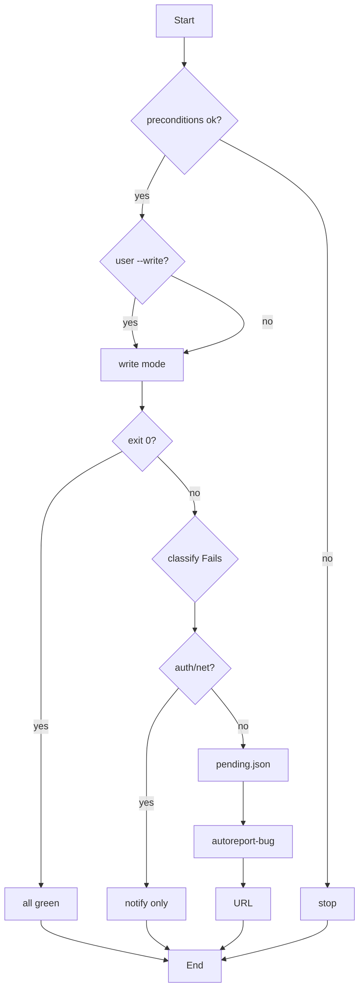

# gitflow-regression

Run `scripts/smoke-test.sh`, parse PASS/FAIL/SKIP, classify failures, report only genuine CLI bugs via `gitflow-autoreport-bug`. Read-only default; write requires explicit confirmation.

## When to Use

| English | 中文 | Trigger Context |
|---------|------|-----------------|
| smoke test | 冒烟测试 | E2E CLI verify |
| regression check | 回归检查 | after changes, pre-release |
| any regressions | 有回归吗 | user asks post-change |
| pre-release check | 发版前检查 | gate before release |

> **Chain boundary** — invokes `gitflow-autoreport-bug` for CLI-bug failures only — never auth/network.

## Core Pattern

```bash
test -f scripts/smoke-test.sh && chmod +x scripts/smoke-test.sh
command -v gitflow-cli
OUTPUT=$(bash scripts/smoke-test.sh --platform "${PLATFORM:-github}" 2>&1); EXIT=$?
PASS=$(grep -oP '\d+(?=\s+passed)' <<< "$OUTPUT" || echo 0)
FAIL=$(grep -oP '\d+(?=\s+failed)' <<< "$OUTPUT" || echo 0)
SKIP=$(grep -oP '\d+(?=\s+skipped)' <<< "$OUTPUT" || echo 0)
[ $EXIT -eq 0 ] && { echo "GREEN"; exit 0; }
grep '\[FAIL\]' <<< "$OUTPUT" | classify_non_auth
```

## Quick Reference

| Goal | Command |
|------|---------|
| Default read-only | `bash scripts/smoke-test.sh --platform <p>` |
| Verbose | append `--verbose` |
| Write (must confirm) | append `--write` |
| Version | `bash scripts/smoke-test.sh --version` |

## Implementation

### Preconditions

- `git rev-parse --show-toplevel`
- `test -f scripts/smoke-test.sh` (chmod +x if needed)
- `command -v gitflow-cli`

### Step 1: Run & Parse

User asked `--write` → write mode. Else `--read-only` mandatory.

```bash
OUTPUT=$(bash scripts/smoke-test.sh --platform "${PLATFORM:-github}" 2>&1); EXIT=$?
```

Extract PASS/FAIL/SKIP. `EXIT=0` → "GREEN", done. `FAIL>0` → Step 2.

### Step 2: Classify

| Failure | Pattern | Report? |
|---------|---------|---------|
| CLI crash / mismatch | `panic`, `segfault`, `mismatch` | ✅ |
| API 4xx/5xx (non-auth) | except 401/403/429 | ✅ |
| Auth | `401`, `403`, `token` | ❌ notify |
| Network / rate limit | `timeout`, `429` | ❌ notify |
| Not found | `command not found` | ❌ notify |

### Step 3: Report

For each genuine CLI bug → `pending.json` → `/gitflow-autoreport-bug` → URL. See `gitflow-autoreport-bug` for schema.

### Step 4: Summary

`PASS: <n> | FAIL: <n> | SKIP: <n>` + URLs or "auth/network — not reported".

## Flowchart



## Responsibility

### ✅ In Scope

- Run smoke-test.sh, parse output
- Classify failures vs auth/network/env
- Generate pending.json for genuine CLI bugs only
- Invoke gitflow-autoreport-bug (chain boundary)

### ❌ Out of Scope

- Fixing source — see `gitflow-workflow`
- Fixing auth — see `gitflow-auth`
- Modifying smoke-test.sh

### 🚫 Do Not

- ❌ Run `--write` without user confirmation
- ❌ Report auth/network as bugs
- ❌ Suppress temporary errors

### Error Handling

| Error | Recovery |
|-------|----------|
| `smoke-test.sh` missing | Stop; restore from git |
| `gitflow-cli` missing | Stop; `cargo build` |
| All auth failures | Stop; `/gitflow-auth` |

## Rationalization Excuse

| Excuse | Reality |
|--------|---------|
| "Just smoke — safe" | `--write` mutates remote — always confirm. |
| "Skip auth check — user knows" | Auth ≠ CLI bug. Never report. |

## Red Flags

- 🚩 "skip the precondition" — refuse; check env
- 🚩 "run --write, I know risk" — confirmation mandatory
- 🚩 "report auth too" — refuse; auth ≠ CLI bug

## Test Scenarios

### Scenario 1: Happy Path

- **Given** exec `scripts/smoke-test.sh`, valid auth
- **When** "run smoke test"
- **Then** `--read-only`, `PASS: <n> | FAIL: 0 | SKIP: <m>`, zero Issues

### Scenario 2: Negative

- **Given** pre-commit subtree. **When** "fix smoke-test.sh"
- **Then** Claude does NOT load; redirects to `/gitflow-workflow`

### Scenario 3: Boundary

- **Given** 2 fails, both `401`. **When** "report all including auth"
- **Then** refuses; classifies as auth; notifies user; zero autoreport-bug calls

### Scenario 4: Chain Boundary

- **Given** 3 fails: 1 panic, 1 timeout, 1 `500`
- **When** Claude processes
- **Then** panic + 500 → autoreport-bug; timeout → notify; 2 URLs

## Success Criteria

- [ ] `--read-only` default; `--write` only on explicit ask
- [ ] Auth/network/env out; only CLI bugs → autoreport-bug
- [ ] Report has PASS/FAIL/SKIP + URLs
- [ ] Chain boundary respected

## Common Mistakes

- ❌ **Reporting auth as bug** — classify first; only crashes → report
- ❌ **Defaulting to `--write`** — read-only mandatory unless user asks

## Trigger Keywords

| English | 中文 |
|---------|------|
| smoke test | 冒烟测试 |
| regression test | 回归测试 |
| any regressions | 有回归吗 |
| pre-release check | 发版前检查 |
| verify CLI works | 验证 CLI 正常 |

## See Also

- `gitflow-autoreport-bug` — downstream chain boundary; reports CLI bugs as Issues
- `gitflow-release` — pre-release smoke gate
- `gitflow-quality` — complementary 6-gate check
- `docs/superpowers/templates/skill-conventions.md` — template conventions
