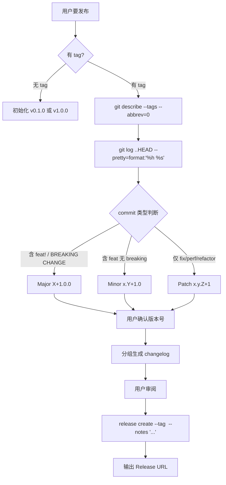

# gitflow-release-helper — Semantic Release Helper

Automates: determine next version → generate changelog → create release → output URL.
Full reference: docs/references/gitflow-release-helper-params.md

## Overview / 概述

按 conventional commits 推断版本号 + 生成 changelog + 创建 release。

## 触发关键词 / Trigger Keywords

CN 发布 release 版本号 changelog 打标签
EN create release bump version semantic version release notes tag major minor
CLI `gitflow-cli release-helper <subcommand>`

## 路由决策 / Version Decision Flow

## 快速参考 / Quick Reference

| Step | Command |
|------|---------|
| 最新 tag | `git describe --tags --abbrev=0` |
| commits | `git log <tag>..HEAD --pretty=format:"%h %s" --no-merges` |
| 创建 release | `gitflow-cli release create --tag <v> --notes "..."` |

## 核心步骤 / Pattern Triplets

| 场景 | 处理 |
|------|------|
| breaking change | Major +1 → 确认 → changelog → `release create` |
| 仅有 feat | Minor +1 |
| 仅有 fix/refactor/perf | Patch +1 |

## ✅ 职责 / 🚫 禁止

✅ 版本推断 + changelog 生成 + 调用 `release create`
🔴 禁止擅自决定版本号 / 无人值守发布 / 跳过 draft / 修改 tag

## 红旗与防御 / Red Flags + Defense

- "自动发布" → 拒绝；必须用户交互确认
- 不展示 Release Note 就创建 → 强制审阅

## 常见错误 / Common Mistakes

| 错误 | 修正 |
|------|------|
| breaking 未升 Major | 每次重新检查 |
| `--notes-file` 未清理 | 发布成功后删除临时文件 |

## 合理化反驳 / Rationalization

"版本号我猜一个" → SemVer 影响依赖，必须确认

## 错误处理 / Error Handling

| 错误 | 处理 |
|------|------|
| 无 tag 全新仓库 | 建议 v0.1.0，用户确认 |
| CI 未通过 | 建议先调 pipeline-analyzer |
| `release create` 失败 | 保留 Note；提示重试 |

## 场景测试 / Test Scenarios

- **Happy**: "发下一个版本" → 推断 Minor → 确认 → changelog → 创建 → URL
- **Negative**: "删除这个 release" → 拒绝；建议 gitflow-release CRUD
- **Boundary**: breaking 但仍选 Patch → 警告不匹配；坚持改 Major
- **Error**: 仓库无 tag → 提示全新开始 v0.1.0；用户确认后创建

## 成功标准 / Success Criteria

- 版本号推断符合 SemVer
- 版本号、Release Note 经用户确认后才创建
- Release URL 成功输出
- 临时文件已清理

## See Also

- gitflow-release — Release CRUD
- gitflow-auth — 发布前状态检查
- gitflow-pipeline-analyzer — 发布前确认 CI 状态
- gitflow-label-milestone — 版本里程碑关联
