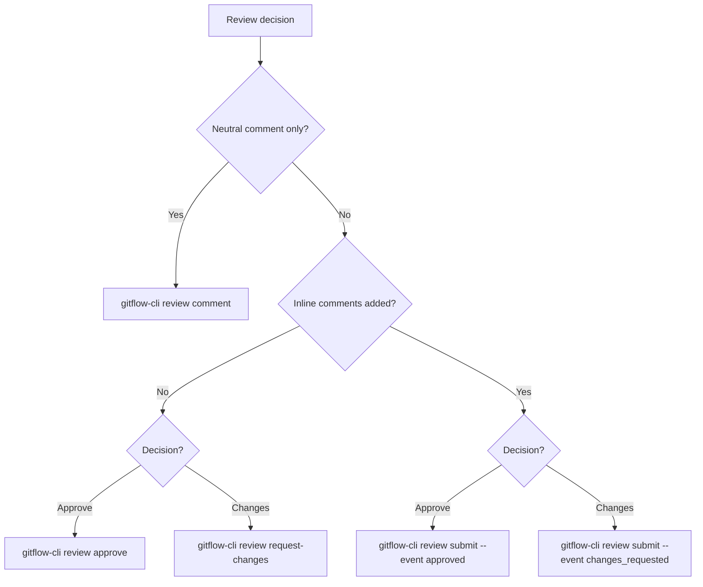

# gitflow-review

## Overview

Submits review conclusions via `gitflow-cli review`. Analysis belongs to `gitflow-pr-review`.

## When to Use

| English | 中文 | Context |
|---------|------|---------|
| approve, LGTM | 审批、通过 | Post-analysis |
| request changes | 要求修改 | PR blocked |
| submit review | 提交审查 | Post-inline comments |
| review comment | 审查评论 | Review-context neutral |
| issue/commit comment | issue/commit 评论 | → `gitflow-issue` only |

## Flowchart

## Quick Reference

| Goal | Command |
|------|---------|
| Approve | `gitflow-cli review approve <number> --body "
"` |
| Changes | `gitflow-cli review request-changes <number> --body "
"` |
| Comment | `gitflow-cli review comment <number> --body "<text>"` |
| Submit | `gitflow-cli review submit <number> --event <approved\|changes_requested> --body "
"` |

## Implementation

### Preconditions

- Auth OK: `gitflow-cli auth status --platform <platform>`
- PR open: `gitflow-cli pr view <number>`
- Not PR author

### Step 1: Verify PR

1. `gitflow-cli pr view <number>` — confirm open, CI green, not draft/merged.
2. Failure → Error Handling, stop.

### Step 2: Confirm Prior Analysis

1. approve/request-changes requires prior `gitflow-pr-review`.
2. None → refuse, redirect to `gitflow-pr-review`.

### Step 3: Execute

1. Follow Flowchart. Run command. Success → PR URL. Failure → Error Handling, stop.

### Error Handling

| Error | Recovery |
|-------|----------|
| `404` | "PR #<number> not found." |
| `403` | "Cannot review PR #<number>." |
| `409` | Already reviewed. Suggest `submit`. |
| `422` | Merged / self-approve. Stop. |
| Timeout | Retry once → stop. |

## Responsibility

### ✅ In Scope

- Submit review conclusions via `gitflow-cli review`
- Validate PR state and auth
- Guide approve-vs-submit via Flowchart

### ❌ Out of Scope

- Code analysis → `gitflow-pr-review`
- Inline comments → `gitflow-pr-inline-review`
- Implementing feedback → `gitflow-pr-apply-feedback`
- General PR comments → `gitflow-pr` `comment`
- Merging → `gitflow-pr` `merge`

### 🚫 Do Not

- ❌ Approve without prior analysis or on failing CI
- ❌ Approve own PRs (platform-blocked)
- ❌ Improvise on error

## Rationalization Excuses

| Excuse | Reality |
|--------|---------|
| "Urgent, just approve" | Urgency never overrides prior-analysis. |
| "Tiny change, skip" | One-liners can introduce vulnerabilities. |
| "Another approved" | Each reviewer must verify independently. |
| "Author knows" | Self-approval blocked by platform. |
| "CI might pass" | Failing CI risks broken merge. |

## Red Flags

- 🚩 "approve without reviewing" — Refuse. → `gitflow-pr-review`.
- 🚩 "skip the check" — Refuse. Cite Preconditions.
- 🚩 "I'm the author" — Refuse.
- 🚩 Red CI + approve — Refuse.

## Test Scenarios

### Scenario 1: Happy Path

- **Given** PR #101 open, CI green, prior `gitflow-pr-review` done
- **When** "PR #101 looks good, approve"
- **Then** Runs `pr view 101`, then `review approve 101 --body "
"`, outputs URL

### Scenario 2: Negative — Issue Comment

- **Given** User wants issue comment
- **When** "给 issue #50 加评论"
- **Then** NOT loaded. → `gitflow-issue`.

### Scenario 3: Boundary — No Prior Analysis

- **Given** PR #101, no prior analysis
- **When** "帮我 approve 一下 PR #101"
- **Then** Refuses. No `review approve`.

### Scenario 4: Error — Self-Approval

- **Given** PR #101 authored by current user
- **When** Claude runs `review approve 101`
- **Then** 422. "self-approve blocked." Stop.

## Success Criteria

- [ ] Review submitted with PR URL returned
- [ ] Prior analysis confirmed before approve/request-changes
- [ ] No self-approval
- [ ] Flowchart routes: no inline → approve; with inline → submit
- [ ] CI checked before approve (refuse if failing)

## Common Mistakes

- ❌ **Skipping `gitflow-pr-review`** — Analysis must precede approve.
- ❌ **`approve` vs `submit` confusion** → Flowchart decides.
- ❌ **Approving red CI** — Wait for green.

## Trigger Keywords

| English | 中文 |
|---------|------|
| approve, LGTM | 审批、通过了 |
| request changes, reject | 要求修改、驳回 |
| submit review | 提交审查 |
| review comment | 审查评论 |
| code review decision | 代码审查结论 |

## See Also

- `gitflow-pr-review` — 6-dimension analysis preceding approve
- `gitflow-pr-inline-review` — Inline comments; feeds `review submit`
- `gitflow-pr-apply-feedback` — Handles feedback on author side
- `gitflow-pr` — General PR ops; use for non-review discussions
- `docs/superpowers/templates/skill-conventions.md` — Template conventions
