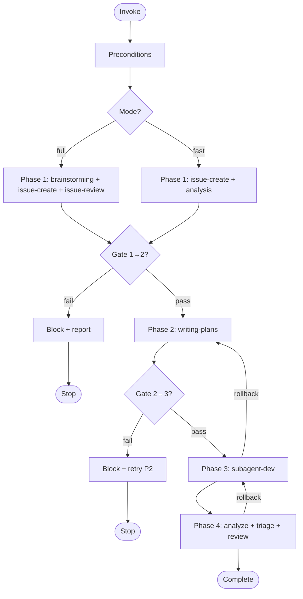

# gitflow-workflow

Four-phase gate-driven lifecycle orchestrator. Coordinates only — never performs operations or development directly.

## When to Use

| English | 中文 | Trigger Context |
|---------|------|----------------|
| develop feature | 开发功能 | high-level requirement needing breakdown |
| fix bug | 修复 bug | structured fix requested |
| analyze issue | 分析 issue | **Do NOT fire** — belongs to `/gitflow-issue-review` |

## Trigger Keywords

| English | 中文 |
|---------|------|
| develop feature | 开发功能 |
| fix bug | 修复 bug |
| workflow | 工作流 |
| implementation plan | 实现计划 |

## Core Pattern

```bash
# Preconditions
git rev-parse --show-toplevel && gitflow-cli --version && gitflow-cli auth status

# Phase 1 → Gate 1→2 → Phase 2 → Gate 2→3 → Phase 3 → Phase 4
```

## Quick Reference

| Goal | Command |
|------|---------|
| List open issues | `gitflow-cli issue list --state open --output json` |
| Verify issue | `gitflow-cli issue view <number>` |
| Post audit log | `gitflow-cli issue comment <number> --body-file <file>` |

## Implementation

### Mode Matrix

| Skill | Full | Fast |
|-------|------|------|
| `superpowers:brainstorming` | ✅ | ⚠️ |
| `/gitflow-issue-create` | ✅ | ✅ |
| `/gitflow-issue-review` | ✅ | ⚠️ |
| `superpowers:writing-plans` | ✅ | ⚠️ |
| `superpowers:subagent-driven-development` | ✅ | ✅ |
| `/gitflow-pipeline-analyzer` | ✅ | ✅ |
| `/gitflow-issue-triage` | ✅ | ✅ |
| `/gitflow-review` | ✅ | ✅ |

✅ mandatory · ⚠️ optional with justification

### Phase 1: Requirement

1. `gitflow-cli issue list --state open --output json` — user selects or defines.
2. Full → `superpowers:brainstorming`; Fast → root-cause analysis.
3. `/gitflow-issue-create` — **artifact: Issue URL.**
4. Full → `/gitflow-issue-review`; Fast → fix doc.
5. Post audit log to Issue (see `docs/templates/workflow-plan.md`).

**Gate 1→2:** Issue URL + analysis comment required. Verify via `gitflow-cli issue view <number>`. Missing → block and stop.

### Phase 2: Plan

1. `superpowers:writing-plans` using `docs/templates/workflow-plan.md`.
2. Plan **must** include Task N+1 (quality gate) and Task N+3 (closure).

**Gate 2→3:** Plan doc + quality gate task required. Missing → block.

### Phase 3: Execute

`superpowers:subagent-driven-development` with the plan. Per task: TDD → review → commit. No skips.

### Phase 4: Post-delivery

`/gitflow-pipeline-analyzer` → `/gitflow-issue-triage` → `/gitflow-review`.

### Rollback

Any phase may roll back. Post reason to Issue (see template).

### Error Handling

| Error | Recovery |
|-------|----------|
| Auth not authenticated | Prompt `gitflow-cli auth login`, stop |
| `issue create` API failure | Retry once; block at gate |
| subagent failure | Block, report, do not improvise |
| Gate evidence missing | Output block message, stop |

## Flowchart



## Responsibility

### ✅ In Scope

- Gate enforcement
- Mode selection
- Audit logging

### ❌ Out of Scope

- Code → `superpowers:subagent-driven-development`
- Platform ops → `gitflow-cli`
- Requirement analysis → `/gitflow-issue-review`
- Plan content → `superpowers:writing-plans`

### 🚫 Do Not

- ❌ Skip skills in full mode
- ❌ Skip TDD or review in fast mode
- ❌ Skip Phase 4 or fabricate URLs

## Rationalization Excuses

| Excuse | Reality |
|--------|---------|
| "Simple task, skip brainstorming" | Full mode mandates all steps |
| "TDD too slow for this fix" | Fast mode skips brainstorming, never TDD |
| "Tech Lead said skip Phase 2" | Authority does not override gates |
| "API down, faking Issue URL" | Tool failure blocks the gate; never fabricate |

## Red Flags

- 🚩 "Skip brainstorming" — refuse in full mode; offer fast
- 🚩 "Start coding, document later" — Gate 1→2 blocks without Issue URL
- 🚩 Authority demands skipping gates — offer fast mode
- 🚩 Tool failure → improvise — follow Error Handling, block at gate

## Test Scenarios

### Scenario 1: Happy Path — Full Mode

- **Given** Authenticated git repo, no existing Issue
- **When** `/gitflow-workflow` with "add shell completion"
- **Then** All 4 phases run; Issue URL and Task N+1/N+3 present; gates pass

### Scenario 2: Negative — Issue Analysis Only

- **Given** "Analyze Issue #42"
- **When** Request targets analysis, not a full cycle
- **Then** Do NOT load this skill; redirect to `/gitflow-issue-review`

### Scenario 3: Boundary — Skip Phase 2

- **Given** User says "skip plan, just code"
- **When** User pushes past Phase 2
- **Then** Gate 2→3 blocks Phase 3; offer fast mode

### Scenario 4: Error — API Failure

- **Given** `gitflow-cli issue create` returns 500
- **When** Phase 1 attempts creation
- **Then** Retry once; block at gate; report; no fabricated URL

## Success Criteria

- [ ] All 4 phases executed
- [ ] Every gate passes with evidence
- [ ] No out-of-scope action
- [ ] All artifacts recorded

## Common Mistakes

- ❌ **Skipping brainstorming in full mode** — Use fast mode for shortcuts
- ❌ **Continuing past a failed gate** — Report and stop

## See Also

- `/gitflow-issue-create` — creates Issues during Phase 1
- `/gitflow-issue-review` — analyzes requirements during Phase 1
- `/gitflow-pipeline-analyzer` — analyzes CI/CD during Phase 4
- `/gitflow-issue-triage` — classifies issues during Phase 4
- `/gitflow-review` — reviews changes during Phase 4
- `superpowers:brainstorming` — explores requirements in Phase 1
- `superpowers:writing-plans` — generates plans in Phase 2
- `superpowers:subagent-driven-development` — executes plans in Phase 3
- `docs/templates/workflow-plan.md` — plan template
