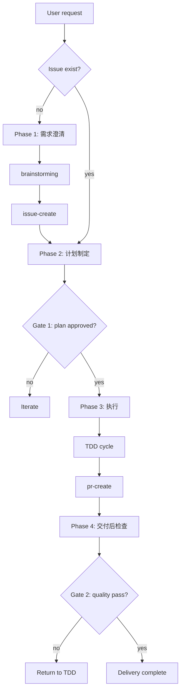

# gitflow-workflow — 四阶段闸门编排器

编排层只指挥；平台走 `gitflow-cli`，循环走 Superpowers。

## When to Use

| EN | ZH |
|----|----|
| full workflow | 全流程 |
| clarify → plan → execute → deliver | 需求→计划→执行→交付 |

完整模式: 四阶段全流程 mandated。快速模式: 快速修复 bug 可跳过 brainstorming/writing-plans。

## Core Pattern

```bash
gitflow-cli auth status
gitflow-cli issue list --state open --output json
```

Phase 1 必须执行: 读取 Open Issues → superpowers:brainstorming(完整模式) → gitflow-issue-create → gitflow-issue-review 审计回贴

## Quick Reference

| Phase | Sub-skill | Mode |
|-------|-----------|------|
| 1 | `superpowers:brainstorming` | full ✅ / fast opt |
| 1 | `gitflow-issue-create` | always |
| 1 | `gitflow-issue-review` | full ✅ / fast opt |
| 2 | `superpowers:writing-plans` | full ✅ / fast opt |
| 3 | `superpowers:subagent-driven-development` | always |
| 4 | `gitflow-pipeline-analyzer → gitflow-issue-triage → gitflow-review` | always |

Phase 2 必须制定完整计划 + gitflow-quality gate: Build 检查/Test 检查/Coverage 检查/Format 检查/Static 检查/Pre-commit 检查 → ALL CHECKS PASSED

Phase 3 内含 TDD / Review。
Phase 4: 流水线分析报告 → Issue 分类报告 → 代码审查报告

## 模式对比

### 完整模式
全流程四阶段，必须调用：brainstorming → issue-create/review → writing-plans → subagent-driven-development → TDD → Phase 4

### 快速模式 - 必须调用的 Skills 清单
Phase 1: gitflow-issue-create(必选), brainstorming(可选)
Phase 2: writing-plans(可选，可跳过)
Phase 3: subagent-driven-development(必选，含 TDD + Code Review)
Phase 4: gitflow-pipeline-analyzer → gitflow-issue-triage → gitflow-review(必选)

## 强制执行规则

### 禁止行为
- ❌ 跳过 Phase 4（任何模式）
- ❌ 快速模式禁止跳过 TDD
- ❌ 快速模式禁止跳过 Code Review
- ❌ 合并多个阶段为一步

## Flowchart



## Implementation

### Preconditions

`command -v gitflow-cli` · `auth status` ok · `git rev-parse` · issues open。

### Steps

1. **Phase 1: 需求澄清** — 读取 Open Issues → brainstorming → issue-create → issue-review
2. **Phase 2: 计划制定** — writing-plans + gitflow-quality gate → ALL CHECKS PASSED
3. **Phase 3: 执行** — subagent-driven-development + TDD + review；合 PR
4. **Phase 4: 交付后检查** — 流水线分析报告 → Issue 分类报告 → 代码审查报告

### Error Handling

| Error | Recovery |
|-------|----------|
| 闸门证据缺失 | 🔒 补齐再进 |
| worktree 泄露 | `worktree remove` + `branch -d` |
| auth 过期 | 重登 resume |

## Common Mistakes

❌ 跳过闸门证据 · ❌ 内联 sub skill · ❌ worktree 未清 · ❌ 跳 TDD/Review
